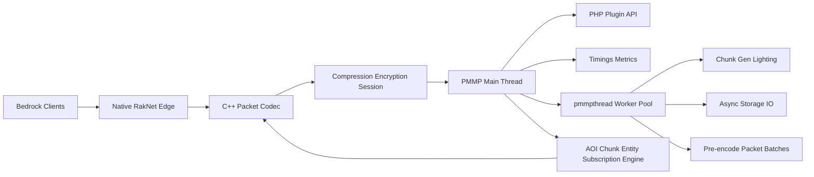
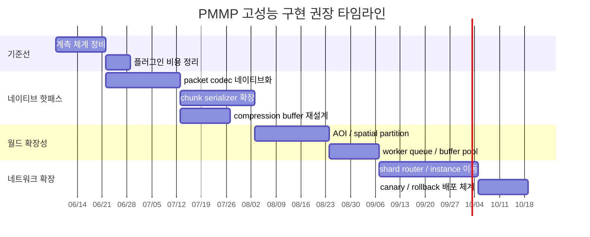

# 마인크래프트 Bedrock/Java 서버 구동기와 PMMP 고성능 구현 전략

## Executive Summary

PocketMine-MP는 이미 “순수 PHP 서버”가 아니라, **PHP 사용자 영역 위에 C/C++ 성능 경로를 얹은 하이브리드 서버**에 가깝다. 공식 저장소는 PMMP를 “PHP, C, C++로 구축된” Bedrock 서버라고 설명하고, 실제 빌드 체인은 `pmmpthread`, `chunkutils2`, `libdeflate`, `morton`, `xxhash`, `encoding` 같은 비표준 확장을 정적으로 묶는다. 반면 공식 문서는 PMMP가 **멀티코어 활용이 약하고**, PHP 스레딩은 Zend 엔진 구조 때문에 **대부분의 복합 데이터를 복사**해야 하므로, “PHP 전체를 병렬화”하는 접근이 아니라 **직렬화·압축·청크·AOI 같은 핫패스를 네이티브로 옮기는 접근**이 가장 높은 투자 대비 효과를 낸다고 분명히 보여준다. citeturn24view0turn25search7turn30view0turn29view0turn28view0

Bedrock 쪽 병목은 프로토콜 성격 때문에 **네트워크 코덱과 세션 처리**에 더 많이 붙는다. 공개 Bedrock 서버는 आज도 주로 **UDP 기반 RakNet**을 쓰고, NetherNet은 **WebRTC 기반이며 현재 LAN/Xbox Live 위주**고 **직접 인터넷 연결에는 쓸 수 없다**. Bedrock 로그인 경로는 `JWT certificate chain`, 선택적 암호화 핸드셰이크, 패킷별 압축 식별자(zlib/snappy/none)를 포함한다. Java 쪽은 **TCP + VarInt 프레이밍 + 로그인 시 암호화 + `Set Compression` 이후 zlib 압축**이 핵심이며, 실제 확장성은 종종 **JVM GC, native transport, regionized multithreading, proxy topology**에 의해 좌우된다. citeturn21view3turn39view0turn21view2turn22view1turn22view2turn33view0turn33view2turn33view3turn33view4

따라서 실행 가능한 권고는 세 단계로 정리된다. **동접 100 수준**은 현행 PMMP 기반에 프로파일링과 확장 위생만 잘해도 충분히 실현 가능하다. **동접 300 수준**부터는 네이티브 직렬화, 청크 인코딩, 압축, 관심영역 관리(AOI), 메모리 풀링을 포함하는 **하이브리드 C++ 코어 + PHP 플러그인** 모델이 필요하다. **동접 1000 수준**은 단일 PMMP 프로세스에서의 “강한 한 월드”가 아니라, **샤딩·인스턴싱·프록시 라우팅**을 전제로 한 네트워크 전체 목표로 재정의하는 것이 현실적이다. 이 수치는 공개 벤더 벤치마크가 아니라, PMMP가 스스로 “하드웨어와 플러그인에 따라 100+ 플레이어”를 목표로 제시하고 있고, 동시에 싱글코어 편향을 인정하며, Java 진영이 Velocity/Folia 식으로 프록시/지역 병렬화를 통해 확장하는 구조를 택한다는 문서를 근거로 한 **실무 추정치**다. citeturn24view0turn30view0turn34view1turn33view4turn33view3

| 결론 항목 | 최종 판단 |
| --- | --- |
| PMMP를 유지할 것인가 | **예**. 단, “PHP 전체 멀티스레딩”이 아니라 “핫패스 네이티브화” 방향으로 유지하는 것이 맞다. citeturn29view0turn25search7turn26view0turn20search11 |
| RakNet vs NetherNet | **당장은 RakNet 우선**, NetherNet은 연구 트랙으로 분리하는 것이 안전하다. citeturn21view3turn39view0turn38view2 |
| 1000 동접 단일 서버 | **비권장**. “한 인스턴스 1000명”보다 “네트워크 전체 1000명” 구조로 설계해야 한다. citeturn24view0turn30view0turn34view1turn33view4 |
| 가장 먼저 만들 것 | **계측 → 네이티브 직렬화/압축 → 청크/AOI → 샤드 라우팅** 순서가 최적이다. citeturn31view0turn26view0turn20search11turn29view0 |

## 조사 범위와 증거 지도

이번 조사는 요청 우선순위에 맞춰 **공식 문서 → GitHub 저장소 README/릴리스/이슈/빌드 스크립트 → 포럼/커뮤니티 → 연구/기술 문서** 순으로 무게를 두었다. 한국어 자료는 설치·운영 관점의 맥락 파악에는 도움이 되었지만, 구조와 성능의 1차 근거는 대부분 영어 공식 저장소에 있었다. 한국어 커뮤니티도 PMMP를 “플러그인 생태계가 강한 Bedrock 서버”로 보면서, 동시에 야생·엔티티·최신 기능 완성도는 약하다고 요약하는데, 이는 PMMP 공식 README가 “vanilla survival에는 부적합”하다고 명시한 내용과 방향이 일치한다. citeturn13search5turn13search3turn24view0

또 하나 중요한 전제는 용어 정리다. 사용자 요청의 표 항목 중 **“Java BDS”는 업계 관용분류가 아니므로 미지정**으로 보고, 본 보고서에서는 문맥상 **JVM 기반 Java 서버 계열(Paper/Folia/Velocity 참조선)**로 해석했다. 별도로 **BDS 기반 확장 계열(Endstone, LeviLamina 등)**은 별도 리스크 트랙으로 다뤘다. BDS 기반 도구는 공식 서버 코어를 활용해 vanilla fidelity를 가져가기 쉽지만, Bedrock Wiki가 정리하듯 1.21.10 이후 심볼 제거가 여러 BDS 기반 프로젝트에 타격을 주었고, Endstone류 문서는 실제로 BDS 실행 파일에 hook을 적용해 기능을 확장한다고 설명한다. citeturn32view0turn35search6turn35search1

| 프로젝트·기술 | 핵심 링크와 한 줄 요약 | 장점 | 한계 | 실제 적용 사례·이슈 |
| --- | --- | --- | --- | --- |
| PocketMine-MP | PMMP는 2026-05-31 기준 5.43.2 stable이며, Bedrock용 고도 커스터마이즈 가능한 서버다. citeturn24view0 | 플러그인 생태계, 빠른 버전 대응, 멀티월드, PMMP 팀이 직접 관리하는 문서/빌드 체계가 있다. citeturn24view0turn13search8 | vanilla survival, redstone, mob AI, vanilla worldgen에는 부적합하다. citeturn24view0 | 오래된 이슈지만 “한 코어만 쓴다”는 지적이 반복됐고, PMMP 쪽은 이를 구조적 특성으로 받아들인다. citeturn18search9turn30view0 |
| Threading docs + ext-pmmpthread | PMMP의 스레딩 문서는 “왜 PHP 스레딩이 힘든가”를 직접 설명하고, ext-pmmpthread는 그 위에서 실용적 절충을 제공한다. citeturn29view0turn28view0 | 실제 PMMP 운영에서 쓰이며, OPcache SHM 재사용과 메모리 절감 이점을 갖는다. citeturn28view0 | Zend 엔진 제약 때문에 큰 객체·배열 전달이 비싸고, 버전 업 시 내부 구조 변경에 취약하다. citeturn29view0turn28view0 | PMMP 문서는 worldgen, lighting, network compression 등 “적은 공유·큰 계산” 작업만 스레딩에 적합하다고 못 박는다. citeturn29view0 |
| PHP-Binaries | PMMP는 자체 ZTS PHP 바이너리와 컴파일 스크립트를 유지한다. citeturn25search7turn25search4 | PMMP 맞춤 확장 집합과 정적 링크 구성이 이미 자동화돼 있다. citeturn25search7 | 업스트림 PHP와 다르게 운영되므로 버전 핀닝과 재현 가능한 빌드가 필수다. citeturn25search0turn25search7 | GitHub Marketplace의 `setup-php-action`은 이 바이너리를 PMMP 자체 CI와 플러그인 CI에 사용한다고 밝힌다. citeturn25search3 |
| ext-encoding + ext-chunkutils2 | PMMP는 느린 PHP 직렬화/청크 경로를 이미 네이티브로 옮기기 시작했다. citeturn26view0turn20search11 | `ext-encoding`은 VarInt 5–10배, NBT read 1.5배 / write 2배 개선 예시를 공개하고, `ext-chunkutils2`는 청크 처리의 성능과 메모리 사용을 낮춘다고 명시한다. citeturn26view0turn20search11 | API 불호환과 네이티브 유지보수 부담이 있다. `ext-encoding`은 `binaryutils` 드롭인 대체가 아니고, `ext-xxhash`는 2025-09에 archive 됐다. citeturn26view0turn26view1 | 이 둘은 PMMP가 “어디를 C/C++로 옮겨야 하는가”의 정답을 이미 보여준다. citeturn25search7turn26view0turn20search11 |
| Dragonfly + gophertunnel/go-raknet | Dragonfly는 Go로 작성된 heavily asynchronous Bedrock 서버이며, 라이브러리처럼 확장하도록 설계됐다. citeturn38view0turn12search3turn38view1 | 고루틴 기반 비동기 구조, 좋은 참조 아키텍처, Go 네트워킹 생태계 활용이 가능하다. citeturn38view0turn12search0turn38view1 | PMMP 플러그인 호환성이 없고, 완전한 PMMP 대체라기보다 새 엔진 쪽에 가깝다. citeturn38view0 | 실제 이슈로 Dragonfly 서버 접속 시 CPU 100% 현상이 보고된 적이 있어, 비동기 구조도 프로토콜/구현 정확성이 무너지면 병목을 일으킨다는 교훈을 준다. citeturn11search7 |
| NetherNet + go-nethernet | NetherNet은 RakNet 대체를 목표로 하는 WebRTC 기반 Bedrock 전송 계층이며, go-nethernet은 그 기본 구현이다. citeturn11search0turn39view0turn38view2 | LAN/Xbox Live 방향의 미래성, WebRTC/STUN/TURN 활용 가능성, Go 구현이 있다. citeturn39view0turn38view2 | 문서가 불완전하고, 직접 인터넷 연결에는 아직 사용할 수 없으며, go-nethernet도 feature-complete가 아니다. citeturn39view0turn38view2 | 저장소 이슈가 프록시/예제 수준에 머무는 점도 생태계 초기 단계를 보여준다. citeturn11search18 |
| Paper + Velocity + Folia | Java 진영의 확장성 참조선은 Paper의 최적화, Velocity의 프록시, Folia의 지역 병렬화다. citeturn34view0turn34view1turn33view4 | 프로덕션 프록시, native transport, JVM 튜닝, 지역 병렬화라는 축이 성숙했다. citeturn33view0turn33view2turn33view3turn33view4 | Folia는 drop-in replacement가 아니며, 기존 플러그인 호환성이 낮다. Velocity도 native 성능은 Linux production을 강하게 권한다. citeturn10search2turn33view3 | Paper에는 simulation-distance / no-tick / tracking 관련 실제 운영 이슈가 계속 보고돼, 옵션 하나가 곧바로 “공짜 성능”을 보장하지 않음을 보여준다. citeturn19search16turn9search19 |
| BDS + Endstone/LeviLamina | 공식 Bedrock Dedicated Server를 기반으로 하는 네이티브 확장 계열은 vanilla fidelity가 높다. citeturn6search0turn35search0turn35search1 | 공식 서버 코어를 활용하므로 vanilla 특성이 강하고, C++/Python 쪽 확장이 가능하다. citeturn35search0turn35search2 | Linux는 공식적으로 Ubuntu 22.04+로 제한되고, BDS 기반 생태계는 심볼 제거·hooking 리스크를 안는다. citeturn6search0turn6search6turn32view0 | Endstone 문서는 BDS 실행 파일에 hook을 적용한다고 설명하고, Bedrock Wiki는 1.21.10의 symbol removal이 BDS 기반 프로젝트 쇠퇴를 불렀다고 정리한다. citeturn35search6turn32view0 |

이 증거 지도에서 가장 중요한 메시지는 단순하다. **PMMP를 고성능으로 만들고 싶다면, PMMP와 싸우지 말고 PMMP가 이미 선택한 길을 더 밀어야 한다.** 그 길은 “네이티브 확장으로 병목을 잘라내고, PHP는 오케스트레이션과 플러그인 API에 남기는 길”이다. 반대로 **NetherNet-first**나 **전체 ECS 재작성**, **PHP 메인 루프 전체 병렬화**는 기술적으로는 멋있지만, 1차 투자 대상으로는 수익률이 낮다. citeturn25search7turn26view0turn20search11turn29view0turn39view0

## 프로토콜과 런타임 병목 비교

Bedrock 프로토콜은 Mojang 공식 저장소가 스스로 “release over release로 바뀔 수 있다”고 경고하며, 현재 공개 README도 특정 릴리스와 네트워크 버전을 명시한다. 즉, PMMP나 독자 서버를 최적화할 때 성능뿐 아니라 **버전 추적 자동화**가 구조 과제다. 반면 Java 프로토콜은 데이터 프레이밍과 로그인·압축 구조가 비교적 오래 안정적으로 유지돼 왔고, 실제 운영 병목은 네트워크 형식 자체보다 **월드 시뮬레이션과 JVM 관리** 쪽에서 더 크게 드러난다. citeturn23view0turn22view1turn22view2

| 비교 항목 | Bedrock | Java | 성능적 의미 |
| --- | --- | --- | --- |
| 전송 계층 | 외부 서버는 주로 **RakNet/UDP**, LAN·Xbox Live 쪽은 **NetherNet/WebRTC**가 등장했다. citeturn21view3turn39view0 | **TCP** 기반이다. 패킷은 VarInt 길이 + VarInt ID + payload로 프레이밍된다. citeturn22view1 | Bedrock은 신뢰성·순서보장·세션 관리·압축 식별자를 자체 처리해야 하므로 **네트워크 코덱 병목**이 더 노출된다. Java는 커널 TCP 위에 얹히므로 **런타임·GC·월드 루프** 영향이 더 크다. citeturn21view2turn22view2 |
| 정수/바이트 인코딩 | little-endian, big-endian, VarInt를 혼용하며 GamePacket header도 압축적으로 인코딩된다. citeturn21view1 | 대부분 big-endian이며 VarInt/VarLong이 별도 규칙으로 쓰인다. citeturn22view0 | PHP에서 Bedrock 코덱을 순수 `pack()/unpack()`와 `chr()/ord()` 루프로 처리하면 손해가 크다. PMMP가 `ext-encoding`으로 이 부분을 네이티브화한 이유가 여기에 있다. citeturn26view0turn21view1turn22view0 |
| 압축 | Bedrock은 패킷 앞에 압축 ID가 오고 zlib/snappy/none이 존재한다. NetworkSettings에서 기본 압축을 설정한다. citeturn21view2 | Java는 `Set Compression` 이후 zlib 압축을 쓰고, 임계값(threshold)보다 큰 패킷만 압축한다. citeturn22view2 | Bedrock은 패킷별 압축 전략·배치 조합이 중요하고, Java는 임계값·GC·native transport 조합이 중요하다. citeturn21view2turn22view2turn33view3 |
| 인증·암호화 | LoginPacket에 **JWT certificate chain**과 raw token이 들어가고, 선택적 Handshake packet으로 암호화를 초기화한다. 인증 없는 체인은 신뢰하면 안 된다고 문서가 경고한다. citeturn21view2 | 로그인 중 Encryption Request/Response가 오가고, 이후 압축이 활성화될 수 있다. localhost/비인증 연결은 예외 처리된다. citeturn22view1turn22view2 | Bedrock은 세션 수립 시 **JWT 검증·암호화·압축 초기화**가 한꺼번에 들어와 edge path가 무겁다. Java는 handshake/login path가 더 단순하지만, 대규모 운영에서는 프록시 계층과 JVM 튜닝이 함께 중요하다. citeturn21view2turn34view1turn33view2 |
| 구조 데이터 | Bedrock도 NBT를 광범위하게 쓰고, Bedrock Wiki는 NBT를 핵심 바이너리 데이터 형식으로 설명한다. citeturn14search1 | Java 프로토콜도 NBT Tag를 chunk/block entity/slot 등에 사용한다. citeturn22view3 | 양쪽 모두 **NBT 직렬화/역직렬화**가 상시 병목 후보다. PMMP에서 이 부분을 네이티브화하는 투자가 재사용 가치가 높다. citeturn26view0turn22view3turn14search1 |
| 스케일링의 핵심 | PMMP 문서는 멀티코어 활용이 약하고, PHP 스레딩은 값 복사 비용이 커서 제한적이라고 설명한다. citeturn30view0turn29view0 | Java 진영은 simulation-distance, view-distance, native transport, G1/ZGC, regionized multithreading(Folia) 같은 조절기가 성숙했다. citeturn33view0turn33view2turn9search3turn9search18turn33view4 | PMMP 최적화는 **네이티브 확장 중심**, Java 최적화는 **JVM·프록시·지역 병렬화 중심**으로 전략이 갈린다. citeturn29view0turn26view0turn33view4turn34view1 |

PMMP 관점에서 가장 주목할 사실은 `ext-encoding`의 수치다. 이 확장은 `pack()/unpack()`와 `BinaryStream` 경로의 느림을 정면으로 겨냥했고, **NBT synthetic test에서 read 1.5배, write 2배**, VarInt 함수에서 **5–10배** 개선을 제시한다. Bedrock 프로토콜이 little-endian/VarInt/NBT를 광범위하게 쓰는 점을 감안하면, 이는 미세 최적화가 아니라 **핵심 설계 방향**이다. 다시 말해, PMMP 고성능화의 첫 번째 축은 “스케줄러를 더 똑똑하게 만드는 것”보다 **코덱을 PHP 밖으로 빼는 것**이다. citeturn26view0turn21view1turn21view2

Java 진영에서는 병목의 결이 다르다. Paper 문서는 `simulation-distance`가 엔티티 틱 범위를, `view-distance`가 전송 범위를 좌우한다고 설명하고, Linux의 `use-native-transport=true`가 성능 부스트를 준다고 적는다. 또 Paper는 Aikar’s flags를 공식 문서로 유지하고 있고, Oracle/OpenJDK 문서는 G1GC의 기본 pause target이 200ms임을, ZGC가 대부분의 비싼 작업을 concurrent하게 수행해 저지연에 적합함을 설명한다. 따라서 Java에서는 **세계 시뮬레이션 범위, native transport, GC 정책, 프록시 계층**이 실전 성능 튜닝의 핵심이 된다. citeturn33view0turn33view2turn9search3turn9search18turn33view3

최신 대규모 온라인 게임 기술을 Minecraft에 가져오는 관점에서도 우선순위가 갈린다. Roblox의 instance streaming 문서는 “세계의 관련 구역만 동적으로 스트리밍해 서버 대역폭과 동기화 비용을 줄인다”고 설명하고, MMOG interest management 연구는 **모든 상태를 모두에게 브로드캐스트하는 방식이 스케일하지 않는다**고 지적한다. Valve 계열 네트워킹 문헌과 일반 게임 네트워킹 해설이 말하는 **authoritative server**, **client-side prediction**, **lag compensation**은 FPS나 물리 기반 액션에는 매우 중요하지만, vanilla Bedrock/Java 클라이언트를 바꿀 수 없는 Minecraft 서버에서는 **분산 월드·인스턴싱·interest management**가 더 직접적으로 먹히고, rollback/lockstep은 적용 가치가 낮다. 이 부분은 문헌과 플랫폼 문서를 바탕으로 한 **구조적 추론**이다. citeturn40view3turn16search6turn16search18turn15search1turn15search8turn15search18

| 최신 대규모 게임 서버 기술 | Minecraft 서버 적용성 | 판단 |
| --- | --- | --- |
| 분산 월드 / 인스턴싱 | **매우 높음** | 1000 동접을 단일 프로세스가 아니라 여러 인스턴스/샤드로 나누는 방식은 Minecraft에 가장 현실적이다. Java는 Velocity가 “한 프록시에 수천 명”을 목표로 하고, Roblox 스트리밍도 관련 영역만 동기화해 서버 부하를 줄인다. citeturn34view1turn40view3 |
| Interest management / AOI | **매우 높음** | MMOG 연구가 브로드캐스트-all을 비현실적이라 보고, Roblox도 replication focus/streaming radius로 동일 문제를 푼다. Minecraft에서도 플레이어별 청크/엔티티 관심 집합을 줄이는 것이 정공법이다. citeturn16search6turn16search18turn40view3 |
| Authoritative server | **기본 유지** | PMMP, Paper, BDS 모두 서버 권위를 전제로 한다. 치트 내성과 상태 일관성을 위해 유지해야 한다. Valve/일반 네트워킹 문헌의 방향과도 맞다. citeturn15search1turn15search8 |
| Client-side prediction | **낮음~중간** | 공식 Minecraft 클라이언트를 제어하기 어렵기 때문에, 서버가 할 수 있는 것은 prediction 자체보다 **반복 보정 감소용 패킷 최적화** 쪽이다. custom minigame·프록시 레이어 일부에는 제한적으로 응용 가능하다. 이는 Bedrock/Java 프로토콜 제약을 바탕으로 한 추론이다. citeturn21view2turn22view1turn15search8 |
| Rollback / rewind | **낮음** | 격투/FPS에는 강력하지만, Minecraft의 월드 상태·NBT·플러그인 이벤트를 서버 단에서 되감는 구조는 복잡도 대비 이익이 작다. 일부 PvP 판정 보정 수준에서만 제한적으로 검토할 만하다. citeturn15search12turn15search21 |
| Deterministic lockstep | **매우 낮음** | 복잡한 월드 상태, 버전 차이, 플러그인, 비결정적 이벤트가 많은 Minecraft에는 맞지 않는다. RTS류 입력-동기화형 게임에 더 가깝다. 이것 역시 네트워크 모델 문헌과 Minecraft 상태 복잡성을 바탕으로 한 추론이다. citeturn15search12turn22view3turn14search1 |

## 네트워크 라이브러리와 서버 아키텍처 비교

먼저 전제를 분명히 해야 한다. 사용자 표의 “RakNet, NetherNet, Dragonfly, go-nethernet” 중 **RakNet과 go-nethernet은 비교적 라이브러리/프로토콜 구현에 가깝고**, **Dragonfly는 서버 엔진 겸 라이브러리**, **NetherNet은 엄밀히 말해 프로토콜 사양**이다. 따라서 아래 표는 “순수 라이브러리” 비교가 아니라 **실제로 PMMP 또는 독자 엔진 설계 시 고려할 네트워크 기반 선택지** 비교로 읽는 것이 맞다. citeturn38view0turn11search0turn39view0

| 네트워크 기반 | 언어 | 라이선스 | 성능 특성 | 멀티스레드/비동기 지원 | 생태계/유지보수 | 적용 난이도 | 추천 용도 |
| --- | --- | --- | --- | --- | --- | --- | --- |
| RakNet | C++ | BSD-style + PATENTS 부여 계열로 공개되었으나 저장소는 2022년 archive/read-only 상태다. citeturn45search1turn45search15turn11search2 | Bedrock 공개 서버의 사실상 기본 경로이며 UDP 위에 신뢰성/순서보장을 얹는다. 검증된 구조지만 현대적 async 프레임워크 자체는 아니다. citeturn21view3turn45search16 | 라이브러리 수준에서 직접 스레드 모델을 제공하기보다, 사용자 코드가 이벤트 루프/스레드 모델을 얹어야 한다. citeturn45search1turn21view3 | 프로토콜 이해도는 높지만, 원 오리지널 C++ 저장소는 정지 상태다. 유지보수는 각 구현체가 맡는 형태다. citeturn11search2turn45search1 | 중간~높음 | **지금 당장 인터넷 Bedrock 서버를 만들 때의 기본 선택지**. PMMP 네이티브 확장이나 독자 C++ edge proxy의 기반으로 적합하다. citeturn21view3turn45search16 |
| NetherNet | 미지정 | 미지정 | WebRTC 기반이며 LAN/Xbox Live로 rollout 중이지만, 직접 연결에는 쓸 수 없다. 사양이 가변적이고 reverse engineering 의존도가 높다. citeturn11search0turn39view0 | WebRTC/STUN/TURN/ICE 흐름을 활용하므로 근본적으로 비동기성이 강하다. 다만 Minecraft 서버 구현 측에서는 signaling, ICE, DTLS, SCTP까지 감당해야 한다. citeturn39view0 | 아직 문서와 구현이 초기 단계다. Bedrock Wiki도 “잘 알려지지 않았다”고 적고, spec 저장소도 정보 출처가 reverse engineering임을 밝힌다. citeturn14search11turn39view0 | 매우 높음 | **연구용·미래 대응용**. 공용 인터넷 Bedrock 서버의 주력 경로로는 아직 이르다. citeturn39view0 |
| Dragonfly | Go | MIT | “heavily asynchronous”를 전면에 내세우는 Go 서버 엔진이며, 확장 라이브러리처럼 쓰도록 설계됐다. 잘 설계하면 높은 동시성과 단순한 backpressure 모델을 얻는다. citeturn38view0 | Go 고루틴/채널 기반 비동기 구조를 자연스럽게 쓸 수 있다. citeturn38view0 | 활성 커밋과 문서가 있지만 PMMP 플러그인 호환성은 없다. 실제 프로토콜 버그/성능 이슈도 존재했다. citeturn38view0turn11search7 | 높음 | **PMMP 대체재가 아니라 참조 아키텍처**. 새로운 Bedrock 엔진, 또는 Go 기반 edge service 설계 참고용으로 강하다. citeturn38view0 |
| go-nethernet | Go | MIT | NetherNet의 basic implementation이며 최신 릴리스는 2026-05-12였지만, README가 아직 feature-complete가 아니라고 경고한다. citeturn38view2 | Go 비동기 모델을 쓸 수 있지만, 실제 병목은 프로토콜 완성도보다 signaling/ICE 처리에 더 생길 가능성이 크다. citeturn39view0turn38view2 | 초기 생태계다. 저장소 이슈도 예제/프록시 수준 문의가 남아 있다. citeturn11search18turn38view2 | 높음 | **LAN/Xbox Live/NetherNet 실험 환경**. PMMP production transport로 바로 붙이는 것은 비권장이다. citeturn38view2turn39view0 |

실무적으로는 더 간단하다. **공개 Bedrock 서버를 지금 만든다면 RakNet을 버릴 수 없다.** NetherNet은 미래 대응 트랙이고, Dragonfly는 “이런 비동기 구조가 가능하다”는 참조선이다. Go로 edge proxy/packet router를 만든다면 Dragonfly나 gophertunnel/go-raknet 계열을 참고하는 것이 낫고, PMMP 자체를 유지한다면 C/C++ RakNet edge + PMMP 하이브리드가 가장 자연스럽다. gophertunnel의 `minecraft.Listen()/Dial()`이 기본적으로 `go-raknet` 위에서 동작한다는 점도 이 판단을 뒷받침한다. citeturn12search3turn38view1turn21view3

이제 서버 아키텍처를 비교하면 방향이 더 분명해진다.

| 서버 아키텍처 | 장점 | 단점 | 성능 | 호환성 | 개발비용 |
| --- | --- | --- | --- | --- | --- |
| 단일스레드 PHP | PMMP 생태계와 플러그인 호환성이 가장 높고, 개발 진입장벽이 가장 낮다. citeturn24view0turn13search8 | 멀티코어 활용이 약하고, 고성능 한계가 빨리 온다. vanilla fidelity도 낮다. citeturn30view0turn24view0 | **낮음~중간**. 고클럭 CPU에 유리하며, PMMP도 이 점을 공식 문서에서 인정한다. citeturn30view0 | **매우 높음** | **낮음** |
| 하이브리드 C++ 코어 + PHP 플러그인 | PMMP API를 유지하면서 코덱·청크·압축·AOI를 네이티브로 옮길 수 있다. PMMP가 실제로 이미 이 방향을 택했다. citeturn24view0turn25search7turn26view0turn20search11 | PHP/ZTS 경계 설계가 까다롭고, extension 유지보수가 필요하다. citeturn29view0turn28view0 | **중간~높음**. PMMP를 유지하려는 경우 가장 ROI가 좋다. 이는 공식 구조를 바탕으로 한 실무 판단이다. citeturn26view0turn20search11turn29view0 | **높음** | **중간** |
| JVM 서버 계열 | Paper/Velocity/Folia가 보여주듯 프록시, native transport, GC, regionized multithreading 옵션이 성숙했다. citeturn34view0turn34view1turn33view3turn33view4 | Bedrock PMMP 플러그인 호환과는 무관하고, Folia는 기존 플러그인과 잘 안 맞는다. citeturn10search2turn33view4 | **높음**. 특히 네트워크 전체 확장성과 spread-out workload에 강하다. citeturn34view1turn33view4 | **Java 생태계에는 높음 / PMMP에는 낮음** | **중간** |
| 독자 엔진 | Go/Rust/C++로 데이터 레이아웃, 스레딩, 네트워크를 처음부터 설계할 수 있다. Dragonfly, PumpkinMC 같은 사례가 존재한다. citeturn38view0turn32view0 | 프로토콜 추적, 월드 포맷, 플러그인 API, 운영도구를 모두 재구축해야 한다. citeturn23view0turn32view0 | **이론상 최고 / 실전 편차 큼** | **낮음** | **높음~매우 높음** |

원문 요청의 “Java BDS”는 미지정 용어이므로 위 표에서는 **JVM 서버 계열**로 해석했다. **BDS 기반 네이티브 확장**은 이 표의 “하이브리드”와 “독자 엔진” 사이 어딘가에 놓인다. 성능과 vanilla fidelity는 좋을 수 있지만, hook·reverse engineering·symbol 변화에 대한 취약성이 크다. Bedrock Wiki가 1.21.10 symbol removal을 BDS 기반 생태계 쇠퇴 요인으로 적은 이유가 바로 그것이다. citeturn32view0turn35search6turn35search1

아래 구조는 **PMMP 호환성을 유지하면서 고성능화를 노리는 경우**의 권장 상위 아키텍처를 재구성한 것이다. PMMP 공식 문서의 스레딩 제약, 현재 확장 체인, Timings 노출 지점들을 근거로 한 설계안이다. citeturn29view0turn25search7turn31view0turn24view0



## PMMP 고성능 구현 전략

핵심 원칙은 네 가지다. 첫째, **계측이 먼저**다. PMMP API 문서의 `Timings`는 이미 `playerNetworkReceiveDecompress`, `playerNetworkSendCompress`, `playerChunkSend`, `playerMove`, `entityBaseTick`, `scheduler`, `asyncTaskWorkers` 같은 계측 지점을 제공한다. 둘째, **공유가 적은 핫패스부터 네이티브로 내린다**. 셋째, **PHP 스레딩은 적은 데이터 이동 + 큰 계산 비용 작업에만 쓴다**. 넷째, **300 이상부터는 in-process 최적화보다 scale-out이 더 싸진다**. citeturn31view0turn29view0

| 우선순위 | 권장 구현 | 근거 |
| --- | --- | --- |
| P0 | Timings 기반 병목 계측, 플러그인 비용 상한선 설정, MC 프로토콜/확장 버전 핀닝 | PMMP는 Timings를 폭넓게 노출하고, 자체 빌드 체인을 유지한다. 버전 드리프트를 제어하지 않으면 최적화가 무의미해진다. citeturn31view0turn23view0turn25search7 |
| P1 | `ext-encoding` 확장 노선 강화, packet/NBT/VarInt/length-prefix 경로 네이티브화 | `ext-encoding`이 공개한 VarInt·NBT 개선폭이 크고, Bedrock은 해당 경로를 매우 많이 밟는다. citeturn26view0turn21view1turn21view2 |
| P1 | `ext-chunkutils2` 확장 범위를 청크 팔레트/비트패킹/전송용 직렬화까지 확대 | 현재도 성능 민감한 chunk handling을 C++로 옮긴다는 점이 명시돼 있다. citeturn20search11 |
| P2 | 네이티브 AOI, Morton 기반 chunk keying, entity subscription diff engine | `ext-morton`가 이미 있고, MMOG/Roblox 문헌은 interest management가 스케일의 핵심이라고 본다. citeturn26view2turn16search6turn40view3 |
| P2 | compress/encrypt/send path에 immutable buffer + pool + SPSC queue 도입 | PMMP 문서상 대형 데이터 공유는 비싸므로, worker와 main 사이에 고정형 buffer/queue가 유리하다. lock-free는 네이티브 경계 내부에서만 제한적으로 써야 한다. citeturn29view0turn17search1turn17search13 |
| P3 | shard/instance/router 도입, 네트워크 전체 동접 목표로 전환 | PMMP는 싱글코어 편향이고, Java 진영도 Velocity/Folia로 같은 문제를 해결한다. citeturn30view0turn34view1turn33view4 |
| P4 | NetherNet·WebRTC edge 연구 트랙 분리 | 네트워크 미래 대응에는 필요하지만, 현재 production direct-connect path가 아니다. citeturn39view0turn38view2 |

PMMP 관련 확장군을 실제 구현 포인트로 풀어 쓰면 더 선명해진다.

| PMMP 확장 | 현재 역할 | 고성능 구현 시 분석 포인트 | 권장 판단 |
| --- | --- | --- | --- |
| ext-chunkutils2 | 청크 처리의 일부 성능 민감 경로를 C++로 구현하고 메모리 사용을 줄이려는 확장이다. citeturn20search11 | 청크 섹션 팔레트, subchunk encode, network chunk delta, chunk cache hit/miss 정책까지 여기서 이어서 다루는 것이 자연스럽다. | **반드시 확장** |
| ext-libdeflate | PMMP 바이너리 체인이 명시적으로 포함하는 압축 백엔드다. citeturn25search7 | Timings가 송수신 압축을 별도 핫패스로 노출하므로, 임계값·사전 버퍼링·batch size 실험의 중심축이 돼야 한다. citeturn31view0 | **유지 + 공격적 튜닝** |
| ext-encoding | 느린 `pack()/unpack()`와 `BinaryStream`를 대체하는 고성능 인코더/디코더다. VarInt와 NBT 수치가 공개돼 있다. citeturn26view0 | packet codec generator, reader/writer pooling, direct slice API, pre-sized buffer 전략으로 발전시킬 여지가 크다. | **최우선** |
| ext-morton | libmorton C++ binding이다. citeturn26view2 | chunk 좌표, spatial key, AOI grid, 캐시 locality 설계에 직접 활용할 수 있다. | **AOI 엔진에 적극 사용** |
| ext-xxhash | 고속 xxhash binding이며, 작은 payload에서 PHP 내장 hash보다 빠른 수치를 제시하지만 2025-09에 archive 됐다. citeturn26view1 | packet cache key, palette fingerprint, dirty-region hash 등에는 유용하지만, 유지보수 리스크가 있다. | **신규 의존 최소화 / 대체 검토** |
| ext-arraydebug | array hash distribution, load factor 등을 보는 디버깅 확장이다. citeturn27view0 | PHP 배열 hotspot을 버리기 전에 실제 해시 분포와 load factor를 확인하는 용도로 매우 좋다. | **프로파일링 전용 채택** |
| ext-pmmpthread | PMMP용 실용 스레딩 확장으로, OPcache CLI 활성화를 권장한다. citeturn28view0 | 큰 객체를 넘기지 말고, scalar / immutable binary blob / native handle ID만 넘겨야 한다. | **제한적 사용** |

그리고 PMMP-PHP-Binaries 흐름은 사실상 당신의 빌드 파이프라인 청사진이다. `compile.sh`는 PHP를 ZTS/static/opcache 계열 옵션으로 구성하고, 다운로드 단계에서 `pmmpthread`, `yaml`, `igbinary`, `recursionguard`, `crypto`, `leveldb`, `chunkutils2`, `libdeflate`, `morton`, `xxhash`, `arraydebug`, `encoding`을 순차적으로 끌어와 빌드한다. 즉 **PMMP는 이미 “PHP 패키지”가 아니라 “맞춤 런타임 + 서버”**다. 이 사실을 인정하면, 커스텀 PMMP 고성능화는 플러그인 최적화가 아니라 **런타임 배포물 최적화** 과제로 바뀐다. citeturn25search7turn25search0

| 최적화 기술 | 구현 난이도 | 기대 효과 | 우선순위 |
| --- | --- | --- | --- |
| 청크 처리 최적화 | 중간 | 청크 생성·직렬화·전송 비용을 크게 줄일 수 있다. PMMP는 이미 chunk hotpath를 C++로 일부 옮겼다. citeturn20search11turn31view0 | **P1** |
| 네트워크 직렬화 최적화 | 중간 | Bedrock VarInt/NBT/length-prefix가 매우 빈번하므로 효과가 즉시 나타난다. `ext-encoding` 수치도 이를 뒷받침한다. citeturn26view0turn21view1turn21view2 | **P1** |
| 메모리 풀 / 오브젝트 풀 | 중간 | 동적 할당과 단편화를 줄여 로그인/세션/버퍼 경로를 안정화한다는 게임 서버 연구가 있다. 단, 무분별한 풀링은 역효과 가능성이 있어 계측이 전제다. citeturn17search2turn17search14 | **P2** |
| SIMD / 비트패킹 최적화 | 높음 | chunk palette, checksum, packing처럼 연속 메모리 경로에서는 효율이 크지만, 구조가 어그러진 PHP 레벨에서는 이득이 작다. 데이터 지향 재배열이 선행돼야 한다. citeturn17search15turn16search17turn20search11 | **P2** |
| zero-copy 송수신 | 높음 | 커널-유저 복사를 줄일 수 있지만, PMMP 메인코어보다 **edge proxy / native transport**에서 더 적합하다. Linux `io_uring` ZC는 분명한 잠재력이 있다. citeturn17search0turn33view3 | **P3** |
| lock-free 구조 | 높음 | contention 높은 큐에서는 좋지만, PMMP/PHP 전체에 남용하기보다 네이티브 SPSC/MPSC queue 경계에서 제한적으로 써야 한다. citeturn17search1turn17search13turn29view0 | **P3** |
| ECS / 데이터 지향 설계 | 매우 높음 | 캐시 지역성과 일괄 처리에는 강하지만, PMMP API와 엔티티·플러그인 구조를 많이 깨야 한다. 서브시스템 단위 적용이 낫다. citeturn16search17turn17search15 | **P4** |
| Spatial partition / interest management | 중간~높음 | MMOG 연구와 Roblox 스트리밍 문서가 모두 대규모 동접에서 결정적이라고 본다. Minecraft에서는 chunk/near-entity 범위 최적화의 핵심이다. citeturn16search6turn16search18turn40view3 | **P2** |

실행 관점에서 보면, **ECS 전체 이식은 마지막**이어야 한다. PMMP와의 호환성을 유지하면서 얻을 수 있는 성능 이득 대부분은 이미 **코덱, 압축, 청크, AOI, 버퍼 재사용**에서 나온다. ECS는 매력적이지만, PMMP 플러그인 API와 객체 모델을 사실상 재설계하게 만들기 때문에 **“PMMP 고성능 구현”이 아니라 “독자 엔진 개발”**의 범주에 가깝다. Unity의 DOTS 자료가 강조하듯, 데이터 지향 설계의 본질은 ECS 그 자체보다 **메모리와 처리의 연속성**이다. 따라서 PMMP에서는 전체 ECS보다 **청크/엔티티 브로드페이즈/AOI를 데이터 지향적으로 자르는 것**이 더 낫다. citeturn16search17turn17search15turn24view0

가장 위험한 리스크는 다섯 가지다. **버전 리스크**는 Mojang의 Bedrock protocol docs가 릴리스 간 변화를 명시할 정도로 크다. **스레딩 리스크**는 Zend/ZTS 설계상 구조적이다. **호환성 리스크**는 PHP API와 네이티브 핸들을 섞을수록 커진다. **의존성 리스크**는 archive된 `ext-xxhash`나 upstream 정지 상태의 RakNet처럼 장기 유지보수성이 약한 구성요소에서 발생한다. **BDS 기반 리스크**는 심볼 제거와 실행 파일 hook 구조의 취약성이다. 이 다섯 개가 관리되지 않으면, 성능 향상보다 운영 부채가 더 빨리 늘어난다. citeturn23view0turn29view0turn26view1turn11search2turn32view0turn35search6

## 로드맵과 운영 체계

성능 목표는 “한 프로세스에서 몇 명을 넣을 수 있는가”보다, **어떤 게임 모드와 운영 형태에서 20TPS·지연·복구 가능성을 유지할 수 있는가**로 정의해야 한다. PMMP README가 100+ 플레이어를 이야기하더라도, 그 수치는 하드웨어와 플러그인에 따라 크게 달라지고, 동시에 공식 문서가 멀티코어 편향의 약함을 인정한다. 그래서 아래 목표는 **공개 수치가 아니라 구조 추정치**다. citeturn24view0turn30view0

| 목표 | 권장 구조 | 예상 기간 | 필요 인력 | 핵심 산출물 | 성공 기준 |
| --- | --- | --- | --- | --- | --- |
| 동접 100 | stock PMMP + existing ext set + 플러그인 예산 관리 | 4~6주 | PMMP/PHP 1, C++ 0.5, QA 0.5 | Timings 기준선, 플러그인 budget 문서, 재현 가능한 빌드, 회귀 테스트 | p95 tick < 35ms, join burst 시 login timeout 없음, chunk send spike가 통제 가능해야 한다. 이는 PMMP의 100+ 포지셔닝을 현실 운용 기준으로 정제한 목표다. citeturn24view0turn31view0 |
| 동접 300 | 하이브리드 PMMP + 네이티브 codec/chunk/AOI + 비동기 worker 정리 | 8~14주 | PMMP/PHP 1, C++ 1, SRE 0.5, QA 1 | native packet path, chunk serializer, AOI diff engine, synthetic load harness | lobby/minigame류에서 20TPS 유지, p95 tick < 45ms, packet compress/decompress path가 전체 CPU의 상위 지표에서 내려와야 한다. 이는 `ext-encoding`/`chunkutils2` 및 PMMP threading limitations를 바탕으로 한 추정이다. citeturn26view0turn20search11turn29view0turn31view0 |
| 동접 1000 | shard/instance/router + edge proxy + per-node PMMP 120~180 수준 | 16~28주 | 설계 1, C++ 2, PMMP/PHP 1, infra 1, QA 1 | shard router, player transfer/session continuity, observability, canary rollout 체계 | **네트워크 전체 1000**을 목표로 하며, 개별 game node는 안정 동접 구간 안에 유지한다. Velocity/Folia가 보여주는 확장 패턴을 Bedrock식으로 재현하는 접근이다. citeturn34view1turn33view4turn30view0 |

아래 타임라인은 2026년 6월 2일 기준, 가장 현실적인 단계 배치를 mermaid gantt로 표현한 것이다. 공식 PMMP 빌드 체인과 현재 확장군을 유지한 채, 점진적으로 hotpath 네이티브화를 진행하고 마지막에 scale-out으로 넘어가는 일정이다. citeturn25search7turn25search3turn31view0turn29view0



아래 차트는 **“현행 PMMP → 핫패스 네이티브화 → AOI/청크 최적화 → 샤드+프록시”** 순으로 갈 때 기대할 수 있는 **안정 동접 구간의 추정치**를 시각화한 것이다. 다시 강조하지만 이 값은 공개 벤치마크가 아니라, PMMP의 100+ 지향, 싱글코어 편향, ext-encoding/ext-chunkutils2의 개선 방향, Velocity/Folia의 scale-out/parallelization 사례를 바탕으로 한 설계 추정치다. citeturn24view0turn30view0turn26view0turn20search11turn34view1turn33view4

```mermaid
xychart-beta
    title "권장 구조별 안정 동접 추정"
    x-axis [현행_PMMP, 네이티브_핫패스, AOI_청크_최적화, 샤드_프록시]
    y-axis "동접 추정" 0 --> 1200
    bar [120, 200, 300, 1000]
```

테스트 시나리오는 기능 테스트보다 **부하 형태**에 맞춰야 한다. PMMP Timings가 이미 packet, entity, chunk, scheduler, async task 단위를 보여주므로, synthetic load와 실제 플레이 패턴을 섞은 시험이 가능하다. citeturn31view0

| 테스트 시나리오 | 부하 모델 | 측정 지표 | 합격 기준 |
| --- | --- | --- | --- |
| 동시 접속 버스트 | 30초 내 대량 join, 로그인/암호화/리소스 초기화 집중 | login latency, timeout, packet decrypt/compress time | timeout 0, p95 login latency 목표치 이내 |
| 청크 탐험 | 여러 플레이어가 미생성 지형으로 동시에 이동 | chunk gen time, chunk send time, worker queue depth | tick 급락 없이 queue가 복구 가능해야 함 |
| 로비/허브 | 시야 범위 내 플레이어 밀집, 상대적으로 적은 world mutation | packet fan-out, compress cost, AOI diff cost | network send cost가 CPU의 과반을 먹지 않아야 함 |
| 미니게임 전투 | 이동·투사체·엔티티 갱신 빈도 증가 | playerMove, entityBaseTick, packet receive/send | p95 tick 안정, rubberband 감소 |
| 플러그인 장애 주입 | 고비용 이벤트 핸들러/DB 지연/예외 발생 | per-plugin timings, async backlog, recovery time | 특정 플러그인만 격리되고 전체 tick가 무너지지 않아야 함 |
| 업그레이드 회귀 | MC 프로토콜/PMMP/PHP 바이너리 버전 변경 후 동일 부하 재실행 | latency delta, TPS delta, crash count | 이전 기준선 대비 허용 편차 이내 |

빌드 파이프라인은 **두 층**으로 짜는 것이 가장 현실적이다. 첫 번째 층은 PMMP 팀이 이미 쓰는 방식 그대로, `pmmp/PHP-Binaries`를 **single source of truth**로 삼아 맞춤 ZTS PHP와 네이티브 확장을 빌드하는 층이다. 두 번째 층은 `setup-php-action`로 PMMP용 PHP와 Composer를 주입해 플러그인/서버 정적 분석과 회귀 테스트를 돌리는 CI 층이다. 이 두 층을 합치면 “하위 런타임 아티팩트”와 “상위 PHP 코드”를 분리 배포할 수 있다. citeturn25search7turn25search3turn25search0

권장 CI/CD 흐름은 다음과 같다. 먼저 **static analysis** 단계에서 PHPStan과 경량 단위 테스트를 실행한다. 그 다음 **native build** 단계에서 Linux 기준 확장 빌드와 ABI 체크를 돌린다. 이어 **protocol regression** 단계에서 Bedrock 패킷 encode/decode golden test를 수행하고, 마지막으로 **load-gate** 단계에서 synthetic lobby / exploration / burst-join 부하를 소규모 자동화로 재생한다. release는 semver가 아니라 **`PMMP version + PHP-Binaries build + protocol schema hash`** 형태로 식별하는 편이 안전하다. Bedrock 프로토콜이 release-to-release로 바뀐다는 공식 경고 때문에, 단순 버전 문자열보다 schema 해시가 회귀 감지에 유리하다. citeturn23view0turn25search7turn25search4

배포와 운영에서 가장 중요한 모범사례는 화려하지 않다. **고클럭 Linux x86_64 노드**를 우선하고, **edge/router와 game node를 분리**하고, `pmmpthread`를 쓰는 경우 **`opcache.enable_cli=1`**를 반드시 켜고, **canary rollout**을 적용해야 한다. PMMP 문서가 고클럭 CPU를 권장하고, Velocity 문서가 native 성능을 위해 Linux x86_64/aarch64를 강하게 추천하며, ext-pmmpthread가 OPcache CLI의 실익을 직접 설명한다는 점을 보면, 이는 단순한 취향이 아니라 문서에 근거한 운영 원칙이다. BDS를 병행한다면 공식 지원 Linux가 Ubuntu 22.04+라는 점도 그대로 따라가는 편이 안전하다. citeturn30view0turn33view3turn28view0turn6search0turn6search6

운영 정책으로는 다섯 가지를 권한다. **프로토콜 업데이트마다 부하 재측정**, **플러그인 budget 제도화**, **world pre-generation 또는 generation burst 완화**, **인스턴스별 책임 분리**, **SLO 중심 대시보드**다. Java 쪽은 `view-distance`, `simulation-distance`, native transport를 명시적으로 조절하고, PMMP 쪽은 packet compression, chunk send, async worker depth를 우선 감시해야 한다. 특히 “서버는 대체로 느리다”가 아니라 **어느 핫패스가 느린지**를 보여주는 도구가 이미 PMMP Timings에 있으므로, 운영 지표도 그 이름과 맞춰 잡는 것이 좋다. citeturn33view0turn31view0

최종 권고를 한 문장으로 줄이면 이렇다. **PMMP 호환성을 유지하면서 고성능을 원한다면, PMMP를 버리거나 PHP를 억지로 병렬화하지 말고, PMMP가 이미 채택한 C/C++ 확장 전략을 끝까지 밀어붙여라. 그리고 300명을 넘기면 “더 빠른 단일 인스턴스”보다 “더 잘 분할된 네트워크”가 싸다.** 반대로 목표가 “한 월드·한 프로세스·고충실 survival·초고동접”이라면, 그 시점부터는 PMMP 커스텀보다 **BDS 기반 네이티브 계열 또는 독자 엔진**, 혹은 Java/Folia류 구조가 더 정직한 선택일 가능성이 높다. citeturn24view0turn29view0turn25search7turn33view4turn34view1turn32view0