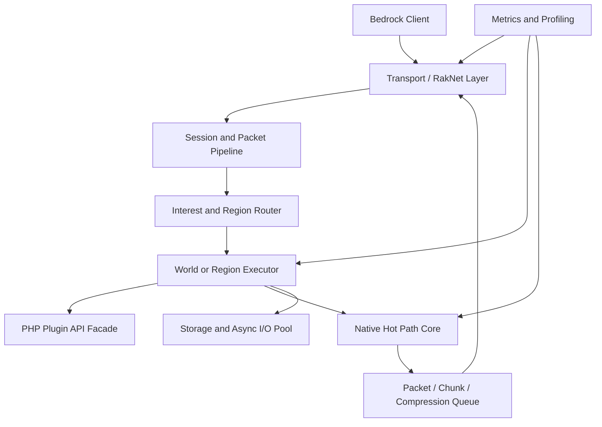

# PMMP 고성능 구현 기틀

이 문서는 PMMP를 기반으로 고성능 Bedrock 서버 코어를 구현하기 위한 설계 문서의 골격이다. 세부 구현은 벤치마크와 PMMP 코어 분석 결과를 채워 넣으면서 확장한다.

## 1. 목표

### 1.1 핵심 목표

- PMMP 플러그인 생태계와 API 호환성을 가능한 한 유지한다.
- 병목 구간을 PHP 객체 그래프가 아닌 네이티브 hot path로 이동한다.
- 청크, 패킷, 압축, 월드 I/O, 엔티티 업데이트를 계측 가능한 단위로 분리한다.
- Bedrock 프로토콜 업데이트 대응을 자동화 가능한 구조로 만든다.

### 1.2 비목표

- PMMP를 완전히 다른 엔진으로 재작성하지 않는다.
- 현 시점에서 NetherNet을 production transport로 전환하는 것을 1차 목표로 두지 않는다.
- PHP 전체 공유 메모리 멀티스레딩을 목표로 하지 않는다.
- 바닐라 BDS 완전 호환 서버를 목표로 하지 않는다.

## 2. 기준 환경

| 항목 | 기준 |
|---|---|
| PMMP 기준 | PMMP 5.x stable |
| PHP 기준 | PMMP PHP-Binaries production 권장 버전 |
| 운영체제 | Linux first, Windows는 개발/테스트 보조 |
| 주요 확장 | pmmpthread, chunkutils2, libdeflate, leveldb, encoding, morton |
| 측정 기준 | TPS, MSPT, p95/p99 latency, CPU, RSS, packet rate, chunk send rate |

## 3. 현재 구조 분석

### 3.1 PMMP 실행 흐름

- 부팅 및 Composer autoload
- 서버 tick loop
- RakLib/session 처리
- 월드 tick
- 청크 로딩/생성/전송
- 엔티티 업데이트
- 플러그인 이벤트와 scheduler
- 저장소 I/O

### 3.2 병목 후보

- packet encode/decode
- batch compression/decompression
- chunk serialization
- chunk cache miss
- player chunk send
- entity movement/collision
- inventory transaction
- plugin blocking I/O
- async worker queue contention
- GC와 임시 객체 생성

## 4. 아키텍처 방향

### 4.1 기본 원칙

- PHP는 플러그인 API, 게임 규칙, 정책 결정에 집중한다.
- 반복적이고 큰 데이터 처리는 네이티브 확장 또는 sidecar로 이동한다.
- region/world ownership을 명확히 하여 단일 작성자 원칙을 유지한다.
- worker 간 공유 상태는 PHP 객체가 아니라 immutable message 또는 native buffer로 넘긴다.
- 모든 최적화는 Timings, perf, flamegraph, microbench 결과로 검증한다.

### 4.2 권장 레이어

## 5. 구현 영역

### 5.1 네트워크와 패킷

- RakLib 유지 또는 edge transport 분리 검토
- packet batch buffer 재사용
- VarInt/NBT/binary codec hot path 분리
- compression flush 정책 실험
- malformed packet fuzzing

### 5.2 청크와 월드 데이터

- chunk cache hit rate 측정
- subchunk/palette native representation 검토
- chunk diff encode 후보 검토
- pregeneration 전제와 live generation 분리
- LevelDB I/O queue 분리

### 5.3 엔티티와 이동

- PlayerAuthInputPacket 처리 비용 측정
- movement validation branch 감소
- entity relevance filtering
- AOI 기반 update priority
- cross-region 이동 규칙 설계

### 5.4 플러그인 API 호환성

- plugin-facing API와 internal hot path 분리
- deprecated/internal namespace 직접 사용 감시
- plugin fixture suite 구성
- blocking I/O 감지와 경고

### 5.5 네이티브 확장 후보

| 후보 | 목적 | 우선순위 |
|---|---|---|
| packet codec extension | VarInt/NBT/batch encode 최적화 | 높음 |
| chunk diff/serializer extension | chunk send 비용 감소 | 높음 |
| queue/ring buffer extension | worker/session queue contention 감소 | 중간 |
| profiling hook extension | 저비용 계측 | 중간 |
| region core extension | 장기 구조 개편 | 높음, 난도 높음 |

## 6. 벤치마크 설계

### 6.1 마이크로 벤치마크

- packet encode/decode
- compression/decompression
- chunk serialize
- PlayerAuthInputPacket parse
- queue push/pop
- plugin event dispatch

### 6.2 서버 시나리오

- 50명 로비
- 100명 로비
- 100명 이동/청크 로딩
- 100명 전투/엔티티 밀집
- 300명 분산 월드
- 장시간 soak test

### 6.3 측정 항목

- TPS
- MSPT 평균, p95, p99
- CPU user/system
- RSS와 peak memory
- GC 횟수와 pause 추정
- packet in/out rate
- compression time
- chunk send queue length
- worker queue length

## 7. 로드맵

### 7.1 1단계: 기준선 고정

- PMMP stable 기준 브랜치 확정
- PMMP PHP-Binaries 기준 확정
- Timings/perf/flamegraph 수집 체계 구성
- 재현 가능한 테스트 월드와 플러그인 fixture 구성

### 7.2 2단계: hot path 측정

- 네트워크, 청크, 압축, 엔티티 이동 비용 분해
- 병목별 p95/p99 지표 확보
- 불필요한 객체 생성과 buffer copy 위치 표시

### 7.3 3단계: 네이티브 hot path 1차 구현

- packet/chunk/compression 경로부터 적용
- API 경계는 coarse-grained로 설계
- 기존 PMMP 동작과 regression test 비교

### 7.4 4단계: region/worker 구조 실험

- 단일 작성자 원칙 기반 owner 설계
- immutable message 경계 도입
- cross-region interaction 규칙 정의

### 7.5 5단계: 운영 자동화

- upstream PMMP release watcher
- BedrockProtocol/BedrockData 업데이트 추적
- benchmark CI
- canary, rollback, crash symbol archive

## 8. 위험 요소

| 위험 | 설명 | 완화 |
|---|---|---|
| 플러그인 호환성 파손 | internal namespace 또는 timing 차이로 기존 플러그인 오작동 | fixture suite, compatibility shim |
| 네이티브 확장 ABI 불안정 | PHP 버전과 OS별 빌드 차이 | PMMP PHP-Binaries 기준 고정 |
| 성능 개선 착시 | microbench 개선이 실제 서버에 반영되지 않음 | 통합 soak test와 p99 지표 사용 |
| 병렬화 race | region 경계와 world state owner 불명확 | 단일 작성자 원칙, deterministic replay |
| Bedrock 업데이트 추적 실패 | 프로토콜 변경으로 접속 불가 | upstream watcher, protocol fixture |

## 9. 산출물

- 기준선 성능 리포트
- 병목별 flamegraph
- PMMP fork 브랜치 전략
- plugin fixture suite
- packet/chunk/compression microbench
- 네이티브 확장 설계 문서
- region ownership 설계 문서
- 릴리즈와 롤백 절차

## 10. 참조 문서

- `PMMP_고성능_구현_출처정리.md`
- `PMMP_고성능_구현전략_요약판.md`
- `PMMP_고성능_구현전략_상세로드맵.md`
- `PMMP_고성능_구현전략_프로토콜중심_상세판.md`
- `Bedrock_Java_서버구동기_비교와_PMMP_고성능전략.md`
