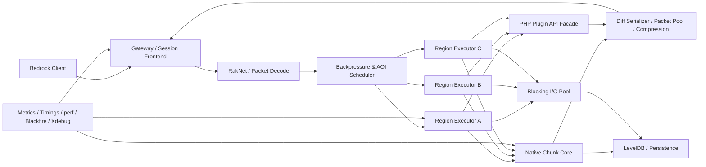
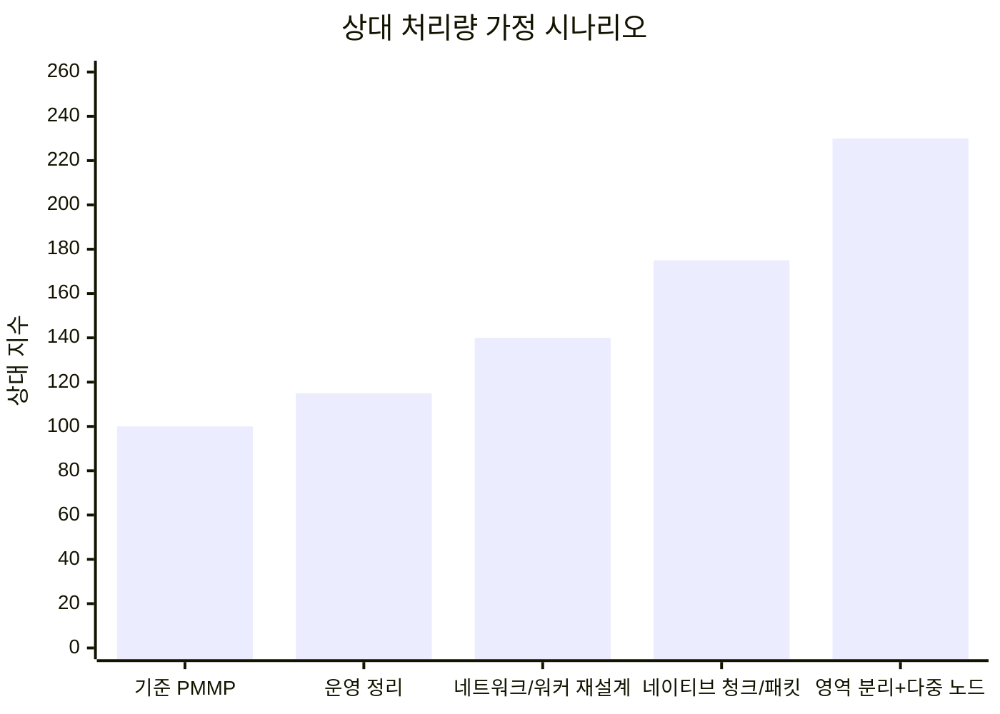
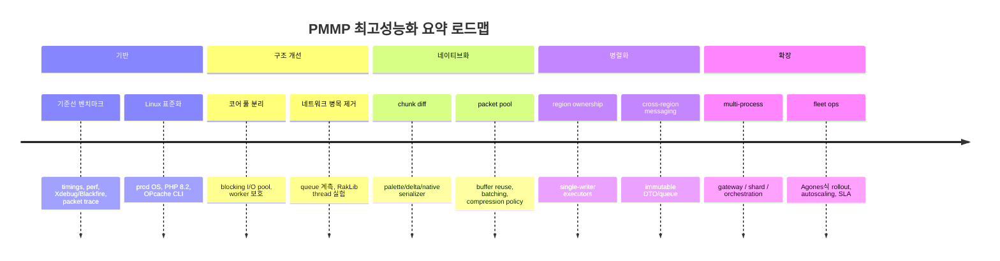

# 마인크래프트 Bedrock PMMP 고성능 구현 전략

## Executive Summary

이 조사에서 가장 중요한 결론은 하나다. **PMMP를 “그냥 더 빠른 PHP 서버”로 손보는 수준으로는 한계가 분명하며, 최상위 성능을 노린다면 `PHP API 유지 + 내부 핫패스의 네이티브화 + 네트워크/작업큐 구조 재설계 + 다중 프로세스/영역 분리`까지 가는 하이브리드 전략이 필요하다**는 점이다. PMMP는 이미 공식적으로 “PHP, C, C++로 작성된 Bedrock 서버 소프트웨어”이며, 실제로 `ext-chunkutils2`로 청크 핫패스를 C++로 옮기고, `ext-libdeflate`로 네트워크 압축을 가속하며, 별도 `PHP-Binaries` 체인으로 맞춤 런타임을 배포하고 있다. 즉, “PMMP에 C++를 더 넣는 것”은 방향 자체가 낯선 실험이 아니라 현재 코드베이스의 연장선이다. 다만 동시에 PMMP 문서는 여전히 멀티코어 활용이 나쁘기 때문에 **고클럭 CPU가 중요하다**고 명시하고 있으며, PHP 스레딩 문서와 `pmmpthread` 문서는 Zend 엔진이 본질적으로 공유 가변 상태와 저비용 병렬 처리에 맞지 않음을 분명히 말한다. citeturn30view3turn33view0turn33view1turn33view3turn30view1turn30view2turn35view0

네트워크 쪽에서는 “PMMP가 RakNet을 써서 느리니 NetherNet으로 바꾸면 된다”는 식의 단순 결론은 현재 시점에서 성립하지 않는다. Bedrock Wiki와 NetherNet 관련 저장소를 종합하면, **외부 공개 서버는 여전히 RakNet이 주력**이고, NetherNet은 **WebRTC 기반의 새 전송 계층**이지만 현재는 LAN/Xbox Live 중심이며 **직접 연결에 사용할 수 없고**, `go-nethernet`도 **basic version**이며 **feature-complete가 아니다**. 따라서 지금 PMMP에서 가장 큰 성능 이득은 전송 프로토콜 교체보다, **RakLib/RakLibIpc/pmmpthread 큐 구조의 병목 제거, 패킷 풀링, 청크 직렬화/압축 경로 네이티브화, 백프레셔와 관심영역 기반 전송**에서 나온다. citeturn24search0turn21view1turn21view0turn18search0turn32view0turn32view1

경쟁 구동기와 외부 사례는 방향을 분명히 보여준다. Dragonfly는 Go 기반의 **heavily asynchronous** 구조이며, Bedrock 프로토콜 라이브러리인 gophertunnel은 인증·패킷 조작·서버 생성까지 한 번에 다루는 “스위스 아미 나이프” 성격을 갖는다. Java 진영에서는 Folia가 **독립 region 병렬 tick**을, MultiPaper가 **단일 월드의 다중 서버 분산**을 실험하고 있다. FiveM의 OneSync는 **focus zone/culling/routing bucket**으로 관심영역을 제한하고, Roblox는 **network ownership**과 **MicroProfiler/Task Scheduler**를 전면에 내세운다. 학술적으로도 SEDA, Actor Model, Orleans, lock-free queue, zero-copy serialization, interest management 연구는 모두 “공유 상태를 줄이고, 전송량을 줄이고, 소유권을 분리하라”는 공통된 방향을 가리킨다. PMMP의 최고성능 구현은 이 흐름을 Bedrock/PMMP 현실에 맞게 재구성하는 문제다. citeturn21view4turn21view2turn21view3turn27view0turn27view1turn27view2turn27view3turn27view4turn28view4turn29search0turn29search1turn29search2turn13search0turn13search1turn15search11turn14search0turn14search4turn14search18turn14search7turn13search2turn15search4

아래는 이 보고서가 제안하는 **최우선 순위**다. 이 순서는 “플러그인 호환성을 유지하면서 PMMP를 최고성능화”한다는 목표를 기준으로 잡았다. 각 항목의 근거는 표의 마지막 열에 달았다.

| 우선순위 | 권장 작업 | 기대 효과 | 난이도 | 근거 |
|---|---|---:|---:|---|
| 매우 높음 | RakLib IPC 경로 재설계 또는 RakLib main-thread 통합 실험 | 네트워크 지연, 큐 ballooning, 락 경합 감소 | 높음 | `Threaded` 기반 큐가 lag spike 후 지속적 성능 저하를 낼 수 있고, maintainer가 RakLib의 thread 제거 가능성을 공식 검토 중이다. citeturn32view0turn32view1 |
| 매우 높음 | 청크 직렬화·팔레트·diff 인코더를 C++ 확장으로 확대 | 청크 전송·메모리 사용량 동시 개선 | 중간~높음 | `ext-chunkutils2`는 이미 성능 민감 청크 처리를 C++로 옮겼고, chunk cache는 큰 이득을 낸다. citeturn33view0turn40search5 |
| 매우 높음 | AsyncWorker를 “코어 풀”과 “블로킹 I/O 풀”로 분리 | 플러그인 I/O가 코어 청크/압축 파이프라인을 막는 문제 해소 | 중간 | maintainer가 블로킹 AsyncTask가 chunk serialization/compression을 지연시킨다고 명시했다. citeturn32view3turn40search0 |
| 높음 | libdeflate 중심의 적응형 압축 정책, 패킷 풀링, 배치 flush 최적화 | 브로드캐스트/전송 CPU 절감 | 중간 | PMMP는 libdeflate를 zlib 대비 훨씬 빠른 대안으로 채택했고, 과거에는 압축 레벨을 CPU 비용 때문에 낮춘 적이 있다. citeturn33view1turn33view2turn40search11 |
| 높음 | 월드/영역 단위 소유권 모델 도입 | 멀티코어 확장성 증가 | 높음 | Folia, Actor Model, Orleans는 모두 소유권이 분리된 상태·메시지 전달을 전제로 확장성을 얻는다. citeturn27view0turn27view1turn13search1turn15search11 |
| 높음 | 프리젠, chunk cache 강화, 관심영역 기반 엔티티/청크 전송 | 핫스팟 시나리오에서 네트워크 및 chunk worker 압박 감소 | 중간 | Folia는 프리젠을 강하게 권장하고, PMMP chunk cache는 대규모 이득을 제공하며, OneSync/interest management 연구는 AOI 제한의 효과를 보여준다. citeturn27view2turn40search5turn28view4turn13search2turn15search4 |
| 중간 | PHP API 유지형 하이브리드 ABI 설계 및 CI/CD 자동 배포 | 플러그인 생태계 보존 + 핵심 경로 네이티브 최적화 | 높음 | PMMP는 이미 custom PHP binaries와 native extension 배포 체인을 운영한다. citeturn30view0turn33view3turn34search4 |

## 결론의 방향

PMMP는 현재도 활발히 유지보수되는 Bedrock 전용 서버이며, 2026년 5월 기준 GitHub Releases에는 **PocketMine-MP 5.43.2 / 5.43.1 / 5.43.0** 계열이 보이고, 5.43.1은 Bedrock 1.26.20용 bugfix/security release로 표시되어 있다. 동시에 PMMP 저장소는 PMMP가 **강력한 플러그인 API와 커뮤니티를 가진 custom Bedrock server**라고 설명하면서도, **바닐라 survival용으로는 부적합**하고 바닐라 world gen, redstone, mob AI 등이 부족하다고 명시한다. 다시 말해 “최강 성능 PMMP”의 현실적인 목표는 **바닐라 BDS를 이기는 survival 호환 엔진**이 아니라, **커스텀 게임·미니게임·로비·네트워크형 Bedrock 플랫폼**을 만드는 데 더 가깝다. citeturn31view0turn31view2turn30view3

이 점은 공식 Bedrock 문서와도 맞물린다. Microsoft Learn은 Bedrock Dedicated Server를 공식 배포하고, Script API·`@minecraft/server-net`·`@minecraft/server-admin` 같은 전용 서버 기능을 계속 확장하고 있지만, 동시에 **Minecraft protocol은 end users를 위한 지원 API가 아니며, 버전마다 크게 변할 수 있고 하위호환 보장이 없다**고 경고한다. 따라서 PMMP를 고성능으로 만드는 프로젝트는 단순 최적화가 아니라, **프로토콜 추적·업데이트 자동화·회귀 테스트까지 포함한 운영 공학**이기도 하다. citeturn41search2turn41search3turn41search7turn41search12turn41search1

여기서 전략이 갈린다. **플러그인 호환성 유지가 최우선**이면 PMMP 내부를 뜯어고치는 하이브리드 아키텍처가 정답이고, **처음부터 엔진을 새로 짜도 된다**면 Dragonfly나 Go/Rust 기반 신형 구동기 접근이 더 구조적으로 유리하다. 그러나 사용자의 요구는 “PMMP 자체를 고성능으로 만든다”이므로, 이 보고서는 후자를 벤치마크 대상으로 쓰되, 최종 권고는 전자에 둔다. citeturn21view4turn21view2turn30view3

## 현재 스택과 경쟁 구동기 비교

아래 표는 **PMMP 고성능화 관점**에서 각 구동기/참조 아키텍처를 비교한 것이다. Java Edition 계열인 Folia·MultiPaper는 직접적인 Bedrock 대체재가 아니라, **멀티스레딩·분산 설계의 참조 모델**로 봐야 한다.

| 구분 | 언어 | 네트워크 스택 | 동시성 모델 | 강점 | 약점 | 추천 용도 | 근거 |
|---|---|---|---|---|---|---|---|
| PMMP | PHP + C/C++ | RakLib 기반 RakNet, BedrockProtocol | 메인 스레드 중심 + worker + RakLib thread | 강력한 플러그인 API, 큰 커뮤니티, 빠른 버전 대응, 네이티브 확장 이미 존재 | 멀티코어 활용이 약하고, 바닐라 기능이 부족하며, PHP 스레딩 제약이 큼 | 커스텀 게임, 로비, 네트워크형 서버 | citeturn30view3turn30view1turn18search0turn33view0turn33view1 |
| PMMP 하이브리드 목표형 | PHP API + 내부 C/C++ 확장 강화 | RakNet 유지, IPC/큐 재설계, 패킷 풀링 | 영역/월드 소유권 + 전용 코어 풀 + 블로킹 I/O 풀 | 호환성 보존, 단계적 이행 가능 | 설계 난이도 높음, ABI/디버깅 복잡 | “가장 뛰어난 성능의 PMMP” 목표에 최적 | PMMP의 현재 네이티브 확장 구조와 worker 병목, RakLib thread 재검토 이슈를 결합한 보고서 권고다. citeturn33view0turn33view1turn32view1turn32view3 |
| Dragonfly | Go | gophertunnel 기반 Bedrock 프로토콜, 보통 RakNet 경로 사용 | heavily asynchronous | Go 런타임, 비동기 지향, 라이브러리형 확장성 | PMMP 플러그인과 비호환, PMMP 생태계 재사용 어려움 | 새 엔진 작성, 장기 재구성 | citeturn21view4turn21view2turn21view3 |
| BDS | 네이티브 바이너리 | 공식 Bedrock 전용 | 폐쇄형 내부 구현 | 공식 서버, 바닐라 호환성, Script API/전용 모듈 확장 | PMMP 같은 플러그인 ABI 부재, 프로토콜은 공식 지원 API 아님 | 바닐라 survival, 공식 호환성 우선 | citeturn41search2turn41search3turn41search7turn41search12turn41search1 |
| PowerNukkitX | Java | Bedrock 계열 네트워크 스택 | JVM 기반 서버 루프 | 커스텀 아이템/블록/엔티티, 바닐라형 기능 범위 확장 | PMMP와 API/생태계 불일치 | Java 친화 Bedrock 커스텀 서버 | citeturn16search0turn16search11turn16search20 |
| Cloudburst Nukkit | Java | Bedrock 계열 | JVM 기반 서버 루프 | Java 기여 친화성, PMMP보다 전통적으로 “더 빠르고 안정적”이라는 프로젝트 설명 | 기능/업데이트 편차, PMMP 플러그인 재사용 불가 | Java 기반 Bedrock 실험/개조 | citeturn16search1turn16search18 |
| Folia | Java Edition | Netty/Paper 계열 | regionised multithreading | 지역 단위 병렬 tick, 독립 region 설계가 매우 명확 | Bedrock 아님, 플러그인 호환 제약, spread-out workload에 유리 | PMMP 영역 소유권 설계의 참조 모델 | citeturn27view0turn27view1turn27view2turn26search5 |
| MultiPaper | Java Edition | Paper 분산 계열 | 다중 서버 단일 월드 분산 | chunk ownership·캐시·마스터 기반 수평 확장 | 운영 복잡도, 동기화 리스크 | 1000+ 설계를 위한 참조 모델 | citeturn27view3turn27view4turn26search6 |

이 표를 요약하면, **PMMP를 버리지 않는 한 가장 합리적인 전략은 Dragonfly를 “교체 후보”가 아니라 “설계 아이디어 공급원”으로 쓰는 것**이다. Dragonfly가 빠르다고 알려진 핵심 이유는 “Go라서”만이 아니라, **비동기 중심 구조와 라이브러리형 설계** 때문이다. 같은 이유로 Folia는 Bedrock 서버로서가 아니라, **여러 region이 동시에 tick해도 race condition이 없도록 invariant를 먼저 세운다**는 점에서 매우 중요한 참고 자료다. citeturn21view4turn27view1

또한 **NetherNet은 지금 당장 PMMP의 주력 대체 전송 계층으로 보기 어렵다**. Bedrock Wiki는 RakNet이 외부 서버의 main protocol이라고 설명하고, NetherNet은 Xbox Live/LAN 중심의 WebRTC 기반 새 프로토콜이지만 “new and not finished”라고 적고 있다. `nethernet-spec` 저장소 역시 reverse engineering 문서이며, **직접 연결에 쓸 수 없고** 언제든 outdated 될 수 있다고 경고한다. `go-nethernet` README도 feature-complete가 아니라고 밝힌다. 따라서 PMMP가 지금 당장 해야 할 일은 “NetherNet 올인”이 아니라, **RakNet 경로를 더 잘 쓰는 것**이다. citeturn24search0turn24search2turn21view1turn21view0

## 핵심 병목과 해결 전략

### 네트워크 계층

PMMP 네트워크 최적화의 가장 큰 병목은 **전송 프로토콜 자체보다 RakLib를 둘러싼 IPC와 큐 구조**에 있다. RakLib는 “Bedrock server를 동작시키기 위한 bare minimum RakNet server implementation”으로 설명되며, PocketMine 이슈에서는 maintainer가 **RakLib를 thread 밖으로 빼는 실험**을 공식적으로 제안했다. 이유도 분명하다. 현 구조는 “various issues, reduced flexibility, and maybe the performance gains aren’t worth it”라는 것이다. 여기에 `pmmpthread` 이슈 #42는 더욱 직접적이다. RakLib가 양방향 통신에 쓰는 `Threaded` 객체는 stop-the-world에 가까운 lag spike가 오면 내부 HashTable이 ballooning되어, spike가 끝난 뒤에도 읽기 비용이 비싸게 남고 writer도 lock 경쟁으로 느려진다. 이 조합은 PMMP가 네트워크에서 겪는 “설명하기 어려운 지속적 지연”의 구조적 원인 후보로 매우 강하다. citeturn18search0turn32view1turn32view0

이 문제에 대한 권고는 명확하다. **단기적으로는 RakLibIpc 경로를 ring buffer/SPSC 혹은 bounded MPSC queue 기반으로 재작성하고, 중기적으로는 RakLib main-thread 통합 혹은 별도 네트워크 프로세스 분리 실험을 병행**하는 것이 맞다. 이때 이론적 참고점은 Michael–Scott queue와 SCQ 같은 lock-free FIFO 연구이며, 실제 서버 구조 관점에서는 SEDA가 적합하다. SEDA는 네트워크 수신, 디코드, 세션 관리, 월드 반영, 송신 준비, 압축, 송신을 **backpressure 가능한 stage**로 쪼개어 병목이 전체 시스템을 오염시키지 않도록 하는 설계를 제안한다. PMMP의 RakLib/RakLibIpc 재구성은 사실상 이 staged pipeline을 Bedrock 문맥에 맞게 재구현하는 작업이다. citeturn14search18turn14search7turn13search0turn32view0turn32view1

압축과 직렬화 쪽은 이미 PMMP가 올바른 방향을 잡고 있다. 공식 changelog는 `libdeflate`가 outbound packet compression에서 **대부분의 경우 zlib보다 두 배 이상 빠르다**고 설명하고, `ext-libdeflate` 저장소도 libdeflate를 “significantly better performance” 대안으로 소개한다. 과거 changelog에서 기본 압축 레벨을 7에서 6으로 낮춘 이유 역시 **25% 더 비싼 CPU 비용이 bandwidth 이득 대비 작았기 때문**이었다. 즉, PMMP 네트워크는 원래부터 “대역폭보다 CPU가 더 먼저 터진다”는 경험 법칙을 갖고 있었다. 그러므로 최고성능 PMMP는 **패킷 종류별 압축 정책**, **브로드캐스트 dedup**, **session buffer pooling**, **zero-copy에 가까운 scatter-gather 송신**, **object pool / slab arena**를 우선한다. 최근 zero-copy serialization 연구는 scatter-gather I/O가 **512B 수준의 작은 버퍼에서도 의미 있는 이득**을 낼 수 있음을 보였고, Cornflakes는 네트워크 스택과 serialization API를 함께 설계해야 진짜 이득이 난다고 주장한다. PMMP라면 이 교훈을 “PHP 문자열을 계속 새로 조립하지 말고, 네이티브 버퍼 조각과 packet view를 유지하라”는 식으로 적용해야 한다. citeturn33view1turn33view2turn40search11turn14search0turn14search4turn14search8

마지막으로, 네트워크는 **AOI 관심영역 모델**을 더 강하게 써야 한다. GTA FiveM의 OneSync는 culling과 routing bucket으로 클라이언트가 필요 없는 엔티티를 거의 아예 만들지 않도록 하며, scope enter/leave 이벤트조차 성능 주의를 붙인다. Roblox는 물리 객체의 **network ownership**을 client/server에 나눠 작업량을 분산하고, Task Scheduler와 MicroProfiler로 frame budget을 관리한다. MMOG interest management 연구와 Donnybrook도 “모든 상태를 모든 플레이어에게 같은 빈도로 보내지 말라”고 말한다. PMMP에 이걸 옮기면, **청크 송신 예산·엔티티 복제 빈도·관심영역 우선순위·패킷 coalescing**이 성능 핵심이 된다. citeturn28view4turn29search0turn29search1turn29search2turn13search2turn15search4

### 멀티스레딩과 작업 큐

PMMP 문서는 이미 “PocketMine-MP is notoriously bad at multi-core usage”라고 말하고, “higher CPU frequency instead of lots of cores”를 권한다. 또 PHP threading 설명서는 PHP가 본래 웹 요청 처리에 최적화되어 왔고, **중요한 내부 자료구조를 thread 간에 공유하도록 설계되지 않았다**고 설명한다. `pmmpthread` README 역시 기대치를 낮추라고 하며, Zend 엔진의 제약으로 인해 **많은 것이 불가능하거나, 가능해도 너무 비싸다**고 적고 있다. 이 사실은 “PMMP를 Folia처럼 완전 병렬화하면 된다”는 발상이 왜 위험한지 설명해 준다. PMMP에서는 **공유 상태를 락으로 보호하는 설계보다, 소유권이 명확한 actor/region 모델**이 훨씬 적합하다. citeturn30view1turn30view2turn35view0

따라서 멀티스레딩 전략은 “전부 병렬화”가 아니라 다음 세 단계여야 한다. 첫째, **코어 작업과 블로킹 작업을 분리**한다. 이를 뒷받침하는 가장 직접적인 근거가 maintainer 이슈다. PMMP는 worker들을 chunk serialization, compression, world generation에 쓰는데, 플러그인이 blocking AsyncTask를 넣으면 코어가 놀고 있음에도 코어 작업은 지연된다. 둘째, **월드 혹은 region 단위 단일 writer 원칙**을 세운다. 이는 Folia의 region invariants, Actor Model, Orleans virtual actors와 잘 맞는다. 셋째, **메시지 전달은 bounded queue와 immutable DTO** 중심으로 설계한다. 이 셋을 묶으면 PMMP의 멀티스레딩은 “PHP 전체를 병렬 실행”하는 것이 아니라, “PHP API는 region executor에 얹고, 네이티브/비동기 서비스는 메시지로 상호작용”하는 형태가 된다. citeturn32view3turn40search0turn27view0turn27view1turn13search1turn15search11

실무적으로는 **월드별 스레드**보다 **region executor + global scheduler**가 낫다. 월드 하나 안에서도 플레이어가 흩어지면 병렬성이 생기기 때문이다. 이 점은 Folia FAQ의 하드웨어 가이드에서도 드러난다. Folia는 330명 테스트 서버 기준으로 netty I/O, chunk I/O, chunk worker, tick thread를 separately 계산하라고 권하고, 총 코어 사용률 80% 이하를 권한다. PMMP에 이를 그대로 복사할 수는 없지만, **쓰레드 예산을 기능별로 미리 배분하고, 남은 예산만 tick/region에 배정하라**는 원칙은 그대로 유효하다. citeturn27view2

### 청크 시스템과 직렬화

PMMP가 이미 채택한 가장 중요한 최적화 중 하나가 **chunk cache와 chunkutils2**다. `ext-chunkutils2`는 청크 시스템의 performance-sensitive component를 C++로 옮겨 **성능과 메모리 사용량을 동시에 줄이기 위해** 만들어졌고, 과거 PMMP 이슈는 chunk cache가 이제 “super lightweight”이며, **모든 worker thread를 써서 compression을 하고, 같은 chunk를 매번 다시 압축하지 않으며, cached chunk packet의 메모리 footprint를 in-memory chunk의 2% 미만으로 유지**한다고 설명한다. 이건 중요한 메시지다. 즉, PMMP 청크 성능 향상의 가장 확실한 방향은 “청크를 더 빨리 매번 새로 만들기”가 아니라 **청크를 덜 만들고, 덜 다시 압축하고, 더 오래 재사용하는 것**이다. citeturn33view0turn40search5

여기서 다음 단계는 **팔레트 기반 native chunk view + diff encoder + 수신자별 delta budgeting**이다. Bedrock 프로토콜 레벨에서는 VarInt와 compact header를 적극 쓰며, Bedrock Wiki 문서도 game packet header가 bandwidth 절감을 위해 compact format을 사용한다고 설명한다. 동시에 PMMP 4.0 changelog는 플레이어가 같은 미생성 chunk를 반복 요청하는 문제를 고쳤고, 3.15 changelog는 chunk generating first join 시 chunk requesting 성능 이슈를 고쳤다. 즉, chunk path는 오래전부터 핵심 병목이었다. 그러므로 “subchunk palette native struct를 유지하고, 변경된 subchunk만 diff 직렬화하며, 아직 필요 없는 청크는 낮은 우선순위로 밀어내는” 구조가 최고성능 PMMP의 필수 조건이다. 이 권고는 `PalettedBlockArray`를 이미 네이티브화한 현재 흐름과 정확히 이어진다. citeturn24search1turn40search6turn40search11turn33view0

또한 **프리젠**은 더 이상 선택이 아니다. Folia는 공식 FAQ에서 world pre-generation을 강하게 권하며, pre-generated world일 때 chunk system worker 수요가 크게 줄어든다고 말한다. PMMP 맥락에서도 이 교훈은 그대로 적용된다. 100명 이상, 특히 300명 이상을 노리면 “live generation을 잘 하겠다”가 아니라 **generation 부하를 런타임에서 제거**해야 한다. 최고성능 PMMP에서 프리젠이 기본값이 아닌 시나리오는 사실상 개발 서버나 일회성 테스트뿐이다. citeturn27view2

### 객체·메모리 관리

PHP 최적화에서 가장 자주 오해되는 부분은 “PHP 8이니까 JIT가 알아서 빠르게 해 준다”는 생각이다. 실제로 PMMP가 제공하는 production recommendation은 현재도 **PHP 8.2**이고, PHP-Binaries 릴리스는 8.3/8.4/8.5 계열에 대해 PMMP 5.x 플러그인이 잘 동작하지 않을 수 있다고 경고한다. OPcache는 CLI에서도 켤 수 있고, `pmmpthread` README는 OPcache를 **강하게 권장**하면서 메모리 사용량과 thread startup 성능 이득을 설명한다. 반면 PHP 8.0 릴리스 문서는 JIT가 synthetic benchmark에서는 크지만 **typical application performance는 PHP 7.4와 비슷하다**고 쓴다. 따라서 PMMP에서 JIT는 “기본 승수”가 아니라 **벤치마크 대상 옵션**이다. 기본 권고는 **OPcache CLI 활성화 + production-grade 8.2 런타임 고정 + JIT는 A/B 실험 후 채택**이다. citeturn33view3turn35view0turn38search0turn38search4turn39search8

메모리 모델 측면에서도, PHP 내부는 결코 “공짜”가 아니다. PHP manual은 변수 컨테이너인 zval이 type/value와 reference counting을 갖는다고 설명하고, PHP Internals Book은 simple value와 complex value의 저장 방식이 다르며, 값 semantics와 reference counting/copy-on-write를 이해해야 효율적인 extension code를 작성할 수 있다고 말한다. 이건 PMMP 고성능화에서 왜 **world state를 PHP object forest로 두는 것이 비싸고**, 왜 **native struct + read-only PHP facade**가 유리한지를 설명하는 핵심 근거다. 청크, subchunk palette, 엔티티 transform, 네트워크 패킷 header처럼 고빈도·고밀도 데이터는 zval/object graph로 오래 유지할수록 손해다. citeturn42search15turn42search2turn42search4

생산 환경에서는 운영체제 선택도 중요하다. PMMP 이슈는 **Windows의 64Hz scheduler resolution** 때문에 `usleep()`, `wait()`류가 15.6ms까지 더 기다릴 수 있어 tick scheduling과 thread pool 기반 병렬화에 악영향을 준다고 설명한다. PMMP 요구사항 문서도 Windows를 지원은 하지만, production 용도라면 Linux 쪽이 유리하다는 maintainer 맥락과 잘 맞는다. 결론은 단순하다. **최고성능 PMMP는 Linux-first로 설계해야 한다.** BDS 역시 Ubuntu만을 공식 지원 Linux 배포판으로 명시한다. citeturn32view2turn30view1turn41search2

### PHP-C++ 하이브리드 아키텍처

PMMP를 고성능화하면서도 플러그인 호환성을 유지하려면, 가장 현실적인 구조는 **공개 API는 PHP에 남기고, 내부 코어 상태는 네이티브로 옮기는 계층화**다. 이미 PMMP는 custom PHP binaries, `pmmpthread`, `chunkutils2`, `libdeflate`, LevelDB, Xdebug 등을 하나의 빌드 체인으로 관리한다. 즉 확장 빌드·배포 인프라는 준비되어 있다. 남은 문제는 기술 설계다. citeturn30view0turn33view3turn34search4

권장 구조는 다음과 같다. **청크·패킷·엔티티 상태의 canonical representation은 C/C++ 확장에 두고**, PHP 쪽에는 façade/domain object를 둔다. 플러그인은 PHP API를 통해 읽고 명령하지만, 내부적으로는 native ID/handle을 넘기게 한다. write path는 region executor 단 하나만 허용하고, 외부 worker나 network thread는 immutable snapshot 혹은 message를 보낸다. 이런 구조면 플러그인 ABI를 갑자기 파괴하지 않으면서 hot path를 네이티브화할 수 있다. `ext-chunkutils2`가 이미 그 방향으로 가고 있고, `pmmpthread`의 “share nothing, do everything” 철학도 이 설계와 잘 맞는다. citeturn33view0turn35view0

이때 새로 만들 가치가 큰 확장은 아래와 같다. 이는 이 보고서의 설계 권고이며, 현재 PMMP의 native extension 흐름과 위 병목 분석을 바탕으로 한 것이다.

| 확장 후보 | 목적 | 기대 이득 | 호환성 리스크 | 근거 |
|---|---|---:|---:|---|
| `ext-rakqueue` | RakLib IPC용 bounded lock-free queue / ring buffer | 높음 | 중간 | `Threaded` queue ballooning과 RakLib thread 제거 검토 이슈가 직접 근거다. citeturn32view0turn32view1 |
| `ext-packetpool` | packet header/body slab, buffer recycling, scatter-gather view | 높음 | 낮음~중간 | libdeflate, zero-copy serialization 연구, packet broadcast 병목이 근거다. citeturn33view2turn14search0turn14search4 |
| `ext-palettediff` | subchunk palette diff encoder / per-recipient delta serializer | 높음 | 중간 | chunkutils2의 현재 역할과 chunk cache 구조가 근거다. citeturn33view0turn40search5 |
| `ext-regioncore` | region ownership state, entity transform/native component storage | 매우 높음 | 높음 | Folia region invariants, actor/orleans 패턴이 근거다. citeturn27view1turn13search1turn15search11 |
| `ext-profhooks` | low-overhead timings/perf hooks exported to PHP and perf | 중간 | 낮음 | PMMP timings, perf/Xdebug/Blackfire/Valgrind 도구 체인이 근거다. citeturn20search0turn36search3turn36search0turn36search17turn37search1 |

## 권장 아키텍처와 다이어그램

권장 아키텍처는 **단일 거대 PMMP 프로세스**가 아니라, “플러그인 호환성은 PMMP에 남기되, 핫패스는 내부 서비스처럼 분해한 PMMP”다. 핵심은 네 가지다. **게이트웨이와 게임 루프를 분리하고, region ownership을 강제하고, 네이티브 canonical state를 두고, 블로킹 I/O를 코어 풀 밖으로 밀어낸다.** 이 설계는 PMMP의 현재 구조와 Folia/Dragonfly/OneSync/Agones에서 본 확장 원리를 결합한 것이다. citeturn32view3turn27view1turn21view4turn28view4turn13search3

이 구조에서 중요한 운영 원칙은 다음과 같다. **퍼블릭 네트워크는 RakNet 경로를 유지**하되, 내부적으로는 session frontend를 게임 상태와 느슨하게 결합한다. **region executor는 단일 writer**로만 동작하게 하여 락을 거의 제거한다. **chunk·entity·packet은 네이티브 구조가 원본**이고, PHP는 그것을 감싼다. **플러그인 I/O와 외부 API 호출은 blocking pool**로 보내 코어 worker를 보호한다. 그리고 **AOI scheduler가 청크·엔티티·브로드캐스트 우선순위를 산정**해 송신량을 제어한다. 이건 FiveM의 culling/bucket, Roblox의 ownership, MMOG interest management, PMMP의 chunk cache 철학을 Bedrock 서버 문맥으로 옮긴 것이다. citeturn28view4turn29search0turn13search2turn15search4turn40search5

아래 차트는 **실측값이 아니라**, 위 구조적 개선을 모두 단계적으로 넣었을 때의 **상대 처리량 가정 시나리오**다. 기준값 100은 “현재의 잘 튜닝된 단일 PMMP 프로세스”다. 수치는 ext-chunkutils2/libdeflate, worker 분리, RakLib thread/queue 병목 제거, chunk cache 강화, region ownership, 분산 운영 패턴의 효과를 반영한 **설계 추정치**다. 실제 수치는 플러그인 종류, 월드 생성 여부, 엔티티 밀도, 클라이언트 분산도에 따라 크게 달라진다. citeturn33view0turn33view2turn32view0turn32view1turn32view3turn27view1turn27view2turn27view4

이 차트의 의미는 “반드시 2.3배 빨라진다”가 아니다. 의미는 오히려 반대다. **초기 최적화는 10~15%씩 쌓이고, 진짜 큰 점프는 네트워크 IPC와 canonical state 구조를 바꾼 뒤에 나온다**는 것이다. PMMP를 최고성능화하려면 옵션 조정보다 **구조 변경이 ROI가 훨씬 크다.** citeturn32view0turn32view1turn33view0turn40search5

## 로드맵

### 요약 로드맵

아래 한 페이지 로드맵은 “무엇을 언제까지 끝내야 하는가”를 최대한 압축한 것이다. 인력 규모가 미정이므로 1인, 3~5인, 10+ 팀으로 나눠 적었다. 이 일정은 **개념 증명→핵심 병목 제거→네이티브화→영역/분산화** 순서를 따른다. 이 순서 자체는 PMMP의 병목 구조와 Folia/MultiPaper/Agones reference pattern을 바탕으로 한 권고다. citeturn32view1turn32view3turn27view1turn27view4turn13search3

| 단계 | 기간 가정 | 핵심 산출물 | 1인 | 3~5인 | 10+ 팀 | 테스트 게이트 | 주요 리스크 |
|---|---|---|---|---|---|---|---|
| 기준선 확보 | 2~4주 | 재현 가능한 벤치마크, flamegraph, timings baseline | 가능 | 가능 | 가능 | 100 CCU 재현 | 잘못된 벤치마크가 전체 방향을 왜곡 |
| 네트워크/워커 정리 | 4~8주 | blocking pool 분리, queue 계측, packet budget | 무리 없이 가능 | 가능 | 가능 | join storm/packet flood | 플러그인 호환 부작용 |
| 네이티브 청크/패킷 확대 | 2~4개월 | `ext-palettediff`, packet pool, native canonical state 일부 | 어렵다 | 적정 | 가능 | 300 CCU spread/hotspot | C++ 확장 안정성, 크래시 디버깅 |
| 영역 소유권 도입 | 3~6개월 | region executor, immutable message path | 매우 어렵다 | 가능 | 적합 | cross-region correctness | race/consistency bug |
| 다중 프로세스/다중 노드 | 6~12개월 | gateway 분리, world shard, orchestration | 사실상 불가 | 제한적 | 적합 | 1000+ synthetic | 운영 복잡도 급증 |

### 상세 로드맵

상세 로드맵은 단계별로 **기술 작업, 필요한 인력, 테스트, 성공 조건, 리스크**를 분리해야 한다.

| 단계 | 기술 작업 | 필요 역량 | 필수 테스트 | 성공 조건 | 리스크 관리 |
|---|---|---|---|---|---|
| 기준선 확보 | PMMP timings 정리, `perf record`/`perf report`, Xdebug profiler, Blackfire CLI 프로파일, packet 캡처, 청크 join/resend 추적 | PHP, Linux perf, PMMP 내부 구조 | 빈 서버, 100 CCU, 300 CCU, 프리젠/라이브젠 분리 | load별 hotspot이 명확한 flamegraph 확보 | 정확한 워크로드 고정, seed 고정, plugin set 고정 |
| 네트워크/워커 정리 | AsyncWorker를 core vs blocking pool로 분리, queue depth/latency 메트릭 추가, compression stage 계측 | PHP concurrency, pmmpthread | disk I/O 폭탄, HTTP API plugin, resource pack 전송 | 코어 worker starvation 제거 | 플러그인 문서화, deprecated API 제공 |
| RakLib 재설계 | RakLibIpc ring buffer 실험, main-thread RakLib branch, session stats 노출 | PHP/C, IPC, socket/RakNet | packet flood, reorder/loss, reconnect storm | queue ballooning 현상 제거 | feature flag 유지, A/B deploy |
| 청크 네이티브화 | `ext-palettediff`, subchunk palette snapshot, native serializer, chunk cache 개선 | C/C++, PHP extension | world edit storm, player turn spam, teleport burst | Player Chunk Send/Compress 지표 대폭 개선 | ASAN/Valgrind/Callgrind로 메모리 검증 |
| 영역 소유권 | region executor, mailbox, entity/chunk ownership, inter-region teleport path | 시스템 설계, lock-free/actor model | hotspot PvP vs spread SMP, cross-region entity interactions | region 간 race-free tick | invariant 검증기, assert build, fuzz |
| 다중 노드 | gateway, shard/world router, persistence coordination, orchestration | SRE, distributed systems | node failover, rolling upgrade, packet/session migration | 1000+ synthetic/실사용 혼합 | Agones/rollout·blue-green·backup 전략 |

이 로드맵에서 **1인 개발자**는 “기준선 확보 + worker 분리 + 청크 네이티브화 일부”까지가 현실적 한계다. **3~5인 팀**은 region ownership까지 가능하다. **10+ 팀**이 되어야 multi-process / multi-node / orchestration까지 안정적으로 가져갈 수 있다. 이건 PMMP 자체가 이미 복합 언어 스택(PHP, C, C++, custom binaries)을 갖고 있고, 분산 운영 단계에서는 Agones/MultiPaper류의 운영 복잡도가 추가되기 때문이다. citeturn30view3turn30view0turn13search3turn27view4

## 측정·검증·운영

### 운영 목표와 하드웨어 시나리오

사용자가 동접 수와 예산을 정하지 않았으므로, 아래 표는 **설계 가정**이다. 이 표는 PMMP의 고클럭 선호, Folia의 16코어 권고, MultiPaper/Agones의 분산 패턴을 합쳐 만든 추천안이다. 실제 수용 인원은 월드 분산도, 엔티티 밀도, 플러그인 부하, 프리젠 여부에 따라 크게 달라진다. citeturn30view1turn27view2turn27view3turn13search3

| 시나리오 | 추천 구조 | 하드웨어 프로파일 | 목표 SLA | 비고 |
|---|---|---|---|---|
| 100 CCU 이하 | 단일 PMMP 하이브리드 프로세스 | 고클럭 8코어급, 32GB RAM, NVMe, Linux | 99.5% | 프리젠 필수, worker/I/O 분리만 해도 체감 큼 |
| 300 CCU급 | 단일 노드 + regionized 내부 구조, 또는 2~3개 게임 프로세스 | 16코어급, 64GB RAM, NVMe, Linux | 99.9% | hotspot보다 spread-out workload에 유리 |
| 1000+ | gateway + shard/world router + 다중 게임 노드 + orchestration | 여러 노드, 10GbE급 내부망 권장, 128GB+ fleet | 99.9%+ | “하나의 거대한 PMMP 프로세스”로는 비현실적 |

### 벤치마크와 테스트 시나리오

최고성능 PMMP를 만들 때 가장 흔한 실패는 “무엇을 측정하는지 모르는 상태에서 최적화하는 것”이다. PMMP는 자체 timings를 제공하고, API 문서에는 `Full Server Tick`, `Player Chunk Send`, `PlayerNetworkSendCompress`, `broadcastPackets`, `asyncTaskWorkers` 등 핵심 타이머가 공개되어 있다. 여기에 Linux `perf`, Xdebug, Blackfire, ASAN, Valgrind/Callgrind를 겹쳐야 전체 그림이 나온다. citeturn20search0turn20search1turn36search3turn36search0turn36search17turn36search2turn37search0turn37search1

| 테스트 이름 | 목적 | 측정 지표 | 합격 기준 |
|---|---|---|---|
| Join Storm | 청크 생성/직렬화/초기 패킷 burst 검증 | join latency, chunk send latency, compression CPU | P95 join time이 목표 이하, tick stall 없음 |
| Spread SMP | region/월드 분산 시나리오 | region queue depth, chunk I/O, broadcast CPU | spread-out 시 스레드 확장 이득 발생 |
| Hotspot PvP | 한 청크/한 지역 집중 부하 | single-region tick time, entity update cost | 병렬화가 없더라도 기준선 유지 |
| Plugin I/O Flood | 플러그인 HTTP/disk 폭탄 검증 | core worker starvation, tick jitter | blocking pool 격리 확인 |
| Teleport Burst | cross-world/cross-region message 검증 | packet spike, chunk resend, race bug | state corruption 없음 |
| Packet Loss/Reorder | RakNet/큐 복원력 검증 | retransmit, session disconnect, backlog | lag spike 후 queue 성능 회복 |
| Resource Pack / Large Payload | split packet, MTU, bandwidth 민감도 | throughput, timeout, memory swell | OOM/timeout 없이 전송 |
| Long Soak | 메모리 누수·fragmentation 검증 | RSS trend, native alloc trend, GC pauses | 12~24시간 soak에서 slope 안정 |

### 구현 체크리스트

아래 체크리스트는 “무엇을 먼저 켜고, 무엇을 절대 잊지 말아야 하는가”에 집중했다. 각 항목은 앞선 분석을 요약한 것이다. citeturn33view3turn35view0turn40search12turn32view2turn27view2

| 항목 | 권장값/행동 |
|---|---|
| 운영 OS | Linux 우선, Windows production 지양 |
| PHP 버전 | PMMP 5.x production은 공식 추천 PHP 8.2 우선 |
| OPcache | `opcache.enable_cli=1` 검토, preload 및 shared memory 활용 |
| JIT | 기본 비활성, 반드시 A/B 벤치 후 채택 |
| 월드 | 프리젠 기본값 |
| 청크 | chunk cache 항상 활성, per-recipient diff 최적화 구현 |
| 워커 | core worker와 blocking I/O worker 분리 |
| 네트워크 | RakLib queue/backpressure 계측 필수, packet pooling 구현 |
| 보안 | `enable-encryption=true`, `verify-xuid=true` 유지 권장 |
| 배포 | PHP-Binaries CI/CD와 extension ABI 검증 자동화 |
| 관측성 | timings + perf + native sanitizer + PHP profiler 동시 사용 |
| 회귀 방지 | 프로토콜·월드·네트워크·플러그인 호환 테스트 세트 고정 |

### 보안·호환성·업데이트 전략

PMMP `pocketmine.yml`은 암호화를 기본 활성화하며, 성능 비용이 있더라도 **session theft 방지 때문에 끄지 말라**고 경고한다. 또한 Bedrock protocol은 공식 지원 API가 아니므로, 버전 업데이트 때마다 역직렬화·직렬화·청크 포맷·login path가 깨질 수 있다. 따라서 고성능화 작업은 반드시 **성능 branch와 protocol-upgrade branch를 분리**해야 한다. 권장 운영 패턴은 **blue/green 또는 canary 롤아웃**, **패킷 캡처 재생 테스트**, **버전별 replay corpus 유지**, **월드 포맷 회귀 테스트**, **플러그인 ABI smoke test**다. 이 부분은 GameServer fleet 운영 관점에서 Agones식 롤아웃과도 잘 맞는다. citeturn40search12turn41search1turn13search3

## 출처 우선순위와 제한

### 우선순위 높은 출처 목록

사용자 요청에 따라 **공식 문서·원논문·GitHub 저장소·커뮤니티 글** 순으로 우선순위를 매겼다. 다만 이 주제는 한국어 공식 자료가 매우 제한적이어서, 핵심 근거는 대부분 영어 원문이다. 아래 표는 실제로 보고서 작성에 가장 중요한 소스만 추렸다.

| 우선순위 | 분류 | 핵심 출처 | 용도 |
|---|---|---|---|
| 매우 높음 | PMMP 공식 | PocketMine-MP repo / releases / docs / BUILDING / timings / `pocketmine.yml` citeturn30view3turn31view0turn31view2turn30view0turn20search0turn40search12 | PMMP의 현재 상태, 공식 한계, API, 운영 파라미터 |
| 매우 높음 | PMMP 공식 확장 | `ext-chunkutils2`, `ext-libdeflate`, `ext-pmmpthread`, `PHP-Binaries` citeturn33view0turn33view1turn35view0turn33view3 | 네이티브 최적화 가능성, 빌드/배포 체인 |
| 매우 높음 | Bedrock 공식 | Microsoft Learn BDS / Script API / server-net / server-admin / protocol warning citeturn41search2turn41search3turn41search7turn41search12turn41search1 | 공식 서버 기능, 호환성, 프로토콜 리스크 |
| 높음 | Bedrock 커뮤니티 기술문서 | Bedrock Wiki RakNet/NetherNet/Server Software, bridge., Bedrock Wiki scripting docs citeturn24search0turn24search2turn24search3turn17search1turn17search2turn17search4 | 비공식 프로토콜·모딩·서버 생태계 |
| 높음 | 대체 구동기 | Dragonfly, gophertunnel, go-nethernet, PowerNukkitX, Cloudburst Nukkit citeturn21view4turn21view2turn21view0turn16search0turn16search1 | 경쟁 아키텍처 비교 |
| 높음 | Java/분산 참조 | Folia docs, MultiPaper, Agones citeturn27view0turn27view1turn27view2turn27view3turn27view4turn13search3 | 영역 병렬화, 분산 단일 월드, 운영 오케스트레이션 |
| 높음 | 학술 논문 | SEDA, Actor Model, Orleans, zero-copy serialization, lock-free queues, interest management, Donnybrook citeturn13search0turn13search1turn15search11turn14search0turn14search4turn14search18turn14search7turn13search2turn15search4 | 이론적 근거 |
| 중간 | 산업 문서 | FiveM OneSync, Roblox network ownership/microprofiler/task scheduler citeturn28view4turn29search0turn29search1turn29search2 | 대규모 게임 운영 아이디어 |
| 중간 | 커뮤니티/이슈 | PMMP GitHub issues, PMMP forum, Reddit/admincraft 일부 citeturn32view0turn32view1turn32view3turn25search0turn25search9 | 실무 팁, 병목 조짐, 운영 감각 |

### 제한과 미해결 질문

이 보고서에는 몇 가지 한계가 있다. 첫째, **PMMP·Dragonfly·BDS를 동일한 워크로드로 직접 비교한 최신 공개 벤치마크는 충분하지 않았다.** 따라서 성능 예측 차트는 구조적 근거에 기반한 시나리오이지, 실측 결과가 아니다. 둘째, **Discord 내부 토론이나 사설 호스팅사의 미공개 운영 데이터**는 검증 가능한 공개 자료가 아니어서 의도적으로 배제했다. 셋째, **NetherNet은 매우 빠르게 바뀌는 영역**이고, reverse-engineering 문서도 outdated 가능성을 경고한다. 넷째, **JIT의 PMMP 실효성**과 **native canonical state 구조의 정확한 ROI**는 반드시 귀하의 플러그인 세트와 세계 상태에서 직접 벤치마크해야 한다. 이 네 가지는 앞으로의 내부 실험으로 반드시 확인해야 할 열린 질문이다. citeturn21view1turn41search1turn39search8

종합하면, 지금 시점의 최선의 전략은 다음 한 문장으로 요약된다. **PMMP를 버리지 말고, RakNet도 당장 버리지 말고, 대신 PMMP를 “PHP API를 가진 네이티브·영역지향·다중 프로세스 가능한 Bedrock 플랫폼”으로 재정의하라.** 그렇게 해야만 플러그인 호환성, Bedrock 실용성, 그리고 최고성능이라는 세 목표를 동시에 잡을 수 있다. citeturn30view3turn24search0turn32view1turn33view0turn27view1turn27view4