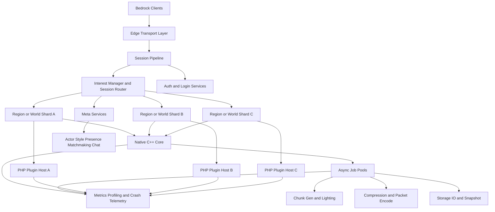

# 마인크래프트 Bedrock PMMP 고성능 구현 전략

## Executive summary

PocketMine-MP의 최신 공개 릴리스는 2026년 5월 31일 기준 5.43.2이며, Minecraft: Bedrock Edition 1.26.20을 지원한다. 그러나 PMMP 공식 문서는 지금도 “멀티코어 활용이 매우 좋지 않다”고 명시하며, 서버용 머신을 고를 때 많은 코어보다 높은 클럭을 우선하라고 권고한다. PMMP가 자체 문서에서 설명하듯, PHP 스레딩은 Zend 엔진의 구조상 거의 모든 복합 자료구조를 스레드 간 복사해야 하므로 비용이 크고, PMMP도 실제로는 월드 생성, 라이팅 계산, 네트워크 압축, 일부 내부 네트워크 시스템 정도에만 스레드를 사용한다. 즉, **“PMMP를 극한까지 빠르게 만들기”의 핵심은 PHP 전체를 공유 메모리 멀티스레드로 바꾸는 것이 아니라, 뜨거운 경로를 네이티브 코드로 밀어내고, 월드 상태 소유권을 분리하며, 프로세스/리전 단위의 병렬화로 가는 것**이다. citeturn28search0turn40view0turn41view0

또 하나 중요한 결론은, **“RakNet이라 느리니 NetherNet으로 갈아타면 해결된다”는 식의 단선적 해법은 현재 시점에서 성립하지 않는다**는 점이다. Mojang의 공식 Bedrock 프로토콜 문서는 네트워크 프로토콜이 릴리스마다 바뀔 수 있음을 전제로 하고 있고, PMMP의 BedrockProtocol 라이브러리도 패킷 정의 자체는 다루지만 JWT, 암호화, 압축은 범위 밖이라고 밝힌다. PMMP의 RakLib는 “Minecraft 서버를 동작시키는 최소 구현”에 가깝고 RakNet 기능도 대부분 지원하지 않는다. 반면 df-mc가 정리한 NetherNet 사양은 이것이 WebRTC 기반의 RakNet 대체 전송 계층이며, LAN 및 Xbox Live 세션부터 배포되기 시작했지만 **직접 연결에서는 현재 사용할 수 없고**, go-nethernet 구현도 아직 **feature-complete가 아니라고 경고**한다. 실제로 Dragonfly는 “비동기적이고 확장성을 목표로 한 Go 서버”이지만, 현재 `go.mod` 기준으로도 `gophertunnel`과 `go-raknet`에 의존한다. 따라서 Dragonfly의 체감 성능은 “이미 NetherNet이라서”가 아니라, **Go 런타임, 비동기 구조, 자료구조 선택, 메모리/할당 전략, 라이브러리-우선 구조**의 영향이 훨씬 크다고 보는 편이 증거와 맞는다. citeturn9view3turn9view2turn11view0turn7view3turn8view0turn29search0turn29search1

이 보고서의 최종 권고는 다음과 같다. **단기적으로는 PMMP 포크를 유지하되 C++ 확장과 네트워크·청크·직렬화·압축 핫패스를 집중 네이티브화**하고, **중기적으로는 단일 프로세스 내부 공유상태 병렬화 대신 “리전/월드 소유권 분리 + 작업 풀 + 단일 작성자 원칙”으로 전환**하며, **장기적으로는 C++ 코어 + PHP 플러그인 ABI + 멀티프로세스 샤드 + 액터형 메타서비스 구조**로 확장하는 것이 가장 가능성이 높다. Java Edition 진영의 Folia가 보여준 “리전 기반 멀티스레딩”은 월드 병렬화의 현실적 기준점을 제공하고, Roblox의 Parallel Luau `Actor`와 Microsoft Orleans의 Virtual Actor 모델, FiveM OneSync의 서버 결정형 엔티티 라우팅은 대규모 실시간 게임 서버에서 **상태 소유권, 메시지 기반 격리, 관심영역 기반 라우팅**이 왜 중요한지 보여준다. citeturn14view2turn14view1turn33search0turn33search1turn33search5turn36search3turn36search2turn35search0turn35search3

핵심 판단을 한 문장으로 요약하면 이렇다. **최고 성능의 PMMP는 “PHP를 더 억지로 멀티스레드화한 PMMP”가 아니라, “PHP 플러그인 생태계를 유지하되, 성능 결정 경로를 C++ 코어와 샤드 아키텍처로 재편한 PMMP”다.** 이 방향은 PMMP가 이미 `ext-chunkutils2`, `ext-pmmpthread`, `ext-morton` 등을 필수 의존으로 품고 있다는 사실과도 일관된다. citeturn30search0turn24view0

## 현재 지형과 기술적 사실관계

PMMP는 현재도 “PHP만으로 된 장난감 서버”가 아니라, **PHP·C·C++를 함께 쓰는 하이브리드 서버**다. 저장소 설명은 이를 “PHP, C, C++로 처음부터 작성된 Bedrock 서버”라고 소개하고, `composer.json`은 `ext-chunkutils2`, `ext-encoding`, `ext-leveldb`, `ext-morton`, `ext-pmmpthread` 등을 요구한다. 또 PMMP용 공식 PHP-Binaries 릴리스는 2025년 12월 기준 PM5용 **PHP 8.2를 production 권장 버전**으로 표시하고, 8.4/8.5는 플러그인 호환성 문제가 있을 수 있다고 경고한다. 따라서 성능 프로젝트의 출발점은 “순수 PHP 서버에 C++를 얹는다”가 아니라, **이미 있는 네이티브 기반을 얼마나 체계적으로 확장하느냐**여야 한다. citeturn10search13turn30search0turn27search0

Bedrock 프로토콜 측면에서 보면, Mojang의 공식 `bedrock-protocol-docs`는 현재 릴리스 문서를 공개하며 프로토콜이 릴리스마다 바뀔 수 있다고 분명히 적고 있다. 같은 맥락에서 PMMP의 `BedrockProtocol` 저장소는 “Minecraft: Bedrock Edition protocol in PHP” 구현이지만 **JWT 처리, 암호화, 압축은 포함하지 않는다**고 밝힌다. 즉, PMMP의 병목을 논할 때 **패킷 정의 해석과 게임 로직만이 아니라, 암호화·압축·전송·배치화가 별도의 최적화 대상**이라는 뜻이다. citeturn9view3turn9view2

RakNet과 NetherNet에 대해서는 오해가 많다. PMMP의 `RakLib`는 README 수준에서조차 “RakNet protocol을 따르는 PHP용 UDP 네트워크 라이브러리”이며, “Minecraft 서버를 동작시키는 bare minimum”이고, “대부분의 RakNet 기능을 지원하지 않는다”고 적고 있다. 반면 Bedrock Wiki의 NetherNet 문서는 NetherNet이 **Xbox Live 세션에서 주로 쓰이는 WebRTC 기반 프로토콜**이라고 설명하고, df-mc의 `nethernet-spec`은 이것이 **RakNet 대체 전송 계층**이지만 **직접 연결에는 현재 사용할 수 없고**, 역공학 기반이며 변경될 수 있다고 못 박는다. Go 구현인 `go-nethernet`도 2026년 5월 공개 버전 기준으로 **still in development, not yet feature-complete**라고 경고한다. 이 사실들 때문에, **PMMP의 실사용 공용 서버 전송 스택을 “지금 당장 NetherNet으로 교체”하는 전략은 성숙도와 호환성 면에서 우선순위가 낮다**고 보는 것이 타당하다. citeturn11view0turn9view0turn7view3turn8view0

Dragonfly와 다른 대체 구동기들을 보면, “언어 = 성능”이 아니라 “런타임 + 구조 + 자료구조 + 운영모델 = 성능”이라는 점이 더 분명해진다. Dragonfly는 스스로를 **“heavily asynchronous”, “scalability and simplicity in mind”**로 소개하며 Go 1.26 이상을 요구한다. 하지만 같은 저장소의 `go.mod`는 `github.com/sandertv/gophertunnel`과 간접 의존으로 `go-raknet`을 포함한다. Cloudburst와 PowerNukkitX는 둘 다 Java 진영 Bedrock 서버로, 저장소 README에서 Java 기반의 빠르고 안정적인 구조 또는 성능 지향을 강조한다. 반면 공식 BDS는 서버 설정 파일과 Script API, 그리고 `@minecraft/server-admin`·`@minecraft/server-net` 같은 BDS 전용 모듈을 제공하지만, 그 일부는 여전히 **pre-release**다. 요컨대 Bedrock 서버 생태계는 이미 **PHP·Go·Java·공식 BDS**로 다원화되어 있고, 각자의 장점은 네트워크 프로토콜 하나보다 아키텍처 전반에 걸쳐 있다. citeturn29search0turn29search1turn16view1turn16view2turn16view0turn12search17turn12search2turn12search5

| 구동기 | 현재 확인되는 성격 | PMMP 성능 프로젝트에 주는 시사점 |
|---|---|---|
| PMMP | 최신 5.43.2는 Bedrock 1.26.20 지원. 공식 문서는 고클럭 선호와 낮은 멀티코어 활용을 명시. 이미 C/C++ 확장을 필수로 사용. citeturn28search0turn40view0turn30search0 | 성능 향상은 “PHP 탈출”이 아니라 “핫패스 네이티브화 + 월드 상태 병렬화 재설계”가 핵심이다. |
| Dragonfly | 비동기 Go 서버. 확장성을 목표로 하며 라이브러리처럼 사용 가능. 현재 `gophertunnel`과 `go-raknet` 의존. citeturn29search0turn29search1 | 성능 차이의 원인은 NetherNet보다도 비동기 구조, 할당 전략, 언어 런타임에서 찾는 것이 맞다. |
| Cloudburst | Java 기반 Bedrock 서버로 “faster and more stable”를 자임. Gradle/JAR 빌드와 플러그인 API 제공. citeturn16view1turn16view2 | JVM 진영의 자료구조·GC·툴링은 참고 가치가 크지만, PMMP 생태계와 ABI는 다르다. |
| PowerNukkitX | Java 21 기반, 기능 풍부·고성능·고확장성을 표방. 2026년 5월 2.0.0 릴리스. citeturn16view0 | “성능 + 확장성 + 바닐라 호환성”을 동시에 추구하는 설계 기준점으로 유용하다. |
| 공식 BDS | `server.properties`와 Dedicated Server용 Script API를 제공하고, `server-admin`·`server-net` 모듈은 BDS 전용이며 일부는 pre-release. citeturn12search17turn12search2turn12search5 | PMMP가 공식 기능을 추적할 때 참고해야 할 기준 구현이며, 운영/보안 모델 비교 대상으로 적합하다. |

| 네트워크 스택 | 확인된 사실 | 현재 판단 |
|---|---|---|
| PMMP `RakLib` | PHP로 작성된 최소한의 RakNet 서버 구현이며 대부분의 RakNet 기능을 지원하지 않음. citeturn11view0 | **즉시 개선 대상**. 하지만 교체는 “NetherNet 직행”보다 “네이티브 RakNet 핫패스화”가 현실적이다. |
| Dragonfly `gophertunnel` + `go-raknet` | Dragonfly는 현재 이 조합을 의존한다. citeturn29search1 | Go 진영의 네트워크 처리 구조를 벤치마크 기준점으로 삼을 가치가 높다. |
| `go-nethernet` | WebRTC 기반 NetherNet 구현이지만 아직 feature-complete가 아니고, NetherNet 자체도 direct connection에서 못 쓰는 상태라고 정리됨. citeturn8view0turn7view3 | **연구용/실험용**. 공용 PMMP 프로덕션 스택의 주축으로 두기엔 이르다. |

## 병목 분석과 설계 원칙

PMMP의 공식 타이밍 시스템이 이미 무엇을 병목 후보로 봐야 하는지를 보여준다. `Timings`에는 `fullTick`, `playerChunkSend`, `playerNetworkSendCompress`, `playerNetworkReceiveDecompress`, `entityMoveCollision`, `schedulerAsync`, `garbageCollector` 등이 분리되어 있고, `WorldTimings`에는 `randomChunkUpdates`, `doChunkGC`, 블록 라이트/스카이라이트 갱신까지 잡혀 있다. 또 `TimingsHandler`는 “다중 스레드의 timings를 비동기적으로 수집해 단일 리포트에 합칠 수 있다”고 설명한다. 즉 PMMP 최적화는 이미 **청크·네트워크·엔티티·스케줄러·GC**라는 분해축을 전제로 해야 맞다. citeturn42search1turn42search3turn42search5

첫 번째 병목은 **청크 및 월드 포맷 처리**다. PMMP가 `ext-chunkutils2`를 따로 유지하는 이유 자체가, 청크 팔레트와 구형 월드 업그레이드, 라이트 배열 같은 **성능 민감 코드를 C++로 옮기면 더 빠르고 메모리도 줄어든다**는 점을 인정하기 때문이다. 이 연장선에서 가장 먼저 네이티브화해야 할 것은 `SubChunk`/팔레트 압축, 라이트 배열 갱신, 블록 상태 직렬화, LevelDB I/O 경량화, 청크 배치 패킷 생성이다. Java 진영의 Folia가 월드 프리제너레이션을 강하게 권하는 것도, 실제 고동접에서는 **청크 생성/청크 I/O 작업자가 병목의 핵심**이 되기 쉽기 때문이다. citeturn24view0turn14view2

두 번째 병목은 **네트워크 스택과 직렬화/압축**이다. PMMP의 `BedrockProtocol`이 암호화와 압축을 범위 밖으로 두고 있고, 타이밍도 송신 압축·복호화·배치화 단계를 별도로 계측하는 점을 보면, 진짜로 비싼 부분은 “패킷 클래스 정의”보다 **배치 생성, VarInt/NBT/바이너리 인코딩, 압축, 소켓 송수신**이다. PMMP의 `ext-libdeflate`는 README에서 `zlib_encode()` 대비 **레벨 1에서 약 40%, 레벨 6에서 50~70%의 성능 향상**을 같은 수준의 압축률로 관찰했다고 제시한다. 네트워크/시리얼라이제이션 연구에서도 복사와 재할당, 사용자 공간과 커널 공간 사이의 데이터 이동이 오버헤드의 큰 부분을 차지한다는 점이 반복적으로 나타난다. eRPC는 범용 RPC도 커널 우회 특수 하드웨어 없이 고성능이 가능하다고 보였고, 최근 zero-copy serialization 연구 역시 **직렬화 단계의 재할당·복사**를 병목으로 지목한다. PMMP에 그대로 RDMA를 들이밀 필요는 없지만, **고정 길이 버퍼, 슬랩/풀, scatter-gather 지향 배치, 재사용 가능한 writer/reader**는 직접 적용 가능하다. citeturn9view2turn42search1turn25view0turn20search2turn20search6

세 번째 병목은 **엔티티 틱과 월드 상호작용의 병렬화 방식**이다. 오래된 연구이지만 Quake 서버 병렬화 논문은 인터랙티브 멀티플레이어 게임 서버가 수평 확장보다 먼저 **락 동기화와 지역별 작업 불균형**에 부딪힌다고 보고했고, 구체적으로 region-based locking을 사용했다. LEARS는 게임 서버에서 lockless, relaxed-atomicity 상태 모델을 제안했다. 현대적인 상용/오픈소스 사례로 오면, Folia는 “가까운 청크를 independent region으로 묶고 각 region이 자체 tick loop를 갖는다”고 문서에 적으며, 더 이상 전역 메인 스레드가 없다고 설명한다. Roblox는 Parallel Luau에서 여러 `Actor`를 통해 병렬 실행을 허용하고, **각 Actor가 각자의 Luau VM을 가지며**, `SharedTable`과 메시지 전달을 통해 협력하게 한다. FiveM의 OneSync는 **서버가 엔티티 라우팅을 결정하는 full state awareness**를 제공하고, legacy 모드는 모든 플레이어가 각 클라이언트에 존재하는 가정 때문에 성능 문제를 일으킨다고 문서가 직접 경고한다. 이 모든 근거는 한 방향을 가리킨다. **월드 상태를 공유 메모리에서 미세 락으로 쪼개는 것보다, 리전/엔티티/세션 단위의 소유권을 정의하고 단일 작성자 원칙을 지키는 편이 낫다.** citeturn19search7turn22search10turn14view2turn14view1turn33search0turn33search1turn33search5turn35search0turn35search3

네 번째 병목은 **객체 할당과 GC**다. PHP는 참조 카운팅 위에 순환 가비지 컬렉터가 얹혀 있고, 루트 버퍼가 꽉 차면 cycle-finding이 돈다. 공식 문서는 root buffer 기본값이 **10,000 roots**라고 밝히며, `gc_status()`는 현재 GC 상태와 시간 정보를, `gc_mem_caches()`는 Zend 메모리 관리자 캐시 메모리 회수를 제공한다. ZendMM은 요청 수명에 최적화된 메모리 관리 계층으로 설계되어 있고, 별도 요청이 짧게 끝나는 웹 환경에 특화돼 있다. PMMP처럼 장시간 실행되는 서버에서는 이 모델이 직접적인 장점이 되지 않을 수 있다. 반면 Go는 공식 GC 가이드에서 `GOMEMLIMIT`과 `GOGC`를 통해 CPU-메모리 트레이드오프를 조절할 수 있다고 설명하고, `sync.Pool`은 임시 객체 재사용으로 할당과 GC 압력을 줄이되, 언제든 제거될 수 있는 임시 캐시라고 문서화한다. 이 차이를 PMMP 최적화에 번역하면, **긴 생명주기의 월드/엔티티 상태를 zval 폭풍으로 표현하지 말고, 네이티브 레이아웃 혹은 packed structure에 유지하며, PHP에는 coarse-grained view만 노출**해야 한다는 뜻이다. citeturn21search13turn38search0turn38search1turn38search10turn21search2turn21search18turn39search1turn39search3turn39search6

이 병목들을 종합하면, 권장 원칙은 다섯 가지로 정리된다. **첫째, 월드 상태는 단일 작성자 원칙으로 소유권을 명확히 나눌 것. 둘째, 스레드 간 전달은 큰 작업과 작은 메시지로 제한하고, 큰 그래프 복사는 피할 것. 셋째, 네이티브 확장은 함수 호출 수를 극단적으로 줄이는 coarse API로 설계할 것. 넷째, 액터/메시지 모델은 월드 내부보다 메타서비스와 샤드 간 협조에 더 적합하며, 지나치게 chatty한 grain/actor 경계는 피할 것. 다섯째, 최적화는 Timings·perf·flame graph·GC 통계로 측정한 뒤 수행할 것.** Orleans의 공식 문서는 actor/grain이 느슨하게 결합되고 독립적이어야 하며, grain 간 지나치게 빈번한 통신은 직접 메모리 접근보다 비싸다고 경고한다. 따라서 액터 모델은 “모든 것의 만병통치약”이 아니라, **경계가 명확한 상태 단위에만 적용해야 효과적**이다. citeturn36search2turn36search3turn42search3turn37search9turn20search19turn37search3

## 권장 아키텍처

권장 아키텍처의 요지는 **“PMMP 포크를 유지하되, PMMP의 주 실행 루프를 그대로 신격화하지 말고, 네트워크·월드·서비스 경계를 다시 설계하라”**는 것이다. 월드 틱과 PHP 플러그인 호환성을 유지하려면, **각 샤드/리전은 자기 상태를 단독으로 수정하는 owner thread 또는 owner process를 가져야** 한다. 이 아이디어는 Folia의 독립 리전 tick loop, Roblox의 Actor VM 분리, FiveM OneSync의 서버 결정형 라우팅과 잘 맞아떨어진다. PMMP의 기존 플러그인 모델을 보존하려면, “모든 플러그인을 멀티스레드 안전하게 만들라”가 아니라 **“플러그인 콜백은 항상 해당 리전의 owner 실행맥락에서만 돈다”**는 규칙을 지켜야 한다. citeturn14view2turn14view1turn33search0turn33search1turn35search3

이 구조에서 **Edge Transport Layer**는 처음부터 NetherNet이 아니라, **RakNet 기반의 네이티브 세션 엔진**으로 시작하는 것이 현실적이다. 근거는 단순하다. PMMP의 RakLib는 PHP 최소 구현이며, Dragonfly도 아직 RakNet 계열 라이브러리 위에 서 있고, NetherNet은 direct connection에 아직 부적합하다. 따라서 우선순위는 **PMMP 바깥 또는 PMMP 아래쪽에 C++ 혹은 Go 기반 UDP/RakNet edge를 두고, 세션 관리와 패킷 배치를 네이티브 버퍼 위에서 처리**하는 것이다. NetherNet은 LAN/Xbox Live 연구 모드, 또는 향후 Bedrock 클라이언트 네트워크 변화 추적용 feature flag로 두는 편이 맞다. citeturn11view0turn29search1turn7view3turn8view0

**Native C++ Core**에는 다음 성격의 기능이 들어가야 한다. 블록/청크/라이트/팔레트의 저장과 변환, packet batch encode/decode, VarInt/NBT/바이너리 직렬화, 압축, 빠른 해시/공간키, 관심영역 계산, 네이티브 버퍼 풀, 샤드 간 메시지 큐가 여기에 속한다. PMMP가 이미 `ext-chunkutils2`로 chunk hot path를 옮겼고 `ext-libdeflate`로 압축 이득을 수치로 제시한다는 점은, 이 방향이 추측이 아니라 **기존 PMMP가 이미 입증한 연장선**임을 뜻한다. citeturn24view0turn25view0

반면 **PHP Plugin Host**는 “핫패스 계산기”가 아니라 **정책 계층**으로 재정의하는 편이 좋다. 권한, 게임 규칙, 커스텀 이벤트, 명령, 외부 API 연동, 퀘스트/미니게임 로직은 PHP가 담당하되, 블록 저장구조를 매 틱마다 PHP 배열로 뒤흔들거나 packet write를 PHP 문자열 덧붙이기로 처리해서는 안 된다. PHP 확장은 일반 PHP extension으로 우선 설계하고, Zend extension 수준의 VM 후킹은 꼭 필요한 경우에만 고려해야 한다. PHP Internals Book은 Zend extension이 VM과 훨씬 더 가깝고 복잡하다고 설명한다. 따라서 **대부분의 PMMP 성능 확장은 Zend extension이 아니라, 안정적인 C/C++ PHP extension으로 충분하다**고 보는 것이 안전하다. citeturn23search10turn23search4turn23search9

메타서비스는 별도 축으로 떼는 것이 맞다. 플레이어 프레즌스, 프로필/인벤토리, 길드/파티, 채팅, 매치메이킹, 월드/샤드 디렉터리, 라우팅 테이블은 월드 틱과 분리된 **액터형 서비스**로 두는 편이 안정적이다. Orleans는 이 모델을 고규모 인터랙티브 서비스용으로 제시하고, 공식적으로 Halo 4/5 계열 서비스에 사용됐으며, 문서에서도 grain 간 지나치게 잦은 통신은 피하라고 권고한다. PMMP의 고성능 전략에서 이 교훈은, **월드 시뮬레이션은 로컬 owner가 책임지고, 전역 서비스는 액터/메시지로 분리**하라는 뜻으로 번역할 수 있다. citeturn36search3turn36search14turn36search2turn36search10

| 확장 후보 | 근거 | 우선순위 | 권장 판단 |
|---|---|---|---|
| `ext-chunkutils2` 확장 | PMMP가 이미 chunk hot path를 C++로 옮겨 더 낮은 메모리와 더 좋은 성능을 목표로 함. citeturn24view0 | 최고 | **즉시 확대**. 팔레트, 라이트, chunk packet 준비, 관심영역 계산까지 범위를 넓혀야 한다. |
| `ext-libdeflate` 통합 강화 | `zlib_encode()` 대비 40~70% 향상 관찰. citeturn25view0 | 최고 | **즉시 적용**. 송신 압축 경로를 우선 교체하고, 압축률·CPU·대역폭을 함께 측정해야 한다. |
| 네이티브 packet codec extension | BedrockProtocol은 압축/암호화 범위 밖. 네트워크 타이밍이 별도 존재. citeturn9view2turn42search1 | 최고 | **신규 개발**. VarInt/NBT/batch encode를 coarse-grained C++ API로 만든다. |
| `ext-morton` 계열 공간키 | libmorton 바인딩 제공. citeturn26view3 | 중간 | 관심영역/공간 인덱스 실험용으론 유용하지만, 유지보수성과 최신성은 직접 검증이 필요하다. |
| `ext-xxhash` 계열 해시 | xxhash 바인딩은 빠르지만 저장소가 2025년 9월 archive 상태. citeturn26view2 | 낮음 | 아이디어는 유효하지만, 의존으로 삼기보다 자체 내장 또는 현재 PHP 내장 xxHash와 비교 벤치가 먼저다. |
| `ext-pmmpthread` 활용 확대 | PMMP는 threads를 제한적 용도에만 쓰며, PHP 스레딩 복사 비용이 크다. citeturn30search0turn41view0 | 중간 | **작업 풀용으로만**. 월드 공유 상태를 넘기는 용도로 확대하면 역효과 가능성이 높다. |

| 운영 목표 시나리오 | 현실적인 목표치 | 권장 구조 |
|---|---|---|
| 동접 100 | 단일 노드에서 20 TPS 유지, p99 틱 시간 50ms 이하, RSS 4GB 안쪽이 현실적 목표. 이는 고클럭 CPU와 네이티브 hot path 최적화가 핵심이다. citeturn40view0turn24view0turn25view0 | 단일 PMMP 포크 + C++ 확장 + 프리젠 월드 |
| 동접 300 | 단일 프로세스 순수 PMMP만으로는 불안정해질 가능성이 높고, 리전/월드 샤드 또는 멀티프로세스 전환이 유리하다. Folia도 이 정도 이상에서 스레드 배치와 청크 시스템을 명시적으로 튜닝한다. citeturn14view2 | 샤드 2~4개 + 라우터 + 네이티브 네트워크 경로 |
| 동접 1000 | “한 프로세스 PMMP 초고도 튜닝” 목표가 아니라, 샤드/서비스 분해가 사실상 필수다. Orleans·Folia·OneSync 사례가 모두 상태 소유권과 분산을 전제한다. citeturn36search3turn14view2turn35search3 | 멀티프로세스·멀티노드 샤드 + 액터형 메타서비스 |

## 실행 로드맵

아래 요약 로드맵은 “바로 실행 가능한” 방향으로 정리한 한 페이지 버전이다. 핵심은 **NetherNet 연구는 뒤로 미루고, 먼저 PMMP가 이미 보여준 네이티브 확장 방향을 조직화하는 것**이다. citeturn24view0turn25view0turn7view3turn8view0

| 기간 | 핵심 목표 | 산출물 |
|---|---|---|
| 첫 분기 | 기준선 확립 | PMMP 포크, 재현 가능한 벤치마크 하네스, perf/flamegraph/Timings 리포트, PHP 8.2 기준 빌드 체계. citeturn27search0turn42search3turn37search1turn20search19 |
| 둘째 분기 | 네이티브 hot path 1차 | chunk/packet/compress 경로 C++ 확장화, libdeflate 통합, 버퍼 풀. citeturn24view0turn25view0turn9view2 |
| 셋째 분기 | 상태 소유권 재편 | 리전 owner 실행 모델, 샤드 내 메시지 큐, PHP 플러그인 owner-thread 규칙. citeturn14view2turn33search0turn36search2 |
| 넷째 분기 | 샤딩·라우팅 | 멀티프로세스 월드/리전 샤드, 세션 라우터, 프레즌스/채팅 분리. citeturn35search3turn36search3 |
| 이후 | 대규모 운영화 | 릴리스 자동화, 프로토콜 업데이트 파이프라인, 회귀성능 CI, 실험적 NetherNet 브랜치. citeturn9view3turn7view3turn8view0 |

상세 로드맵은 다음과 같다.

| 단계 | 기술 작업 | 관련 리포지토리와 기반 | 빌드·테스트·벤치마크 | 종료 기준 |
|---|---|---|---|---|
| 기준선 고정 | `pmmp/PocketMine-MP`를 포크하고, PM5 production 기준인 PHP 8.2 환경을 고정한다. 공식 PHP-Binaries의 디버그 심볼도 함께 보관한다. `Timings`, `perf stat`, `perf record`, flame graph, `gc_status()`, `gc_mem_caches()`를 기본 수집 지표로 넣는다. citeturn27search0turn42search3turn37search0turn37search1turn20search19turn38search0turn38search1 | PMMP, PMMP PHP-Binaries, Linux perf, PHP manual | GitHub Actions에서 Linux x86_64/arm64, debug/release, ASAN/UBSAN 빌드 매트릭스를 구성한다. PHP extension은 `phpize`, `.phpt`, `run-tests.php` 관행을 따른다. citeturn23search9turn24view0 | 동일 월드·동일 플러그인·동일 봇 시나리오에서 3회 이상 반복 시 수치 편차가 통제된다. |
| 네이티브 hot path 1차 | `ext-chunkutils2` 범위를 넓혀 chunk packet 준비, 팔레트 조회, 라이트 배열 갱신, 공간키 연산을 C++로 이동한다. 동시에 `ext-libdeflate`를 송신 압축 기본 경로에 통합한다. citeturn24view0turn25view0 | `ext-chunkutils2`, `ext-libdeflate`, PMMP network timings | packet encode/compress microbench 및 100/300봇 네트워크 부하 테스트를 추가한다. `playerChunkSend`, `playerNetworkSendCompress` 타이밍을 회귀 지표로 삼는다. citeturn42search1 | 청크 전송과 송신 압축 경로의 CPU 비중이 명확히 감소하고, p95/p99 틱 지연이 같이 개선된다. |
| 네이티브 네트워크 경로 | `RakLib`를 그대로 손보는 방식과 별도로, C++ 또는 Go 기반 edge transport를 두고 Rust/Go/C++ 비교 브랜치를 운용한다. 핵심은 RakNet 직접 대체보다 세션 경계 분리, 고정 버퍼, 배치 재사용이다. 현재 Dragonfly가 여전히 RakNet 계열을 쓰므로, 비교 기준은 NetherNet이 아니라 Dragonfly 지표다. citeturn11view0turn29search1turn29search0 | PMMP RakLib, Dragonfly, gophertunnel 계열 | edge process unit test, packet replay test, soak test, malformed packet fuzzing을 넣는다. BedrockProtocol이 압축/암호화를 안 다루므로 이 경로를 별도 fuzz 대상에 둔다. citeturn9view2 | RakLib thread blocked류 증상과 송수신 tail latency가 줄고, PMMP main loop CPU 비중이 감소한다. citeturn11view1 |
| 리전 owner 모델 | 월드 또는 리전을 owner thread/process에 귀속시킨다. PHP 플러그인 콜백은 owner에서만 실행되도록 하고, 교차 리전 상호작용은 메시지 큐로 변환한다. 공유 메모리 락보다 단일 작성자 원칙을 우선한다. citeturn14view2turn14view1turn33search0turn36search2 | Folia 문서, Roblox Actor 개념, Orleans best practices | 리전 경계 테스트, 교차 리전 엔티티 이동 테스트, deterministic replay 테스트를 추가한다. | 같은 샤드 내 데이터 경쟁이 제거되고, 플러그인 API 규칙이 문서화된다. |
| 멀티프로세스 샤딩 | 300~1000 동접용으로 월드/리전 샤드를 프로세스 단위로 분리하고, 세션 라우터와 프레즌스 디렉터리를 둔다. 채팅·매치메이킹·프로필은 별도 서비스로 분리한다. citeturn35search3turn36search3turn36search10 | PMMP core fork + actor-style services | 라우터 장애 복구, 샤드 재배치, 롤링 업데이트 실험을 CI에 넣고, 퍼포먼스 CI는 샤드 수 증가에 따른 선형성 악화 여부를 추적한다. | 1000 동접급 실험에서 샤드당 20 TPS를 유지하고, 한 샤드 장애가 전체 다운으로 번지지 않는다. |
| 관리·배포 자동화 | 프로토콜 변경 감시, Mojang docs diff, PMMP release tracking, 네이티브 ABI 버전 관리, 성능 회귀 게이트를 자동화한다. Bedrock 프로토콜은 릴리스마다 바뀔 수 있으므로, 업데이트 대응은 운영 문제이기도 하다. citeturn9view3turn28search0 | Mojang protocol docs, PMMP release feeds, GitHub Actions | nightly benchmark, release candidate soak test, debug symbol 아카이브, crash symbolication을 표준화한다. citeturn27search0 | 프로토콜 업데이트와 네이티브 ABI 변경이 릴리스 파이프라인에 통합된다. |
| NetherNet 연구 브랜치 | 극후순위 연구로 LAN/Xbox Live 관련 실험 브랜치를 운영한다. Direct public server 대체 목표는 두지 않는다. citeturn7view3turn8view0turn9view0 | `df-mc/go-nethernet`, `df-mc/nethernet-spec` | 상호운용성 테스트, 기능 커버리지 추적, direct connection 불가 조건 문서화 | 연구 성과는 남기되, 메인라인 성능 전략을 교란하지 않는다. |

이 로드맵에서 특히 강조할 점은 **PHP 확장 경계를 설계할 때 “PHP↔C++ 경계 통과 횟수”를 최소화해야 한다**는 것이다. Zend 엔진과 PHP 확장 문서가 보여주듯, 확장은 만들 수 있지만 잘못 설계하면 경계 호출 비용과 zval 생성 비용 때문에 오히려 느려질 수 있다. 그래서 개별 블록 조회 함수 10만 번보다, “이 chunk 범위를 packet batch로 내보내기”, “이 팔레트를 네이티브 버퍼로 직렬화하기” 같은 **굵은 API**가 낫다. citeturn23search9turn21search2turn21search18

## 실험 설계와 위험, 참고자료

실험은 반드시 **“플러그인 없는 코어 벤치”와 “실제 워크로드 벤치”를 분리**해야 한다. PMMP의 병목은 plugin, chunk generation, packet burst, entity storm가 서로 다르기 때문이다. 또한 PMMP의 타이밍 시스템과 Linux `perf`, flame graph, PHP GC 통계를 동시에 봐야 “CPU를 줄였는데 GC가 늘어났다” 같은 상쇄 효과를 놓치지 않는다. Xdebug의 GC statistics는 개발 환경에서만 쓰고, 운영 실험에는 오버헤드 때문에 넣지 않는 편이 낫다. citeturn42search3turn37search9turn37search1turn20search19turn37search3

| 벤치마크 시나리오 | 측정 목적 | 핵심 지표 | 재현 조건 |
|---|---|---|---|
| 로비형 100봇 | 네트워크·패킷·명령 처리 | TPS, MSPT avg/p95/p99, 송수신 패킷 수, compress/decompress 시간, CPU 명령 수. citeturn42search1turn37search0turn37search1 | 동일 월드, 동일 스폰, 플러그인 최소, 15분 3회 반복 |
| SMP형 300봇 분산 배치 | 리전 소유권/샤드 구조 | 리전별 tick 예산, chunk send latency, player move/entity move collision 시간. citeturn42search1turn42search5 | 월드 프리젠 유무를 나눠 A/B 테스트. Folia도 프리젠을 강권한다. citeturn14view2 |
| 콜드 월드 생성 부하 | 청크 생성/라이트/저장 | chunk gen ms, light update ms, LevelDB I/O 지연, 샤드별 대기 큐 길이 | 고정 seed, 프리젠 없음, 디스크 동일 조건 |
| 엔티티 스톰 | 엔티티/충돌/관심영역 | entityMove, entityMoveCollision, projectileMove, viewer set 계산 시간. citeturn42search1 | 몹/투사체 수 고정 증가 |
| 압축·직렬화 마이크로벤치 | native hot path 확인 | 패킷당 encode μs, 압축률, bytes copied, allocation count | 동일 payload 집합, warm/cold 캐시 분리 |
| 장시간 soak test | 메모리·GC·누수 | RSS, GC collector_time, free_time, gc_mem_caches freed bytes, crash/oom 유무. citeturn38search0turn38search1turn38search11 | 6~24시간 지속, 플러그인 포함 워크로드 |

| 위험 요소 | 이유 | 대응책 |
|---|---|---|
| PHP 공유상태 멀티스레딩 집착 | PMMP 문서가 보여주듯 PHP 스레딩은 거의 모든 복합 구조 복사가 필요해 비용이 크다. citeturn41view0 | shared-memory가 아니라 owner model과 메시지 큐로 병렬화한다. |
| 플러그인 호환성 붕괴 | Folia 사례처럼 메인 스레드 가정이 깨지면 플러그인 수정이 대량 발생한다. citeturn14view2turn14view1 | “플러그인은 owner shard에서만 실행” 규약을 고수하고, 비동기 API를 명시적으로 분리한다. |
| 프로토콜 업데이트 비용 | Mojang은 Bedrock protocol이 release over release 바뀐다고 명시한다. citeturn9view3 | 문서 diff 자동화, packet replay test, 릴리스 전 soak test를 CI에 넣는다. |
| NetherNet 과대평가 | direct connection 불가, 구현 미완성 상태다. citeturn7view3turn8view0 | 연구 브랜치로만 유지하고, 프로덕션 성능 프로젝트의 핵심 경로에서 제외한다. |
| 네이티브 코드의 메모리 안전성 | PHP 밖으로 나가면 속도는 늘어도 crash surface가 커진다. | ASAN/UBSAN, fuzzing, debug symbol 보관, crash symbolication 자동화 |
| 성능 회귀의 은폐 | 압축은 빨라졌지만 GC나 락 경쟁이 늘어날 수 있다. | Timings + perf + flame graph + GC 통계를 함께 본다. citeturn42search3turn37search9turn20search19turn38search0 |
| 대규모 동접 목표의 과도한 낙관 | PMMP 공식 문서도 멀티코어 활용이 약하다고 인정한다. citeturn40view0 | 100/300/1000을 서로 다른 아키텍처 목표로 나누고, 한 프로세스 목표와 분산 목표를 혼동하지 않는다. |

참고자료는 다음 우선순위로 보는 것이 가장 효율적이다. **공식 문서와 원논문이 기준선**, 그 다음이 **핵심 GitHub 저장소**, 마지막이 **Bedrock Wiki·FiveM docs 같은 실무형 커뮤니티 문서**다.

| 우선순위 | 권장 자료 | 왜 중요한가 |
|---|---|---|
| 최우선 | Mojang `bedrock-protocol-docs`. citeturn9view3 | Bedrock 네트워크 변경의 공식 기준선이다. |
| 최우선 | PMMP 문서의 요구사항·스레딩 문서·FAQ. citeturn40view0turn41view0turn11view1 | PMMP의 실제 한계와 운영 문제를 직접 설명한다. |
| 최우선 | `pmmp/PocketMine-MP`, `pmmp/RakLib`, `pmmp/BedrockProtocol`, `pmmp/PHP-Binaries`. citeturn28search0turn11view0turn9view2turn27search0 | 버전, 의존, 네트워크 구현 범위, 배포 현실을 보여준다. |
| 최우선 | `pmmp/ext-chunkutils2`, `pmmp/ext-libdeflate`. citeturn24view0turn25view0 | PMMP가 이미 어떤 hot path를 네이티브화했는지 보여준다. |
| 높음 | Dragonfly와 `go.mod`, `go-nethernet`, `nethernet-spec`. citeturn29search0turn29search1turn8view0turn7view3 | “Go 기반 대체 구동기”와 “NetherNet의 현실”을 정확히 판단하게 해준다. |
| 높음 | Folia 문서와 저장소. citeturn14view2turn14view1turn14view0 | 리전 기반 병렬 틱의 현실적인 참조 구현이다. |
| 높음 | Orleans 공식 문서와 원논문. citeturn36search3turn36search2turn36search14 | 대규모 게임/서비스형 액터 아키텍처의 검증된 기준이다. |
| 높음 | Quake 병렬화, Colyseus, MMO load balancing, LEARS, lock-free queue, eRPC 논문. citeturn19search7turn18search5turn18search3turn22search10turn22search5turn20search2 | 병렬화, 샤딩, 락 경합, 네트워크 오버헤드의 이론적 기반을 제공한다. |
| 중간 | Roblox Parallel Luau/Actor/SharedTable 문서. citeturn33search0turn33search1turn33search5 | 현대 게임 런타임에서의 actor-style 병렬화 개념을 보여준다. |
| 중간 | FiveM OneSync·Profiler 문서. citeturn35search0turn35search3turn35search1 | 서버 결정형 엔티티 라우팅과 운영 프로파일링의 실무 사례다. |
| 중간 | PHP internals, ZendMM, GC manual, Linux perf, Flame Graph 문서. citeturn21search2turn21search18turn38search0turn38search1turn37search9turn20search19 | PHP 확장 설계와 측정 체계의 기반이다. |

**제한과 미해결 질문**도 분명히 남는다. 내가 검토한 자료에서는 2024~2026 기준으로 **동일 하드웨어·동일 워크로드에서 PMMP, Dragonfly, Cloudburst를 정면 비교한 최근 공개 벤치마크**는 뚜렷하게 확인되지 않았다. 또한 목표가 “동접 1000이 한 월드에 밀집”인지, “여러 월드/미니게임 샤드에 분산”인지에 따라 최적 아키텍처가 크게 달라진다. 마지막으로 NetherNet은 현재 문서상 direct connection이 안 되므로, 향후 Mojang 클라이언트/서버 네트워크 정책이 바뀌는지의 추적이 필요하다. citeturn7view3turn8view0

결론적으로, 당신이 원하는 것은 “PMMP에 C++ 확장을 조금 더 얹는 것”보다 더 큰 프로젝트다. 그러나 방향은 분명하다. **PMMP를 고성능으로 만들려면, PMMP를 버릴 필요는 없지만, PMMP의 성능 결정 경로를 더 이상 PHP가 담당하게 두면 안 된다.** 먼저 **청크·직렬화·압축·네트워크 edge를 네이티브화**하고, 그 다음 **리전 owner 모델과 멀티프로세스 샤딩**으로 넘어가며, 마지막에 **액터형 메타서비스**로 외곽을 분리하는 순서가 가장 설득력 있고, 현재 공개된 공식 문서·원논문·주요 저장소와도 가장 잘 맞는 전략이다. citeturn24view0turn25view0turn41view0turn14view2turn36search3turn35search3