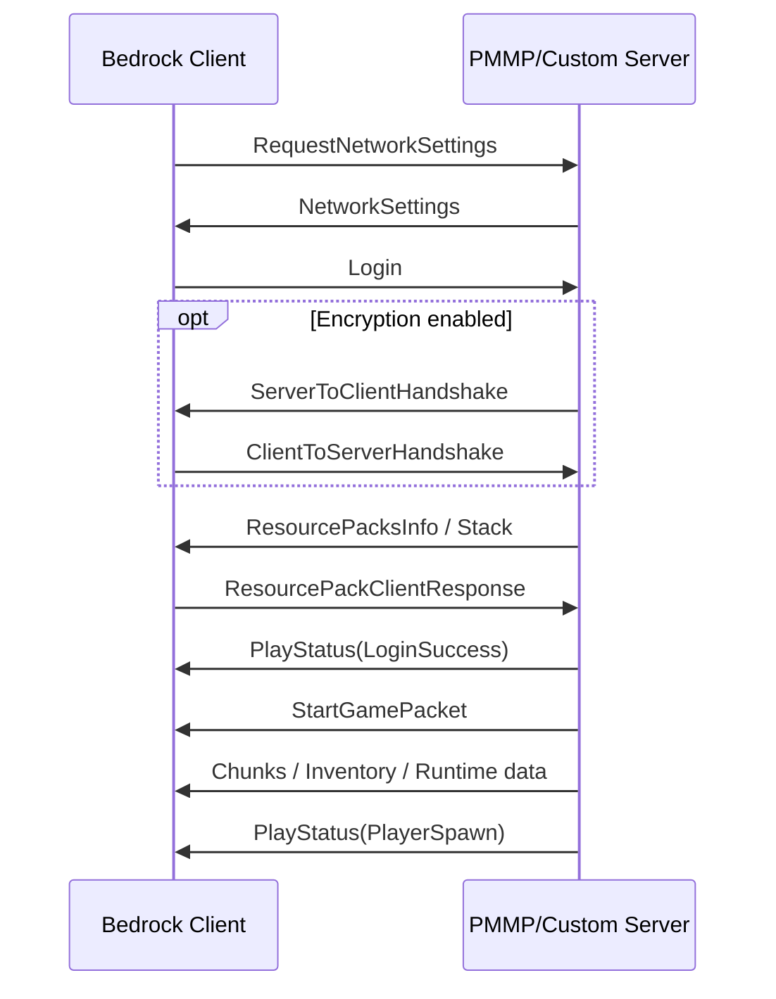
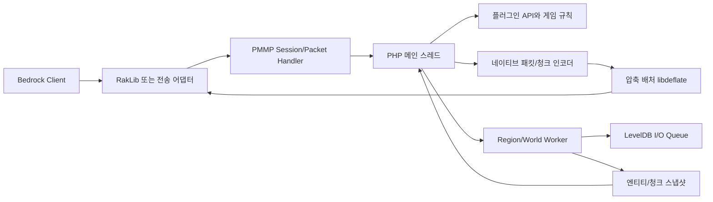
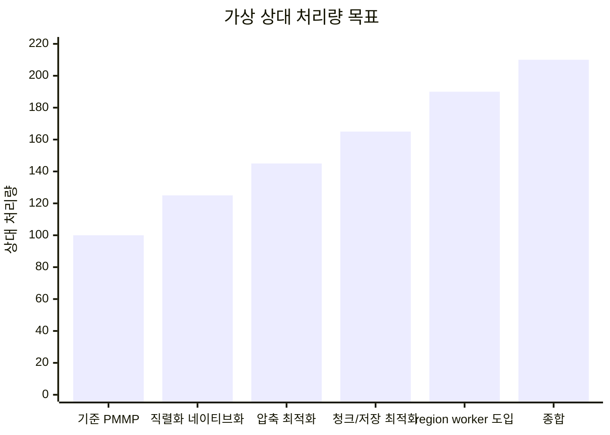
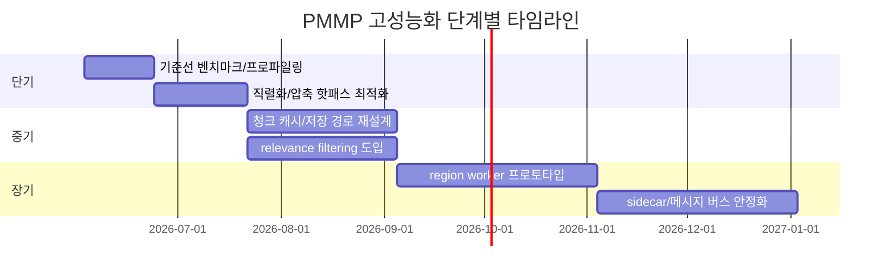

# 마인크래프트 Bedrock PMMP 고성능 구현 전략

## Executive Summary

2026-06-02 기준 최신 안정 릴리스인 PocketMine-MP 5.43.2는 Minecraft: Bedrock Edition 1.26.20을 지원하는, PHP 중심의 커스텀 서버 소프트웨어다. 공식 문서와 저장소는 PMMP가 “PHP로 처음부터 작성된” 고도 커스터마이즈형 서버이며, 바닐라 서바이벌 서버 대체제가 아니라는 점, 그리고 실제 운영에서는 “많은 코어”보다 “높은 단일 코어 클럭”을 선호해야 한다는 점을 명확히 말한다. 즉, PMMP의 본질적 한계는 단순히 “RakNet이라 느리다”가 아니라, **게임 로직의 단일 스레드성, PHP 런타임의 스레딩 제약, 그리고 대량 청크·패킷·엔티티 처리에서의 메모리/직렬화 비용**이 결합된 구조라는 데 있다. citeturn19view0turn18search1turn24view0turn20view0

또한 PMMP는 이미 “PHP만”으로 돌아가는 프로젝트가 아니다. 공식 빌드 스크립트와 빌드 문서는 PMMP가 커스텀 PHP 바이너리와 비표준 확장들을 요구한다고 밝히며, 최신 PM5용 기본 권장 런타임은 PHP 8.2다. 공식 빌드 체인에는 `ext-pmmpthread`, `ext-leveldb`, `ext-libdeflate`, `ext-morton`, `ext-xxhash`, `ext-encoding`, `ext-recursionguard`, `ext-chunkutils2` 등이 포함되어 있다. 이는 **PMMP 고성능화의 현실적인 방향이 “PHP를 버리고 전체를 다시 쓰기”가 아니라, 이미 존재하는 네이티브 확장 전략을 더 공격적으로 확장하는 것**임을 보여준다. citeturn18search2turn47search2turn46search0turn4view0

네트워크 관점에서 보면, RakLib는 PHP용 RakNet 서버 구현이며 “기능 최소 집합”만 제공하고 대부분의 RakNet 기능을 지원하지 않는다. 반면 NetherNet은 WebRTC 기반의 차세대 전송 계층으로 LAN/Xbox Live 쪽에서 롤아웃이 시작됐지만, `df-mc/nethernet-spec` 자체가 역공학 기반 문서이며 direct connection에서 현재 사용할 수 없다고 적고 있고, `go-nethernet`도 아직 개발 중·미완성이라고 경고한다. 결론적으로 **지금 당장 PMMP를 “RakNet → NetherNet”으로 바꾸는 것은 생산용 해법이 아니다**. 오늘 당장 성능을 올리려면 transport 교체보다 **패킷 직렬화, 압축, 청크 인코딩, 관심 영역 전송, 월드 저장 경로**를 먼저 최적화하는 편이 훨씬 수익률이 높다. citeturn17view5turn17view2turn17view1turn31search2

대체 엔진 비교에서는 Dragonfly가 가장 중요한 참조 대상이다. Dragonfly는 Go로 작성된 “heavily asynchronous” Bedrock 서버 소프트웨어이며, 보통 라이브러리 형태로 사용된다. 그 기반인 gophertunnel은 Go용 Bedrock 라이브러리로, 연결 객체의 다중 goroutine 호출 안전성, FlushRate를 통한 압축/지연 트레이드오프, 최신 Bedrock 버전 추종을 강하게 의식한 설계를 드러낸다. 따라서 PMMP가 배워야 할 핵심은 “Go로 갈아타기” 자체보다, **비동기적 데이터 경로, 배치 전송, 최신 프로토콜 추종 자동화, coarse-grained worker 경계**다. citeturn17view0turn17view3turn35search4turn36search1

병렬화 전략은 Java/대규모 게임 사례를 그대로 복제할 수는 없지만, 아이디어는 명확하다. Folia는 인접 청크를 독립 region으로 묶고 각 region의 tick loop를 스레드 풀에서 병렬 실행한다. Minestom은 인스턴스/청크를 스레드 풀 기반으로 관리하며, C2ME는 청크 생성·로딩·I/O를 병렬화한다. Roblox는 Parallel Luau와 MicroProfiler/Script Profiler를 통해 병렬 계산과 계측을 제도화하고 있다. PMMP는 PHP의 zval·HashTable·copy-on-write 특성 때문에 같은 수준의 “전면 병렬 tick”이 어렵지만, **월드/region ownership 분할, 네이티브 작업 큐, 메시지 기반 worker, 관심 영역 기반 전송 감소, 프로파일 기반 최적화**는 충분히 이식 가능하다. citeturn11search24turn11search4turn11search5turn11search2turn15search6turn15search2turn15search17turn20view0

이 보고서의 최종 권고는 단순하다. **최고성능 PMMP의 현실적 로드맵은 “네트워크 전송 계층 교체”보다 “네이티브 데이터 경로 강화 + region/worker 분리 + 관심 영역 전송 + 정교한 벤치마크 체계”에 있다.** 단기에는 `ext-encoding`과 `libdeflate` 중심의 직렬화/압축 최적화, 청크 캐시와 저장 경로 개선이 최우선이다. 중기에는 region 단위 월드 작업자와 immutable snapshot/message 경계를 도입해야 한다. 장기에는 PHP 플러그인 호환성을 유지한 채, 네트워크/청크/월드 hot path를 C/C++ 또는 Go sidecar로 분리하는 방향이 가장 타당하다. citeturn48search0turn42search0turn25search0turn40search6turn41search0turn40search11

## 목차

이 보고서는 PMMP 현재 구조와 커스텀 바이너리 체계, Bedrock 프로토콜과 접속 시퀀스, RakNet·NetherNet·Dragonfly·gophertunnel 비교, 병렬화 및 데이터 경로 최적화 전략, PHP 확장과 유지관리 패턴, 벤치마크 체계와 단계별 로드맵 순서로 구성된다.

## PMMP 현재 구조와 병목 지형

### 최신 stable 기준의 구조적 사실

PocketMine-MP의 공식 저장소와 문서는 PMMP를 “Minecraft: Bedrock Edition용 고도 커스터마이즈 가능한 서버 소프트웨어”로 설명하며, 최신 안정 릴리스는 2026-05-31 공개된 5.43.2다. 저장소 메타데이터는 코드가 거의 전부 PHP로 구성되어 있음을 보여주지만, 프로젝트 소개와 빌드 문서는 PMMP가 실제로는 PHP·C·C++가 결합된 형태이며, 실행을 위해 커스텀 PHP 바이너리와 별도 확장 구성이 필요하다고 밝힌다. citeturn19view0turn18search1turn18search2

PMMP는 공식적으로 “바닐라 생존 서버에 적합하지 않다”고 못 박고 있다. 문서와 README는 PMMP가 redstone, vanilla world generation, mob AI 등 다수의 바닐라 기능을 완전하게 제공하지 않는다고 설명하며, 대신 강한 플러그인 API와 빠른 버전 추종을 강점으로 제시한다. 같은 문서는 하드웨어 선택에서 PMMP가 멀티코어 활용이 약하므로 고클럭 CPU를 선호하라고 권고한다. 이는 PMMP를 “범용 바닐라 엔진”이 아니라, **이벤트/플러그인 중심의 커스텀 게임 서버 프레임워크**로 보는 것이 본질에 맞다는 뜻이다. citeturn19view0turn20view2turn24view0

### PHP-Binaries와 ext 스택

PMMP 빌드 문서는 비표준 확장과 설정 때문에 커스텀 PHP 바이너리가 필요하다고 밝힌다. 현재 PM5 계열용 PHP-Binaries 릴리스는 PHP 8.2를 production 권장 런타임으로 제시하고, 8.3·8.4는 사용 가능하지만 공식 권장 밖, 8.5는 pre-release 상태다. 같은 빌드 체인의 `compile.sh`는 PM5 기본 PHP 베이스를 8.2로 선택하며, 여러 비표준 확장 버전을 함께 정의한다. citeturn18search2turn46search0turn4view0

아래 표는 이번 조사에서 확인된 PMMP 공식 빌드 대상 확장과, 공개 README에서 목적이 확인된 확장들의 성격을 정리한 것이다.

| 확장/라이브러리 | 현재 공식 빌드 포함 여부 | 확인 가능한 역할 | PMMP 성능 관점 의미 |
|---|---:|---|---|
| `ext-encoding` | 포함 | raw binary 인코딩/디코딩 가속, `pack()/unpack()` 대체, VarInt/엔디언 처리 고속화 citeturn4view0turn48search0 | 패킷/청크/NBT 핫패스 핵심 |
| `ext-libdeflate` + `libdeflate` | 포함 | 빠른 whole-buffer DEFLATE/zlib/gzip 압축·해제 citeturn4view0turn47search2turn42search0 | 패킷 배치 압축 CPU 절감 |
| `ext-leveldb` | 포함 | Bedrock world 지원용 LevelDB 연동 citeturn4view0turn47search2 | 저장 경로 병목 완화 기반 |
| `ext-morton` | 포함 | libmorton 바인딩 citeturn4view0turn49search0turn49search3 | 청크/좌표 해시 locality 개선 |
| `ext-xxhash` | 포함 | xxHash 바인딩 이름 확인 citeturn4view0 | 빠른 키/캐시 해시 가능성 |
| `ext-recursionguard` | 포함 | 호출 깊이 하드캡, xdebug 대비 훨씬 낮은 오버헤드 citeturn4view0turn48search1 | 운영 환경 안정성/진단 보조 |
| `ext-arraydebug` | 포함 | PHP 배열 해시 분포·충돌 디버깅 citeturn4view0turn49search2 | 자료구조 병목 진단 |
| `ext-pmmpthread` | 포함 | PMMP용 스레딩 확장 이름 확인, Windows에 pthreads4w 필요 citeturn4view0turn47search2 | 네이티브 worker 경계의 기반 |
| `ext-chunkutils2` | 포함 | 공식 빌드 대상임은 확인되나, 이번 확보 자료에서는 상세 surface 미상 citeturn4view0 | 청크 핫패스 네이티브화의 신호 |

핵심은 PMMP가 이미 “성능이 필요한 곳은 C/C++ 확장으로 옮기는 하이브리드 모델”을 채택하고 있다는 점이다. 다시 말해, 사용자가 생각하는 “더 많은 C++ 확장과 PMMP 최적화”는 PMMP 철학과 충돌하지 않는다. 오히려 **공식 빌드 체인 자체가 그 방향을 정당화**한다. citeturn18search2turn47search2turn4view0

### PMMP에서 병목이 잘 생기는 위치

PMMP 문서의 스레딩 설명은 PHP가 본래 짧고 I/O 중심의 웹 요청 처리에 최적화되어 왔고, 인터프리터가 단일 스레드 사용자 코드에 강하게 최적화되어 있으며, 복잡한 자료구조가 thread-safe하지 않고 대부분 복사가 필요하다고 설명한다. 또한 ZTS는 빌드타임 옵션이며, 사후 활성화가 불가능하다. 이 문서적 사실은 PMMP 병목의 본질을 설명해 준다. **PMMP의 병목은 주로 “언어 수준 객체 그래프를 들고 여러 코어를 자유롭게 쓰기 어렵다”는 데서 출발**한다. citeturn20view0turn45search1turn45search5turn45search10

따라서 PMMP에서 가장 비싼 영역은 대개 다음 네 가지로 모인다. 첫째, 작은 값들을 매우 많이 직렬화하는 패킷 인코딩/디코딩이다. 둘째, 대형 버퍼를 반복 생성하는 청크·NBT·인벤토리 직렬화다. 셋째, 많은 엔티티 혹은 플레이어에 대해 relevance filtering 없이 broad broadcast를 하는 전송 path다. 넷째, 청크 저장·로드와 같은 world I/O다. 이 네 곳은 모두 공식 changelog, ext-encoding README, libdeflate 설명, LevelDB 최적화 내역과 일치한다. citeturn48search0turn42search0turn25search0

## Bedrock 프로토콜과 접속 시퀀스

### 공식 문서 기준의 프로토콜 범위

Mojang의 `bedrock-protocol-docs` 저장소는 Bedrock 네트워크 프로토콜을 서버 파트너들이 자체 서버를 만들 수 있도록 공유한다고 명시하며, 2026-06 조사 시점의 현재 릴리스를 `r/21_u13`, 네트워크 버전을 `893`으로 표시한다. 동시에 “프로토콜은 릴리스마다 바뀔 수 있다”고 경고한다. 즉, PMMP를 고성능화하려면 성능 자체뿐 아니라 **프로토콜 업데이트 자동 추종 체계**가 기술 전략의 일부여야 한다. citeturn28view0

PMMP의 별도 `BedrockProtocol` 라이브러리는 Bedrock 패킷 구현을 제공하지만, README가 명시하듯 JWT 검증, 암호화, 압축은 포함하지 않는다. 반면 PMMP 코어의 현재 네트워크 경로는 `RequestNetworkSettingsPacket`을 받은 뒤 현재 compressor의 network ID를 담아 `NetworkSettingsPacket`을 전송한다. 즉, 실제 서버 구현자는 **패킷 구조체 라이브러리와 인증/암호화/압축 경로를 별도로 조합**해야 한다. citeturn17view4turn25search1

### 로그인과 초기화 흐름

Bedrock Wiki의 프로토콜 정리는, 최신 Bedrock에서 로그인 이전 단계가 `NetworkSettingsRequest -> NetworkSettings -> Login -> Optional Handshake -> ResourcePack negotiation -> PlayStatus(LoginSuccess) -> StartGamePacket -> PlayStatus(PlayerSpawn)` 순서로 진행된다고 설명한다. Microsoft Creator 문서도 Mojang이 네트워크 프로토콜 저장소를 유지한다고 소개하며, BDS와 Script API 문서들은 Bedrock Dedicated Server가 별도 서버 제품군임을 보여준다. citeturn34search0turn10search3turn37search1

이 흐름에서 중요한 것은 `LoginPacket`이 인증 정보와 스킨/디바이스 데이터 등을 담은 JWT 체인을 포함하고, 선택적 핸드셰이크가 암호화를 초기화한다는 점이다. Bedrock Wiki는 로그인 패킷 안에 certificate chain과 raw token이 포함되며, 현재 입력 모드·언어·디바이스 정보·스킨 데이터 등 광범위한 클라이언트 메타데이터가 실린다고 정리한다. 단, 이 부분은 Mojang 공식 저장소보다 커뮤니티 문서 의존도가 높으므로, 구현 시에는 반드시 실제 패킷 캡처와 공식 프로토콜 저장소를 함께 검증해야 한다. citeturn32search2turn34search0turn28view0

### 패킷 구조와 PlayerAuthInputPacket의 의미

Bedrock Wiki는 Bedrock 프로토콜이 Little Endian, Big Endian, VarInt를 혼용하며, gamepacket ID가 최대 10비트이고, 압축 식별자가 패킷 앞에 들어간다고 설명한다. 이 구조는 직렬화 비용과 branch 수를 크게 좌우하므로, 고성능 서버일수록 인코더/디코더 구현의 품질 차이가 그대로 처리량 차이로 이어진다. citeturn34search0turn31search1

`PlayerAuthInputPacket`은 현대 Bedrock 서버 구현에서 가장 중요한 이동 관련 패킷 중 하나다. PMMP API 문서는 이 패킷이 위치, pitch/yaw/headYaw, 이동 벡터, 입력 플래그 집합, 입력 모드, 플레이 모드, 상호작용 모드, tick, delta, 아이템 상호작용, 아이템 스택 요청, 블록 액션, 차량 정보, analog movement, 카메라 방향, raw move 등을 담고 있음을 보여준다. Mojang의 anti-cheat 문서는 서버가 `PlayerAuthInputPacket`에 담긴 예측과 서버 authoritative 위치를 비교해 correction을 보낸다고 설명한다. 즉, **이 패킷은 단순 입력 캡처가 아니라, 이동·상호작용·클라이언트 예측 보정의 중심 허브**다. citeturn33view0turn10search1turn8search17

이 사실은 성능 전략에 바로 연결된다. 플레이어 수가 늘수록 `PlayerAuthInputPacket` 처리 비용은 tick 당 선형으로 증가하며, correction·reconciliation·interaction validation까지 얽히면 CPU 사용량이 급증한다. 따라서 PMMP를 고성능화하려면 이동 검증, 블록 액션 해석, 입력 플래그 판독, delta accumulation을 **최대한 branch가 적고 allocation이 적은 네이티브 경로**로 내리는 것이 효과적이다. 이는 직접 측정 전 단계의 설계 추론이지만, 관련 패킷 구조와 anti-cheat 흐름이 이를 뒷받침한다. citeturn33view0turn10search1turn34search0

## RakNet 한계와 대체 스택 비교

### RakLib의 현실적 위치

PMMP의 RakLib는 “PHP를 위한 RakNet 서버 구현”이며, README는 이 라이브러리가 “베어 미니멈” 수준의 구현으로, Minecraft Pocket Edition 서버를 동작시키는 데 필요한 최소 기능만 제공하고 대부분의 RakNet 기능을 지원하지 않는다고 적고 있다. 이는 RakLib가 단순히 오래된 프로토콜 구현이라는 뜻이 아니라, **의도적으로 작은 표면적과 제한된 기능으로 유지되는 전송 계층**이라는 뜻이다. citeturn17view5

따라서 흔히 커뮤니티에서 말하는 “PMMP가 RakNet이라 느리다”는 주장은 절반만 맞다. RakLib가 기능 최소 집합인 것은 사실이지만, PMMP가 느려지는 더 큰 이유는 전송 자체보다도 그 뒤의 PHP-side packet decode/encode, 청크 조립, broad broadcast, 월드 tick 구조에 있다. 이 결론은 PMMP 문서의 단일 코어 권고와 PHP 스레딩 제약, ext-encoding/libdeflate의 성능 타깃이 모두 “패킷/버퍼/월드 처리”에 집중되어 있다는 사실에서 나온 합리적 추론이다. citeturn17view5turn24view0turn20view0turn48search0turn42search0

### NetherNet의 가능성과 현재 한계

`df-mc/nethernet-spec`은 NetherNet을 Minecraft Bedrock용 RakNet 대체 전송 계층으로 설명하고, WebRTC 기반이며 LAN과 Xbox Live 게임부터 점진적으로 배포되고 있다고 적고 있다. 같은 문서는 현재 direct connection에서 사용할 수 없고, 문서 내용 자체도 게임 `v1.20.50` 역공학 결과라 언제든 낡을 수 있다고 경고한다. Bedrock Wiki 역시 NetherNet이 새롭고 이해가 덜 되었으며, 구현 예로 `go-nethernet` 등을 들지만 상세한 실운영 문서는 부족하다고 말한다. citeturn17view2turn31search2

`go-nethernet`의 README는 LAN/Xbox Live용 기본 NetherNet 구현이며 “still in development and not yet feature-complete”라고 명시한다. 이 상태를 종합하면, NetherNet은 장기적으로 연구 가치가 크지만 **2026년 현재 PMMP용 production transport replacement로 채택하기에는 너무 이르다**. 특히 public external server, cross-host direct join, 업데이트 추종, 운영 도구, 디버깅 생태계 측면에서 아직 리스크가 크다. citeturn17view1turn17view2turn31search2

### Dragonfly와 gophertunnel이 주는 교훈

Dragonfly는 Go 기반 Bedrock 서버로, README가 “heavily asynchronous”, “written in Go”, “written with scalability and simplicity in mind”라고 설명한다. 또한 라이브러리로 확장되는 사용 방식을 지향한다. 다시 말해 Dragonfly의 장점은 단순히 언어가 Go라는 점이 아니라, **고성능 서버를 ‘기본 엔진 + 라이브러리 확장’으로 조합하는 구조**에 있다. citeturn17view0

gophertunnel은 현재 최신 Bedrock을 기준으로 프로토콜을 지원하는 Go 라이브러리다. 공식 문서는 `Conn`의 `Read`, `Write` 등이 여러 goroutine에서 동시에 호출 가능하다고 설명하고, `FlushRate`가 압축률/CPU 효율과 지연을 trade-off한다고 명시한다. 이 설계는 PMMP가 참고해야 할 중요한 원칙 두 가지를 보여준다. 첫째, **연결 객체 API는 다중 실행 컨텍스트에서 안전해야 한다.** 둘째, **패킷은 즉시 보내기보다 짧은 기간 버퍼링해 배치 압축하는 편이 CPU와 네트워크 둘 다에 유리하다.** citeturn35search4turn36search1turn17view3

### 대체 엔진 비교표

| 항목 | PMMP + RakLib | Dragonfly + gophertunnel | go-nethernet / NetherNet | 공식 BDS |
|---|---|---|---|---|
| 구현 언어 | PHP 중심, 커스텀 C/C++ 확장 결합 citeturn19view0turn4view0 | Go, heavily asynchronous citeturn17view0turn17view3 | Go, WebRTC 기반 NetherNet 라이브러리 citeturn17view1turn17view2 | Mojang 공식 네이티브 서버 배포본 citeturn37search0turn37search1 |
| 전송 계층 | RakNet via RakLib, 최소 구현 citeturn17view5 | 보통 RakNet/Bedrock 라이브러리 조합 citeturn17view3 | NetherNet, direct connection 불가·미완성 citeturn17view1turn17view2 | Mojang 제공 네트워크 스택 citeturn37search0 |
| 병렬화 모델 | 공식 문서상 멀티코어 활용 약함 citeturn24view0turn20view0 | goroutine 기반 비동기 구조, 연결 API 동시성 고려 citeturn17view0turn35search4turn36search1 | 아직 평가 이르며 구현 표면 작음 citeturn17view1turn31search2 | 네이티브 서버이나 내부 구조 공개 제한적 citeturn37search1turn37search5 |
| 패킷 처리 | PHP + native ext 혼합, 직렬화 비용 민감 citeturn48search0turn42search0 | 최신 버전 추종과 버퍼 flush 제어 강조 citeturn17view3turn36search1 | 전송 연구용 가치 큼, production path는 불확실 citeturn17view2turn17view1 | 바닐라 및 공식 스크립팅 경로 제공 citeturn37search3turn37search16 |
| PMMP 커스텀에 주는 교훈 | 기존 플러그인 생태계 최대 활용 | 비동기 데이터 경로, coarse-grained worker | 장기 연구 과제 | 공식 Add-On/Script API 참조 엔진 |

실무 결론은 분명하다. **PMMP를 버리고 Dragonfly로 갈아타면 성능 ceiling은 높아질 수 있다.** 하지만 사용자가 원하는 것이 “플러그인 호환성을 잃지 않고 PMMP 자체를 고성능화”라면, Dragonfly는 대체재라기보다 **설계 참고용 엔진**으로 보는 편이 맞다. 반대로 NetherNet은 아직 “지금 즉시 갈아탈 기술”이 아니라 “연구 브랜치에서 계속 추적해야 할 차세대 transport”다. citeturn17view0turn17view1turn17view2turn17view5

## 병렬화와 데이터 경로 최적화 전략

### PMMP에서 가능한 병렬화와 불가능한 병렬화

PMMP 내부 문서는 PHP에서 스레딩이 어려운 이유를 매우 직설적으로 설명한다. 거의 모든 복잡한 자료구조가 non-thread-safe이고, 참조 카운트가 원자적이지 않으며, Zend Memory Manager도 스레드 간 공유를 전제로 하지 않는다. PHP `parallel`과 `pthreads` 문서도 ZTS 빌드가 필수라고 적는다. 이는 PMMP에서 “기존 PHP 객체를 여러 스레드가 만지는 전면 병렬화”가 거의 불가능하거나, 가능하더라도 비용이 너무 크다는 뜻이다. citeturn20view0turn45search1turn45search4

따라서 PMMP의 올바른 병렬화 방향은 **PHP 객체의 공유**가 아니라 **네이티브 버퍼와 immutable message의 공유**다. 즉, 월드/청크/패킷 hot path를 C/C++ 또는 sidecar Go 프로세스로 옮기고, PHP와는 coarse-grained 메시지 교환만 해야 한다. 이 결론은 PHP 메모리 모델 문서, Arena allocation 가이드, 그리고 actor/work-stealing 문헌을 함께 볼 때 가장 설득력이 높다. citeturn45search10turn45search5turn43search0turn40search6turn41search0turn40search1

### Java 서버와 대규모 게임에서 가져올 수 있는 패턴

Folia는 loaded world의 청크를 independently ticking regions로 나누고, 각 region이 자기 tick loop를 thread pool에서 병렬 수행한다고 설명한다. Minestom은 chunks를 thread pool에서 independently manage한다고 밝히며, C2ME는 청크 생성/로드/I/O 성능 향상을 위해 여러 CPU 코어를 병렬 사용한다고 소개한다. 이 세 사례는 **Minecraft류 서버에서 region/instance/chunk ownership 기반 병렬화가 현실적으로 작동한다**는 강한 증거다. citeturn11search24turn11search8turn11search4turn11search5turn11search2

Roblox의 Parallel Luau와 MicroProfiler, Script Profiler는 또 다른 힌트를 준다. Roblox는 계산 집약적 코드를 여러 스레드에서 실행하는 모델과, 이를 시각적으로 계측하는 툴을 공식 문서로 제공한다. 여기서 PMMP가 배워야 할 것은 “모든 게임 로직을 동시 실행”이 아니라, **병렬 실행 가능한 순수 계산 조각을 먼저 분리하고, profiler로 실제 병목을 계속 확인하는 운영 문화**다. citeturn15search6turn15search2turn15search17turn12search0

MMO 연구 문헌 역시 broadcasting all updates to all players가 비현실적이며, interest management가 규모 확장에 핵심이라고 반복해서 지적한다. 또한 combat state-aware interest management는 상황에 따라 update rate를 조절해 일관성과 성능 사이의 효용을 극대화할 수 있음을 보여준다. PMMP에 그대로 옮기면, **플레이어 주변 반경만 보낸다** 수준을 넘어, 전투 중·고속 이동 중·정지 상태에 따라 엔티티/블록 업데이트 우선순위를 달리하는 동적 relevance 모델이 필요하다는 뜻이다. citeturn40search11turn39search10turn39search7

### 권장 아키텍처

아래 구조는 이번 조사 결과를 바탕으로 한 **권장 개념도**다. 저장소와 문헌이 보여주는 제약을 반영해, PHP 메인 스레드는 플러그인/게임 규칙/최종 결정권을 유지하되, 고비용 데이터 경로는 네이티브 worker 또는 sidecar로 밀어내는 형태다. 이는 설명된 구조를 바탕으로 한 설계 제안이며, 현재 PMMP의 문자 그대로 구현을 그대로 그린 것은 아니다. citeturn19view0turn20view0turn17view5turn25search1turn41search0

이 구조에서 핵심 원칙은 세 가지다. 첫째, **region ownership**이다. 플레이어·엔티티·청크는 어느 한 region worker의 소유권 아래 있어야 하며, 소유권 변경은 portal/teleport/경계 이동 시에만 일어난다. 둘째, **immutable snapshot**이다. PHP 메인 스레드와 worker 사이에는 살아 있는 zval 객체가 아니라, 직렬화된 버퍼나 value object만 오가야 한다. 셋째, **work stealing은 “작업 스케줄링”에만 쓰고, 게임 상태 ownership은 훔치지 않는다**는 점이다. 고전 work-stealing 문헌과 locality-aware actor scheduling 문헌을 함께 보면, locality와 ownership을 무시한 무차별 도둑질 스케줄링은 캐시 및 메시지 비용을 크게 키울 수 있다. citeturn40search6turn41search0turn40search1

### 청크·월드·엔티티·직렬화 최적화의 우선순위

PMMP 4.0 changelog는 LevelDB가 region-based format보다 빠르며, partial chunk saves가 저장 시 기록량을 크게 줄인다고 설명한다. 같은 changelog는 z-order curve, 곧 Morton code를 청크/블록 좌표 해시에 사용해 해시 충돌 이슈를 줄였고, `World->setBlock()` 성능도 30~35% 개선했다고 적고 있다. 즉, PMMP는 이미 **데이터 레이아웃과 좌표 해시**가 큰 성능 차이를 만든다는 경험적 증거를 가지고 있다. citeturn25search0

`ext-encoding` README는 더 직접적이다. VarInt 함수는 `BinaryStream` 대비 5~10배, 기본 synthetic test에서 NBT 읽기는 1.5배·쓰기는 2배, `pack()/unpack()` 대체 함수는 3~4배 개선을 보였다고 설명한다. 또한 `ByteBufferWriter`가 선형 realloc 대신 지수적 buffer growth를 사용하며, `LevelChunkPacket` 인코딩이 대표적 수혜처라고 명시한다. 이것은 PMMP 최적화의 최우선 작업이 **“더 많은 연산을 native serialization path로 옮기는 것”**임을 거의 결정적으로 보여준다. citeturn48search0

압축 경로에서는 libdeflate가 핵심이다. PMMP changelog는 outbound Minecraft packet compression에서 libdeflate가 zlib보다 대부분의 경우 2배 이상 빠르다고 밝히고, libdeflate 공식 README도 zlib보다 압축과 해제가 모두 훨씬 빠르며 x86/ARM에서 특히 강하다고 설명한다. 그러므로 패킷 배치 압축은 “있으면 좋은 최적화”가 아니라 **동접 증가 시 CPU headroom을 직접 늘리는 1급 과제**다. citeturn25search0turn42search0turn47search2

Zero-copy와 arena도 PMMP에 직접 적용할 가치가 높다. FlatBuffers는 직렬화된 데이터를 바로 접근할 수 있게 설계된 메모리 효율형 serialization library이고, Protocol Buffers Arena는 같은 생명주기의 객체를 arena에 모아 allocation/free 비용을 줄이는 방식을 제공한다. Bedrock wire format 자체는 바꿀 수 없지만, **PMMP 내부 캐시 포맷·청크 스냅샷·worker IPC 포맷**은 FlatBuffers류의 flat binary layout이나 arena-style lifetime grouping을 채택할 수 있다. 이 부분은 명시적 설계 제안이며, 외부 클라이언트와의 wire protocol을 바꾸자는 뜻이 아니다. citeturn44search4turn44search1turn43search0turn43search5

## PHP 확장 설계와 유지관리

### 권장 확장 설계 패턴

PHP 확장을 성능 목적으로 쓸 때 가장 중요한 것은 “작은 함수를 많이 호출하는 것”이 아니라, **핫패스 전체를 덩어리째 네이티브 함수 하나로 옮기는 것**이다. PHP Internals Book은 zval과 Zend Memory Manager의 메모리 모델을 이해하지 못하면 효율적이고 올바른 확장을 만들기 어렵다고 설명한다. 따라서 PMMP 전용 확장은 PHP 배열과 객체를 세세하게 넘겨받아 조작하기보다, 가능한 한 raw buffer, fixed-size native array, 혹은 간단한 scalar tuple만을 취급해야 한다. citeturn45search7turn45search5turn45search10

이 원칙에 가장 잘 맞는 대표 사례가 `ext-encoding`이다. README는 byte order와 signedness를 호출 시 런타임 인자로 넘기지 않고 함수 이름에 bake-in하여 hot path branching을 줄였다고 설명한다. 또 C++ templates로 조합별 branchless native functions를 생성한다고 한다. 이는 PMMP가 앞으로 만들 확장들—예를 들어 `ChunkEncodeJob`, `PaletteDiffJob`, `EntitySnapshotPackJob`—에도 그대로 적용해야 할 설계 패턴이다. **런타임 범용성보다 compile-time specialization을 선택하는 편이 PMMP 핫패스에서는 거의 항상 이긴다.** citeturn48search0

### 우선순위 확장 후보

| 후보 | 기대 효과 | 구현 난이도 | 플러그인 호환 리스크 | 우선순위 |
|---|---|---:|---:|---:|
| `ext-encoding` 적용 확대 | 패킷/NBT/청크 직렬화 즉시 개선 citeturn48search0 | 낮음 | 낮음 | 매우 높음 |
| `libdeflate` 경로 정교화 | 패킷 broadcast CPU 대폭 절감 citeturn25search0turn42search0 | 낮음 | 낮음 | 매우 높음 |
| chunk encoder/native palette utils | `LevelChunkPacket`·chunk cache 개선 가능, 공식 빌드에 `ext-chunkutils2` 존재 citeturn4view0turn48search0 | 중간 | 낮음~중간 | 매우 높음 |
| 좌표/캐시 해시 네이티브화 | Morton/xxHash 기반 locality와 lookup 개선 citeturn25search0turn49search0turn4view0 | 낮음~중간 | 낮음 | 높음 |
| 관심 영역 필터 native job | 엔티티 broadcast 감소, MMO식 relevance 전송 적용 citeturn40search11turn39search7 | 중간 | 중간 | 높음 |
| region/world worker sidecar | 멀티코어 ceiling 가장 큼 citeturn11search24turn41search0turn20view0 | 높음 | 높음 | 장기 핵심 |

현실적으로 가장 좋은 순서는 “직렬화/압축 → 청크 경로 → relevance filtering → world worker”다. 이 순서를 거꾸로 하면 구조 리스크가 너무 커지고, 반대로 이 순서를 따르면 초기 단계에서 이미 눈에 띄는 성능 이득을 얻으면서도 플러그인 호환성 손상이 적다. 이는 PMMP의 현재 빌드 체계와 ext-encoding/libdeflate 성능 초점, PHP 스레딩 제약을 종합했을 때의 실무적 판단이다. citeturn4view0turn48search0turn42search0turn20view0

### 보안·호환성·업데이트 유지관리

PMMP의 Security Policy는 취약점을 public issue가 아니라 private security report로 신고하라고 강조한다. 고성능화를 위해 네트워크, 암호화, 직렬화 코드를 손대게 되면, replay attack 방어와 인증 경로 안정성, malformed packet 처리의 엄격성이 반드시 따라와야 한다. PMMP 4.0 changelog가 packet decode/handling 오류 처리와 encryption 도입을 별도 항목으로 강조한 것도 같은 맥락이다. citeturn18search5turn25search0

플러그인 호환성은 “메인 스레드 API 유지, 내부 구현 교체” 원칙으로 가는 것이 맞다. PMMP의 강점은 plugin API와 생태계이므로, region worker를 도입하더라도 플러그인이 직접 worker thread에 접근하게 해서는 안 된다. 대신 이벤트, Player/World API, scheduler semantics를 유지하고, 내부에서만 비동기 스냅샷 생성과 native job dispatch를 수행해야 한다. 이것이 PMMP를 Dragonfly나 BDS와 구별되게 만드는 핵심 전략이다. citeturn19view0turn20view2turn20view0

Bedrock 모딩과의 관계도 정리할 필요가 있다. Microsoft Creator 문서는 Add-On, Behavior Pack, Script API, GameTest를 공식 경로로 제공하고, `@minecraft/server-net` 같은 모듈은 BDS 전용이라고 명시한다. 즉, PMMP를 고성능화해도 그것이 곧 Bedrock 공식 Add-On 런타임을 갖는다는 뜻은 아니다. 따라서 사용자가 원하는 기능 중 일부는 PMMP 플러그인으로, 일부는 BDS용 공식 Add-On/스크립팅으로 분리해 생각하는 것이 맞다. citeturn38search1turn38search3turn38search9turn38search2turn37search16turn37search3

## 벤치마크와 로드맵

### 벤치마크 원칙과 도구

PMMP 4.0 changelog는 timings가 `hrtime()` 기반 고해상도 타이머를 사용한다고 밝힌다. 이것을 1차 계측 계층으로 삼고, PHP 레벨 상세 분석은 Xdebug Profiler로, 시스템·네이티브 레벨은 Linux `perf`, 캐시/분기 특성은 Valgrind Callgrind로 보는 3층 구조가 좋다. Xdebug 공식 문서는 profiler가 CPU 시간과 메모리 병목을 분석한다고 설명하고, `perf`는 경량 프로파일링과 counter/tracepoint 계측이 가능하며, Callgrind는 call graph와 instruction/caller-callee 관계, cache/branch 시뮬레이션을 제공한다. citeturn25search0turn50search0turn50search1turn50search2

다만 Xdebug는 운영 프로파일러로 상시 켜기에는 무겁다. `ext-recursionguard` README는 xdebug가 함수 호출 오버헤드를 2000% 이상 증가시킬 수 있다고 비교하고, 자신은 10% 수준이라고 설명한다. 따라서 실전 전략은 **운영 계측은 timings + perf, 개발 계측은 Xdebug/Callgrind**로 나누는 것이다. citeturn48search1turn50search0

### 권장 테스트 시나리오

| 시나리오 | 측정 목적 | 핵심 KPI | 관련 근거 |
|---|---|---|---|
| 이동 폭주 | `PlayerAuthInputPacket` 처리 비용 확인 | tick 시간, 이동 패킷 처리량, correction 빈도 | `PlayerAuthInputPacket` 중심 이동/예측 구조 citeturn33view0turn10search1 |
| 청크 버스트 | `LevelChunkPacket` 인코딩/압축 병목 측정 | 청크당 CPU, 플레이어당 initial join latency | `ext-encoding`이 `LevelChunkPacket`을 대표 수혜처로 지목 citeturn48search0 |
| 대규모 broadcast | relevance filtering 효과 검증 | outbound Mbps, CPU/player, drop/queue 길이 | libdeflate와 interest management의 효과 citeturn42search0turn40search11turn39search7 |
| 저장 폭주 | partial save/dirty chunk 경로 측정 | 저장 시간, write amplification, I/O stall | LevelDB/partial save 최적화 근거 citeturn25search0 |
| 플러그인 혼합 부하 | 호환성 유지 확인 | API regression, 이벤트 지연, deadlock 없음 | PMMP의 plugin-first 성격 citeturn19view0turn20view2 |

테스트는 반드시 “순수 코어”, “대표 플러그인 세트”, “worst-case synthetic” 세 축으로 나눠야 한다. PMMP는 플러그인 영향이 큰 서버이므로, 코어만 빨라져도 최종 운영 성능이 안 나올 수 있다. 반대로 코어가 느린 상태에서 플러그인만 튜닝하면 ceiling 자체가 올라가지 않는다. citeturn19view0turn20view2

### 가상 성능 목표 차트

아래 차트는 **실측치가 아니라**, 본 보고서가 제안하는 단계별 작업이 제대로 수행됐을 때 기대할 수 있는 상대 처리량 목표를 개념적으로 표현한 것이다.

이 가상 목표는 ext-encoding의 직렬화 개선, libdeflate의 압축 개선, LevelDB/partial save와 Morton 기반 자료구조 개선, 그리고 결국 region worker가 멀티코어 활용을 늘린다는 근거 위에 세운 설계 목표다. 다만 실제 수치는 플러그인 구성과 월드 특성에 크게 좌우된다. citeturn48search0turn42search0turn25search0turn24view0

### 요약 로드맵

| 단계 | 기간 | 핵심 작업 | 산출물 | 우선순위 |
|---|---:|---|---|---:|
| 단기 | 4~8주 | 기준선 벤치마크, `ext-encoding` 확대, `libdeflate` 튜닝, timings/perf 파이프라인 구축 | 재현 가능한 벤치 세트, flamegraph, 직렬화 패치 | 매우 높음 |
| 중기 | 2~4개월 | 청크 인코더 native cache, dirty-chunk save queue, relevance filtering, packet batch 최적화 | join latency 감소, save stall 감소, outbound CPU 감소 | 높음 |
| 장기 | 4~9개월 | region/world worker, immutable snapshot IPC, optional Go/C++ sidecar, protocol update automation | 멀티코어 활용 증가, 동접 ceiling 상승 | 매우 높음 |

### 상세 로드맵

#### 단기 단계

단기 단계의 목표는 “무조건 빨리 체감되는 개선”을 만드는 것이다. 첫 작업은 기준선 수립이다. 최신 stable PMMP, 권장 PHP 8.2 바이너리, 대표 플러그인 세트, 3종 워크로드를 고정하고 timings·perf·선택적 Xdebug 프로파일을 남긴다. 동시에 `LevelChunkPacket`, NBT, 인벤토리/맵 패킷, movement input path가 실제 최상위 hot path인지 검증한다. citeturn46search0turn50search0turn50search1turn50search2turn48search0

둘째 작업은 `ext-encoding` 적용 확대다. pure PHP 혹은 `BinaryStream`류 경로가 남아 있는 패킷/청크/NBT 코드를 찾아 `ByteBufferReader/Writer`, `VarInt`, `LE/BE` 계열로 치환한다. 이 단계의 산출물은 패킷 단위 microbenchmark와 실제 조인/텔레포트 latency 감소다. 셋째 작업은 `libdeflate` 압축 경계를 재조정하는 것이다. 압축 threshold, flush batch 크기, 브로드캐스트 묶음 크기를 조절해 “낮은 지연 vs 높은 압축률” 균형점을 찾는다. citeturn48search0turn25search0turn42search0turn36search1

#### 중기 단계

중기 단계는 “동접 ceiling을 만드는 구조적 최적화”다. 핵심은 청크 경로다. 청크 송신 전 과정을 `read chunk -> transform palette/light/biome -> serialize -> compress`로 나눠 각 단계를 cacheable unit으로 만드는 편이 좋다. 플레이어별 시야 차이 때문에 완전 캐시는 어렵지만, 월드 수정이 적은 구간에서는 “dirty bit + versioned chunk snapshot + compressed blob cache”가 매우 강력하다. PMMP의 partial chunk save와 Morton 기반 최적화는 이미 이런 방향이 유리함을 시사한다. citeturn25search0turn49search0

동시에 relevance filtering을 강화해야 한다. MMO interest management 연구에 맞춰, 플레이어별로 엔티티와 블록 업데이트를 전부 브로드캐스트하지 말고, 거리·가시성·전투 상태·상호작용 가능성에 따라 우선순위를 다르게 잡아야 한다. PMMP에서는 이 계층을 native job으로 두고, 최종 송신 목록만 PHP 메인 루프에 반환하는 방식이 가장 안전하다. citeturn40search11turn39search7turn20view0

#### 장기 단계

장기 단계의 목표는 “PMMP의 멀티코어 약점을 구조적으로 완화”하는 것이다. 가장 현실적인 설계는 Folia와 actor scheduling 문헌을 참조한 **region worker 모델**이다. 각 worker는 특정 region의 월드 상태·엔티티 상태·청크 dirty state를 소유하고, PHP 메인 스레드는 플러그인 이벤트와 최종 authoritative 결정만 맡는다. worker와 PHP 사이에는 mutable 객체가 아니라 snapshot/message만 오간다. 이 단계는 성능 기여가 가장 크지만, 플러그인 호환성과 개발 난이도 리스크도 가장 크다. citeturn11search24turn11search8turn41search0turn20view0

장기 단계에서 sidecar를 도입한다면, C/C++ in-process extension과 Go sidecar 중 무엇을 고를지는 목표에 따라 다르다. **레이턴시와 메모리 복사 최소화**가 최우선이면 in-process C/C++가 유리하다. **개발 생산성, 동시성 모델, 프로토콜 추종 유연성**이 중요하면 Go sidecar + gophertunnel 계열이 더 편하다. 다만 sidecar는 IPC와 장애 복구를 별도 설계해야 하므로, 단기 해법이 아니라 장기 투자 과제다. citeturn17view3turn35search4turn36search1turn45search10

### 필요한 인력과 도구

이 로드맵을 정상적으로 실행하려면 최소한 PMMP internals 1명, C/C++ 확장 개발 1명, 벤치/CI·릴리스 엔지니어링 0.5~1명이 필요하다. 1인 개발도 가능하지만, 이 경우 기간을 거의 2배로 잡는 편이 현실적이다. 도구는 PMMP timings, Xdebug, Linux perf, Callgrind, PHP debug symbols, GitHub Actions 기반의 PHP 8.2/8.3/8.4 및 Linux/Windows/macOS matrix CI가 필수다. PMMP PHP-Binaries는 이미 디버깅 심볼 분리 빌드와 debug/Valgrind 관련 옵션을 제공한다. citeturn50search0turn50search1turn50search2turn46search0turn47search2

### 위험요소와 완화책

가장 큰 위험은 플러그인 호환성 붕괴다. 이를 막으려면 메인 스레드의 API 의미론을 유지하고, 내부 최적화는 feature flag 뒤에 숨겨야 한다. 두 번째 위험은 Bedrock 프로토콜 업데이트 속도다. Mojang 공식 문서가 릴리스마다 프로토콜이 달라질 수 있다고 명시하므로, 패킷 구조 생성과 회귀 테스트 자동화가 필요하다. 세 번째 위험은 네이티브 확장의 유지보수 비용이다. PHP ZTS와 플랫폼별 ABI, Windows용 pthreads4w, 다양한 PHP minor 버전 호환성을 매 릴리스마다 확인해야 한다. citeturn28view0turn47search2turn45search1

넷째 위험은 NetherNet 같은 차세대 전송 기술에 너무 일찍 올인하는 것이다. 현재 문서 상태로는 NetherNet이 direct public server transport를 대체하기 어렵고, `go-nethernet`도 feature-complete가 아니다. 따라서 NetherNet은 production mainline이 아니라, 별도 실험 브랜치 혹은 proxy 연구 과제로 유지하는 것이 맞다. citeturn17view1turn17view2turn31search2

### 최종 권고

이 보고서의 최종 권고는 다음 한 문장으로 요약할 수 있다. **“가장 뛰어난 성능의 PMMP”는 RakNet을 당장 버려서 얻는 것이 아니라, PMMP의 기존 강점인 플러그인 호환성을 유지한 채, 패킷/청크/압축/월드 I/O를 네이티브화하고, 장기적으로 region ownership 기반 worker 구조를 얹어 얻는다.** 이것이 현재 공개 문서와 저장소, Bedrock 프로토콜 자료, Java/Roblox/MMO 사례를 함께 봤을 때 가장 투자 대비 효과가 높은 전략이다. citeturn17view5turn48search0turn42search0turn25search0turn11search24turn15search6turn40search11

### 오픈 질문과 한계

이번 조사로도 완전히 닫히지 않은 부분이 있다. NetherNet은 공식적으로 public direct server transport로 문서화되어 있지 않고, 확보한 주요 문서도 역공학 기반이라 production 채택 판단에는 추가 검증이 필요하다. 또한 Dragonfly·PMMP·BDS를 동일 하드웨어와 동일 워크로드로 비교한 공식 표준 벤치마크는 이번에 확보한 1차 출처들에서 찾지 못했다. 마지막으로 Bedrock login/encryption 세부는 공식 문서와 커뮤니티 문서가 혼재하므로, 실제 구현 착수 전에는 packet capture와 최신 protocol docs를 이용한 재검증이 필요하다. citeturn17view2turn17view1turn28view0turn34search0