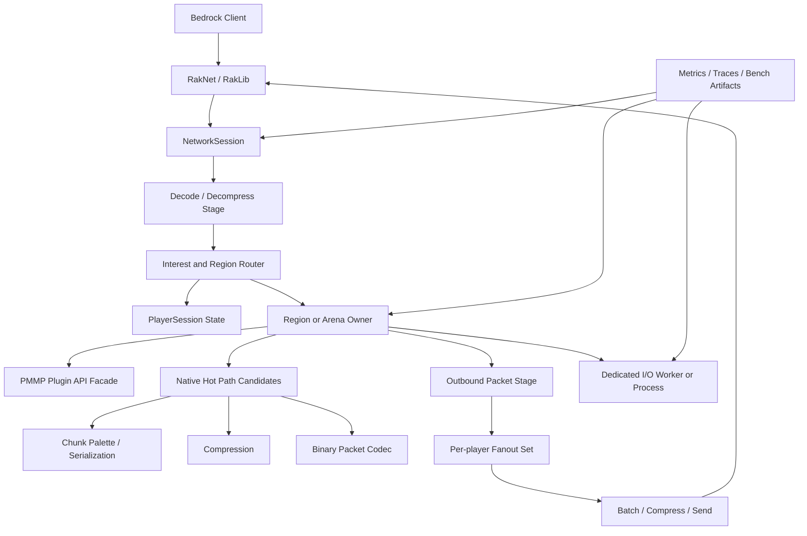

# PMMP 고성능 통합 실행계획

작성 기준: 2026-06-07  
대상 저장소: `main_pmmp/`의 PocketMine-MP 5.x 계열  
목표: PMMP 플러그인 생태계와 Bedrock 호환성을 최대한 유지하면서, 측정 가능한 방식으로 tick budget, 네트워크 처리량, 청크 전송, 엔티티 처리, 운영 자동화를 개선한다.

## 1. 결론

이 계획의 1차 목표는 “PMMP를 바로 완전 병렬 서버로 바꾸기”가 아니다. PMMP 공식 요구사항과 threading 문서 기준으로 PMMP는 멀티코어를 약하게 활용하며, PHP 스레드 간 복합 데이터 전달 비용이 크다. 따라서 가장 먼저 해야 할 일은 메인 스레드 tick budget을 보호하고, 네트워크 압축, 청크 직렬화, 관심영역 fanout, 대량 I/O를 명시적인 큐와 측정 가능한 단계로 분리하는 것이다.

장기적으로는 Folia, MultiPaper, SEDA, actor 모델을 참고해 region 또는 arena 단위 단일 소유자 모델을 실험한다. 단, PMMP의 PHP 플러그인 API와 Bedrock 프로토콜 갱신 부담을 고려해 production 경로와 실험 경로를 분리한다.

## 2. 기준 원칙

| 원칙 | 적용 방식 |
|---|---|
| 측정 우선 | p50/p95/p99 tick time, compression time, packet count, chunk send latency, RSS, async queue length를 저장한다. |
| 메인 스레드 보호 | 이벤트 핸들러, 패킷 조립, 청크 전송, DB/file/network I/O가 tick을 오래 점유하지 않게 한다. |
| 단일 소유자 상태 | World, Region, Arena, PlayerSession 중 하나가 상태를 소유하고, 다른 작업은 메시지 큐로 요청한다. |
| 복사량 감소 | PHP 배열과 객체 그래프를 worker로 넘기지 않고 scalar, 작은 DTO, 바이너리 문자열, 압축 문자열로 제한한다. |
| fanout 축소 | global broadcast를 줄이고 view distance, world, arena, team, phase, UI 구독 상태 기반 per-player fanout set을 만든다. |
| native/sidecar 분리 | compression, chunk palette, binary codec, packet pipeline처럼 반복 비용이 큰 작업만 PHP extension 또는 sidecar 후보로 둔다. |
| upstream 추적 | PMMP, PHP-Binaries, BedrockProtocol, BedrockData, RakLib, schema 패키지 업데이트를 묶어서 관리한다. |
| AI 보조, 사람 승인 | AI와 서브 에이전트는 분석과 초안 작성용이며, 배포와 기준 완화는 사람이 승인한다. |

## 3. 현재 로컬 구현 타깃

아래 파일들은 이번 계획의 실제 작업 중심이다.

| 영역 | 로컬 경로 | 확인할 내용 |
|---|---|---|
| 네트워크 세션 | `main_pmmp/src/network/mcpe/NetworkSession.php` | packet encode/decode, compression/decompression timing, send/receive queue |
| 배치 브로드캐스트 | `main_pmmp/src/network/mcpe/StandardPacketBroadcaster.php` | 동일 packet batch 재사용, compression path, broadcast fanout |
| 서버 루프 | `main_pmmp/src/Server.php` | `prepareBatch()`, network tick, async pool, main tick 흐름 |
| AsyncPool | `main_pmmp/src/scheduler/AsyncPool.php` | worker queue, central async pool 사용량, completion 처리 |
| AsyncTask | `main_pmmp/src/scheduler/AsyncTask.php` | CPU-bound 전용 원칙, I/O 금지 경고, 데이터 전달 방식 |
| 기본 설정 | `main_pmmp/resources/pocketmine.yml` | `async-workers`, `compression-level`, `async-compression`, chunk send 관련 설정 |
| 플레이어 청크 | `main_pmmp/src/player/Player.php` | chunk order, `sendNextChunk`, movement update, per-player queue |
| 입력 처리 | `main_pmmp/src/network/mcpe/handler/InGamePacketHandler.php` | `PlayerAuthInputPacket`, block action 제한, movement validation |
| Bedrock 패킷 | `main_pmmp/vendor/pocketmine/bedrock-protocol/src/` | packet pool, network settings, auth input, protocol update 영향 |
| 로컬 프로토콜 | `main_pmmp/install-local-protocol.sh` | BedrockProtocol/Data/UpgradeSchema 로컬 staging |

## 4. 목표 아키텍처



핵심은 `NetworkSession -> Router -> 단일 소유자 상태 -> Outbound Stage`의 경계를 명확히 하는 것이다. PMMP API는 가능한 한 유지하되, 내부적으로는 stage, queue, cache, fanout set을 추가한다.

## 5. 단계별 실행계획

### Phase 0. 기준선 고정

목표: “무엇이 빨라졌는지” 판단 가능한 기준을 만든다.

작업:

| 작업 | 산출물 | 합격 기준 |
|---|---|---|
| PMMP, Bedrock, PHP, 확장 버전 기록 | `runtime_manifest.json` 또는 시작 로그 | `php -v`, `php -m`, PMMP git/tag, RakLib, BedrockProtocol/Data 버전 기록 |
| production 기준 PHP 결정 | 운영 메모 | 공식 PHP-Binaries 우선, PHP 8.4는 별도 실험 경로로 분리 |
| benchmark config 고정 | `benchmarks/config/*.yml` | view-distance, player count, world seed, compression level, chunk radius 고정 |
| git branch 정책 | 문서 | `baseline/*`, `perf/*`, `protocol/*`, `experiment-region/*` 분리 |

주의:

- PMMP 공식 자료상 PHP 8.4는 “동작 가능”과 “공식 production 기준”을 구분해야 한다.
- Windows/OneDrive/한글 경로는 개발에는 가능하지만, 커스텀 PHP 빌드와 성능 측정은 짧은 ASCII 경로와 Linux 환경을 별도로 둔다.

### Phase 1. 관측성과 벤치마크

목표: tick, packet, chunk, entity, async queue 비용을 분리 측정한다.

작업:

| 작업 | 대상 | 산출물 | 합격 기준 |
|---|---|---|---|
| tick stage timer 추가 | `Server.php`, `NetworkSession.php`, `StandardPacketBroadcaster.php` | `var/perf/tick-stage-*.jsonl` | tick별 network, world, scheduler, broadcast 시간이 분리됨 |
| packet size/count 기록 | `NetworkSession.php` | packet histogram | packet id, raw size, compressed size, encode/decode time 기록 |
| chunk send latency 기록 | `Player.php` | chunk latency CSV | enqueue부터 send까지 p50/p95/p99 산출 |
| async queue metric | `AsyncPool.php` | queue length, completion budget | worker backlog과 main-thread completion time 확인 |
| synthetic player harness 조사 | 외부 도구 또는 간단한 Bedrock client simulator | bench runner 문서 | 동일 조건 반복 실행 가능 |

벤치마크 시나리오:

| 이름 | 부하 | 목적 |
|---|---|---|
| idle-players | 50/100/200명 접속 유지 | baseline session, heartbeat, memory |
| spawn-chunk-burst | 동시에 접속 후 spawn 주변 청크 수신 | chunk send, compression, cache miss |
| movement-fanout | 같은 arena에서 이동, 점프, 회전 | PlayerAuthInput, movement broadcast, AOI |
| entity-dense | 엔티티 200/500/1000개 | entity tick, metadata packet, culling |
| ui-scoreboard | scoreboard/actionbar/form 갱신 | UI packet fanout, update coalescing |
| plugin-io | DB/file/network I/O 플러그인 부하 | async pool 오염, tick blocking 탐지 |

성공 기준:

- benchmark artifact에 commit SHA, PHP version, PMMP version, config, warmup, 반복 횟수가 들어간다.
- p95 tick time 50ms 초과 구간은 stage 단위로 원인을 추적할 수 있다.

### Phase 2. 설정과 플러그인 레벨 즉시 개선

목표: 코어 대수술 전 운영 설정과 플러그인 패턴만으로 얻을 수 있는 성능을 확보한다.

작업:

| 작업 | 위치 | 기준 |
|---|---|---|
| `async-workers` 실험 | `resources/pocketmine.yml` | worker 증가가 compression/chunk 부하에 실제 이득인지 측정 |
| `compression-level` 실험 | `resources/pocketmine.yml` | CPU와 bandwidth 균형을 p95 tick과 outbound bytes로 판단 |
| `async-compression` 임계값 실험 | `resources/pocketmine.yml`, `Server.php` | 큰 packet에서만 이득인지 재측정 |
| plugin global loop 제거 가이드 | 문서/플러그인 | `foreach(Server::getOnlinePlayers())` 기반 전역 갱신을 구독 기반으로 전환 |
| Player 객체 장기 참조 제거 | 플러그인 | player name/uuid/id + WeakMap 기반 상태로 전환 |
| scoreboard/actionbar coalescing | 플러그인 | tick당 갱신 상한, 동일 문자열 재전송 방지 |

합격 기준:

- 코어 변경 없이도 p95 tick time과 outbound packet 수가 개선되는지 확인한다.
- 플러그인 작업은 PMMP API 5.x 호환성을 유지한다.

### Phase 3. 네트워크와 배치 hot path

목표: 같은 내용을 여러 플레이어에게 보낼 때 packet encode/compress를 반복하지 않는다.

작업:

| 작업 | 대상 | 구현 방향 | 합격 기준 |
|---|---|---|---|
| broadcast batch cache | `StandardPacketBroadcaster.php` | 동일 packet set의 encoded batch를 재사용 | 동일 broadcast에서 encode/compress 횟수 감소 |
| per-player fanout set | `NetworkSession.php`, router 신규 계층 | world, view distance, arena, team, phase, UI subscription 기반 | global broadcast 제거율 측정 |
| compression policy | `Server.php`, compressor 계층 | size threshold, libdeflate 사용 가능 여부, async threshold 비교 | p95 compression time 감소 |
| send queue backpressure | `NetworkSession.php` | 큐 길이 상한, 낮은 우선순위 UI update drop/coalesce | lag player 1명이 전체 tick에 주는 영향 감소 |
| static packet cache | packet builder | resource pack, static form, repeated text packet 후보 | cache hit rate 기록 |

주의:

- client authority를 늘려 서버 검증을 줄이는 방향은 보안상 금지한다.
- `libdeflate` README 수치는 참고값이며 실제 Bedrock packet size 분포에서 다시 측정한다.

### Phase 4. 청크와 월드 hot path

목표: 청크 전송과 블록 상태 처리에서 PHP 배열/객체 churn을 줄인다.

작업:

| 작업 | 대상 | 구현 방향 | 합격 기준 |
|---|---|---|---|
| chunk send queue metric | `Player.php` | player별 pending chunk, sent chunk, latency 기록 | chunk 병목이 packet/compress/cache 중 어디인지 분리 |
| chunk serialization cache | chunk/network 계층 | 동일 subchunk 또는 runtime state 결과 재사용 | spawn burst p95 감소 |
| pregen/offline build | 운영 도구 | 월드 생성, light, block upgrade 사전 처리 | 접속 직후 chunk 생성 spike 감소 |
| palette/native 후보 정리 | `ext-chunkutils2`, PMMP chunk 코드 | PalettedBlockArray, LightArray 활용 경로 확인 | PHP 배열 기반 루프 감소 |
| view distance 정책 | config/router | 상황별 동적 view distance 또는 spawn-radius 제한 | first join peak 감소 |

장기 후보:

- chunk diff packet, subchunk cache, biome/light cache, binary buffer 기반 chunk packet builder.
- PHP extension 또는 sidecar는 benchmark에서 chunk serialization이 상위 병목일 때만 진행한다.

### Phase 5. 엔티티, 이동, 관심영역

목표: 이동과 엔티티 업데이트를 “모든 플레이어에게 즉시 전송”하지 않고, 실제 수신자와 최신 상태 중심으로 줄인다.

작업:

| 작업 | 대상 | 구현 방향 | 합격 기준 |
|---|---|---|---|
| movement input fast path | `InGamePacketHandler.php` | `PlayerAuthInputPacket` validation 비용 분리 측정 | movement p95 처리 시간 확인 |
| move update coalescing | `Player.php`, entity broadcaster | 같은 tick 내 마지막 위치만 유지 | movement packet 수 감소 |
| AOI grid | 신규 router 또는 world helper | chunk/view distance 기반 수신자 집합 유지 | broadcast 대상 계산 비용 감소 |
| entity metadata diff | entity network 계층 | 변경 없는 metadata 재전송 방지 | entity-dense packet 수 감소 |
| arena/team/phase routing | 플러그인 API 또는 router | minigame room, spectator, team별 수신자 분리 | minigame fanout 감소 |

보안 기준:

- 이동, 충돌, 전투, 인벤토리 판정은 서버 권위를 유지한다.
- 클라이언트가 보낸 상태는 trust하지 않고 validation path를 통과한다.

### Phase 6. Async와 I/O 파이프라인

목표: 중앙 AsyncPool을 compression/chunk 같은 CPU-bound 작업 중심으로 유지하고, DB/file/network I/O는 별도 worker/process로 분리한다.

작업:

| 작업 | 대상 | 구현 방향 | 합격 기준 |
|---|---|---|---|
| AsyncTask 사용 감사 | `src/`, 플러그인 | I/O-bound, 대형 객체 전달, PMMP API 접근 탐지 | 위험 작업 목록 생성 |
| dedicated I/O worker | 신규 운영 모듈 또는 sidecar | DB write, log ingest, analytics, webhook 분리 | central AsyncPool backlog 감소 |
| bounded queue | I/O worker | 큐 길이, timeout, retry, drop 정책 명시 | 장애 시 tick 보호 |
| completion budget | `AsyncPool.php`, main tick | tick당 completion 처리 상한 | worker 완료 폭주 시 tick spike 감소 |
| SEDA stage metric | 각 stage | input queue, service time, drop/coalesce count | 병목 stage 자동 식별 |

규칙:

- `AsyncTask::onRun()`은 짧은 CPU-bound 작업 중심으로 둔다.
- World, Entity, Player, Chunk, Item 객체 그래프를 worker로 보내지 않는다.
- 작업 입력은 scalar, 작은 DTO, binary string, compressed string 중심으로 제한한다.

### Phase 7. Region/Arena Actor 실험

목표: production 경로와 분리된 branch에서 단일 소유자 상태 모델을 검증한다.

작업:

| 작업 | 구현 단위 | 합격 기준 |
|---|---|---|
| `MatchActor` prototype | minigame room 1개 | room 내부 상태를 actor 1개가 소유 |
| `RegionActor` prototype | chunk group | region state를 단일 writer가 처리 |
| cross-region command queue | message DTO | 직접 참조 없이 command와 event만 교환 |
| deterministic replay | input log | 같은 입력으로 같은 결과 재현 |
| plugin compatibility shim | 제한된 API subset | 기존 PMMP plugin 중 일부가 동작 |
| merge/split research | Folia region logic 참고 | region 이동, entity crossing 규칙 문서화 |

비목표:

- 첫 실험에서 전체 world tick 병렬화를 production에 넣지 않는다.
- PHP thread 공유 객체 기반 병렬화는 하지 않는다.
- chunk lease가 없는 단일 월드 다중 프로세스 tick은 하지 않는다.

### Phase 8. Bedrock 업데이트와 릴리즈 자동화

목표: Bedrock 버전 변경이 올 때마다 수동 추적 비용을 줄인다.

작업:

| 작업 | 대상 | 산출물 |
|---|---|---|
| upstream release watcher | PMMP, BedrockProtocol, BedrockData, PHP-Binaries, RakLib | release impact report |
| protocol staging | `install-local-protocol.sh` | 로컬 BedrockProtocol/Data/UpgradeSchema 조합 테스트 |
| packet fixture | `vendor/pocketmine/bedrock-protocol/src/` | 새 packet decode/encode fixture |
| API compatibility matrix | 플러그인 목록 | PMMP API version, plugin.yml, known breakage |
| canary checklist | 운영 문서 | join, movement, chunk, inventory, form, resource pack, transfer 검증 |
| rollback note | 운영 문서 | 이전 PMMP/PHP/protocol 조합으로 되돌리는 절차 |

주의:

- Bedrock 업데이트는 `BedrockProtocol`, `BedrockData`, `BedrockBlockUpgradeSchema`, `BedrockItemUpgradeSchema`, PMMP `WorldDataVersions`를 묶어서 본다.
- 공식 Bedrock 문서만으로 충분하다고 가정하지 않는다. PMMP 업데이트 문서처럼 packet trace와 실제 동작 검증이 필요하다.

### Phase 9. AI와 서브 에이전트 운영체계

목표: 사람의 판단을 대체하지 않고, 조사, 분석, 검증, 문서화를 자동화한다.

역할:

| Agent | 목적 | 기본 권한 |
|---|---|---|
| Orchestrator | 작업 분해, agent 라우팅, 위험 등급 산정 | read-only |
| Code Analysis Agent | PMMP/PHP 코드 경로, 핫스팟, API 호환성 분석 | repo read, static analyzer |
| Benchmark Agent | tick, memory, packet, queue benchmark 설계 및 실행 | 제한된 benchmark |
| Regression Test Agent | PHPUnit, 통합 테스트, 재현 시나리오 후보 생성 | 테스트 patch 제안 |
| CI Triage Agent | PHPStan/PHPUnit/Actions 실패 분류 | CI log read |
| Documentation Agent | 변경 요약, 운영 문서, 릴리즈 노트 작성 | docs write proposal |
| Release Watch Agent | upstream 릴리즈와 보안 권고 감시 | external read |
| Issue Summary Agent | 이슈/PR/로그 요약과 중복 클러스터링 | issue/log read |
| Risk Gatekeeper | prompt injection, secret, supply-chain, 품질 gate 검토 | 승인권 없음 |
| Reviewer/Evaluator Agent | 다른 agent 출력의 근거와 환각 검토 | read-only |

공통 입력 계약:

```yaml
task_id: string
repo_ref: branch | commit_sha
scope: files | modules | issue_ids
trust_level: trusted_internal | untrusted_pr | external_issue | public_web
constraints:
  can_write_files: false
  can_run_shell: false
  can_access_secrets: false
  max_runtime_minutes: 20
success_criteria:
  - measurable condition
```

공통 출력 계약:

```yaml
summary: short Korean summary
findings:
  - severity: critical | high | medium | low | info
    evidence: file/log/benchmark/source reference
    confidence: high | medium | low
recommendations:
  - action
artifacts:
  - report path or CI artifact URL
risk_notes:
  - security/quality concern
needs_human_approval: true
```

자동화 파이프라인:

| 파이프라인 | 흐름 |
|---|---|
| PR | context collector -> code analysis + docs 병렬 -> perf-sensitive면 benchmark -> regression 후보 -> CI triage -> risk gate |
| Nightly | main benchmark -> release/dependency/security watch -> flaky 탐지 -> 성능 추세 리포트 |
| Release | upstream changelog -> compatibility matrix -> canary benchmark -> release/rollback note |
| Incident | 운영 로그 + 최근 diff -> 병렬 분석 -> suspect commit/repro -> 사람 승인 후 hotfix/rollback |

보안 게이트:

- issue body, PR title, commit message, CI log, 외부 문서는 모두 untrusted input으로 취급한다.
- untrusted text를 shell, workflow expression, MCP/tool argument에 직접 연결하지 않는다.
- agent는 secret, production DB, live console, 배포 credential에 접근하지 않는다.
- GitHub Actions는 최소 권한 `GITHUB_TOKEN`, SHA pinning, secret 없는 untrusted PR workflow 분리를 적용한다.
- `pull_request_target`에서 fork PR 코드를 checkout/build/run 하지 않는다.
- agent가 작성한 코드는 사람 리뷰와 CI 통과 전 merge하지 않는다.

품질 게이트:

- PHPStan/Psalm/PHPUnit 통과.
- PMMP API 호환성과 `plugin.yml` API version 확인.
- 성능 변경은 baseline 대비 p95 tick time, memory, CPU, packet throughput 기준으로 판정.
- benchmark는 warmup, 반복 횟수, 동일 서버 설정, artifact 저장 없이는 승인하지 않는다.
- agent 출력은 근거 링크, 로그, 파일 위치, benchmark artifact가 없으면 초안으로만 취급한다.

## 6. 우선순위 백로그

| 우선순위 | 작업 | 근거 | 담당 agent | 완료 기준 |
|---|---|---|---|---|
| P0 | runtime manifest와 benchmark config 생성 | PMMP/PHP/Bedrock 버전 차이가 성능과 호환성에 직접 영향 | Benchmark | artifact에 버전과 config 포함 |
| P0 | network/chunk/async stage timer 추가 | 병목 없는 최적화는 위험 | Code Analysis, Benchmark | p95 tick 원인 분리 |
| P0 | AsyncTask 사용 감사 | PMMP 문서상 I/O와 대형 객체 전달은 위험 | Code Analysis | 위험 AsyncTask 목록 |
| P1 | broadcast batch cache 후보 측정 | packet encode/compress 반복 제거 | Benchmark | encode/compress 횟수 감소 |
| P1 | per-player fanout set 설계 | interest management 기반 global broadcast 축소 | Code Analysis | fanout 대상 수 기록 |
| P1 | chunk send latency 측정 | 접속 spike와 chunk 병목 분리 | Benchmark | chunk enqueue/send p95 |
| P1 | scoreboard/actionbar coalescing | UI packet 폭주 방지 | Code Analysis | UI packet count 감소 |
| P2 | dedicated I/O worker 설계 | central AsyncPool 오염 방지 | Code Analysis | AsyncPool backlog 감소 |
| P2 | compression policy 실험 | libdeflate/zlib/async threshold 비교 | Benchmark | CPU/bandwidth/tick 비교 |
| P2 | Bedrock update watcher | 프로토콜 추적 비용 감소 | Release Watch | impact report 생성 |
| P3 | MatchActor prototype | region actor보다 안전한 첫 actor 실험 | Code Analysis | minigame room 단위 동작 |
| P3 | RegionActor prototype | Folia식 ownership 검증 | Code Analysis, Benchmark | cross-region command queue |
| P3 | native/sidecar 후보 PoC | PHP hot path 한계 검증 | Benchmark | PHP 대비 실제 개선 수치 |

## 7. milestone

| 기간 | 목표 | 성공 기준 |
|---|---|---|
| 0-2주 | 기준선, 관측성, benchmark runner | stage별 p95/p99와 artifact 생성 |
| 2-6주 | 설정/플러그인/브로드캐스트/청크 즉시 개선 | p95 tick, outbound packet, chunk latency 개선 |
| 6-12주 | Async/I/O 분리, fanout router, compression policy | AsyncPool backlog와 compression spike 감소 |
| 3-6개월 | MatchActor/RegionActor 실험 branch | 단일 소유자 모델과 plugin compatibility 검증 |
| 6개월 이상 | native/sidecar, shard/lease 구조 검증 | 실측 기반 production 적용 여부 결정 |

## 8. 리스크

| 리스크 | 설명 | 대응 |
|---|---|---|
| PHP 스레드 복사 비용 | 복합 객체 전달은 병렬화 이득을 지울 수 있음 | scalar/DTO/binary string만 worker로 전달 |
| plugin API 호환성 | PMMP 플러그인 생태계를 깨면 운영 가치가 낮아짐 | compatibility shim과 API matrix 유지 |
| Bedrock 업데이트 부담 | 새 버전마다 packet/data/schema 변경 발생 | release watcher와 canary fixture |
| benchmark 왜곡 | Windows/OneDrive/디버그 설정이 결과를 왜곡 | Linux, 고정 config, warmup, 반복 측정 |
| AI 환각 | agent가 출처 없는 결론을 낼 수 있음 | evidence 필수, reviewer/evaluator, 사람 승인 |
| 보안 자동화 사고 | untrusted PR/issue가 tool 실행으로 이어질 수 있음 | read-only 기본, allowlist, secret 차단 |

## 9. 출처 맵

| 주장 | 주요 출처 |
|---|---|
| PMMP는 멀티코어 활용이 약하고 단일 코어 성능이 중요 | PMMP requirements |
| PHP thread 간 복합 데이터 전달 비용이 큼 | PMMP threading 문서, PHP memory/GC 문서 |
| PMMP hot path에는 chunkutils2, libdeflate, pmmpthread 등 확장 영향이 큼 | PHP-Binaries, ext-chunkutils2, ext-libdeflate |
| Bedrock 업데이트는 Protocol/Data/Schema/WorldDataVersions 묶음으로 봐야 함 | PMMP protocol update guide |
| regionized multithreading의 핵심은 스레드 수가 아니라 단일 소유자 invariant | Folia overview, Folia region logic |
| chunk 소유권과 shard authority는 동시 tick 방지에 필요 | MultiPaper architecture |
| stage, bounded queue, backpressure는 고부하 서버에 적합 | SEDA paper |
| interest management는 global broadcast 축소의 핵심 | FiveM OneSync, IBM interest management survey |
| AI agent는 guardrail, eval, human approval이 필요 | OpenAI agent guide, Anthropic agent patterns, OWASP LLM Top 10, GitHub Actions hardening |

## 10. 바로 다음 작업 체크리스트

- [ ] `benchmarks/` 디렉터리와 benchmark artifact 포맷 정의
- [ ] `runtime_manifest.json` 생성 스크립트 작성
- [ ] `NetworkSession`, `StandardPacketBroadcaster`, `Player::sendNextChunk`, `AsyncPool` 측정 지점 선정
- [ ] `resources/pocketmine.yml` 성능 실험 matrix 작성
- [ ] 플러그인 코드 기준 global loop, blocking I/O, Player strong ref 탐지 규칙 작성
- [ ] Bedrock/PMMP release watcher 초안 작성
- [ ] AI agent 입출력 YAML 템플릿을 `plan_md/` 또는 `docs/agents/`에 분리
