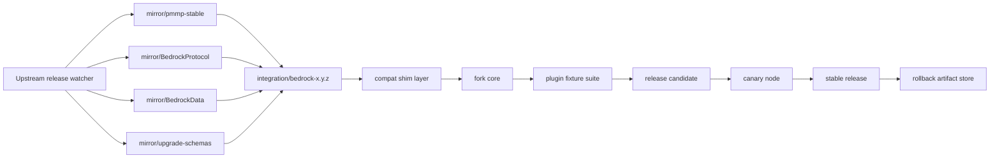
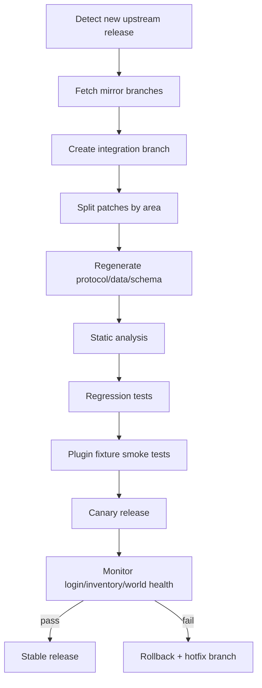

# 마인크래프트 베드락 서버 구동기 최신 업데이트 대응과 커스텀 PMMP 포크 운영 전략 보고서

## Executive summary

이 보고서의 결론은 명확하다. **최신 베드락 업데이트를 빠르고 정확하게 따라가야 하고, 그 위에 장기 유지 가능한 커스텀 포크를 만들려면 현재 기준으로는 PMMP를 기반으로 삼는 것이 가장 실무적**이다. 2026년 6월 2일 기준 PMMP의 최신 안정 릴리스는 **5.43.2**이며, Bedrock **1.26.20** 대응이 이미 안정화되어 있다. PMMP는 공식 문서에서 “새 Minecraft 버전은 보통 며칠 안에 지원된다”고 직접 밝히고 있고, 실제 릴리스도 **support release → security/bugfix follow-up** 구조를 자주 보인다. 또한 5.x 라인에서는 **이전 5.x 플러그인이 대체로 그대로 동작**한다고 릴리스 노트에 명시하면서도, `pocketmine\network\mcpe` 나 `pocketmine\data` 같은 내부/준내부 영역은 예외라고 분명히 경고한다. 즉, **플러그인 API 안정성과 내부 프로토콜 유연성을 동시에 관리하는 체계가 이미 성숙**해 있다. citeturn18search1turn11view0turn12view1turn41search1

반대로 **Dragonfly**는 Go 기반 비동기 아키텍처와 확장성 측면에서는 강하지만, 업데이트 대응이 **gophertunnel** 의 최신 프로토콜 지원에 강하게 연동되고, 큰 변화가 있을 때는 API/도구체인 요구사항까지 함께 움직인다. 실제로 v0.10.0은 “significant changes”를 명시하며 **world transaction 모델 도입**과 **Go 1.23+ 요구**를 동반했고, 현재 저장소는 **Go 1.26** 과 **gophertunnel v1.56.2** 를 사용한다. gophertunnel 쪽도 “한 번에 하나의(대개 최신) 버전만 지원”하는 모델을 채택하고 있어, Dragonfly 계열은 **프로토콜 최신화는 빠를 수 있어도, 애플리케이션 코드와 빌드 환경 양쪽이 동시에 흔들릴 수 있는 계열**로 보는 것이 맞다. citeturn6view4turn31search0turn31search1turn31search2

**Nukkit 계열**은 업데이트 대응 방식이 서로 다르다. **Cloudburst Nukkit** 은 공식 공지에서 반복적으로 “업데이트는 **새 클라이언트 접속을 허용하는 protocol update만 포함하며, 새 블록/기능은 지원하지 않는다**”고 못 박고 있으며, 배포 채널도 안정 태그보다 **Jenkins/Latest Snapshot** 중심이다. **PowerNukkitX** 는 이 틈새를 메우기 위해 **stable + nightly** 모델을 운영하며 2026년 5월 28일에 **2.0.0** stable을 내놓았지만, 그만큼 최첨단 기능과 호환성 버그가 섞일 가능성이 높다. **Genisys/GenisysPro** 는 현재 시점에서 현대적인 기반으로 보기 어렵다. Genisys는 **2021년 아카이브** 되었고, 저장소 자체가 “maintenance-only, PMMP에서 cherry-pick 위주, 가능하면 PMMP로 이동하라”고 경고한다. GenisysPro 역시 **discontinued** 상태이며 최신 릴리스가 **2017년** 이다. citeturn37view1turn38view0turn19view0turn20view0turn34search2turn34search6turn34search1turn34search8

따라서 권장 전략은 단순 업스트림 추적이 아니라, **업스트림 미러링 + 프로토콜/데이터 스테이징 + 호환 셈(compat shim) + 자동 릴리스 감지 + 회귀 테스트 픽스처 + 카나리/롤백** 을 갖춘 **운영형 포크**를 만드는 것이다. PMMP 공식 문서가 제시하는 **“새 Minecraft 버전 지원 절차”** 와, PMMP 저장소가 제공하는 **로컬 BedrockProtocol/BedrockData 통합 테스트 스크립트** 는 이 전략이 단순 아이디어가 아니라 **이미 업스트림이 내부적으로 활용하는 방식의 확장판**임을 보여준다. citeturn41search2turn30view0

## 범위와 가정

이 보고서는 사용자의 요구에 따라 **리눅스 서버 운영 환경**을 기본 가정으로 삼았다. 특정 Minecraft 버전 타깃은 별도로 주어지지 않았으므로, **2026년 6월 2일 기준 최신 안정 계열**을 중심으로 분석했다. PMMP는 **5.43.2 / Bedrock 1.26.20**, PowerNukkitX는 **2.0.0 / Bedrock 1.26.20**, Dragonfly는 공식 위키 기준 **v0.10.7 / Bedrock 1.21.111** 까지 공개 릴리스 기록이 확인되며, Nukkit은 **Latest Snapshot** 과 Jenkins 빌드 중심으로 배포되고 있다. citeturn18search1turn20view0turn42view0turn38view0

평가 기준은 네 가지다. 첫째, **릴리스 주기**와 배포 채널이 예측 가능한가. 둘째, 릴리스가 **버그 수정·API 변경·보안 패치·성능 개선**을 얼마나 분리해서 다루는가. 셋째, 릴리스 노트와 커밋/PR 패턴에서 **breaking change가 어디에 모이는가**. 넷째, 실제 이슈 트래커에서 보이는 **호환성 사고를 얼마나 빨리 원인-수정-회귀테스트 구조로 감쌀 수 있는가**다. PMMP는 플러그인이 `plugin.yml` 에 **API version** 을 선언해야 하고, 필요하면 **`mcpe-protocol`** 도 추가로 제한할 수 있으며, API 버전은 서버 버전과 동일하게 취급된다. 이것은 포크 설계에서 **“어디까지 안정 계약으로 간주할지”** 를 정하는 데 직접적인 기준이 된다. citeturn41search3turn41search0

## 구동기별 최신 업데이트 대응 방식 비교

PMMP 공식 문서는 PocketMine-MP가 **지속적으로 업데이트되며 새로운 Minecraft 버전이 보통 며칠 안에 지원된다**고 설명한다. 하지만 같은 “업데이트 빠름”이라도 각 엔진이 실제로 택하는 대응 방식은 매우 다르다. 어떤 프로젝트는 **프로토콜 우선**, 어떤 프로젝트는 **nightly 우선**, 어떤 프로젝트는 **major bump에 breaking change를 몰아넣는 방식**을 택한다. 포크 설계자는 이 차이를 이해해야만 “업스트림 merge하면 끝”이라는 함정을 피할 수 있다. citeturn41search1

| 구동기 | 최신 확인 채널과 최근 릴리스 패턴 | 변경 유형 분포 | 릴리스 노트·커밋 패턴 | 대표 호환성 문제와 실무적 해결 | 포크 기반 적합도 |
|---|---|---|---|---|---|
| **PMMP** | 2026-02-15 **5.40.0**, 2026-03-25 **5.42.0**, 2026-05-09 **5.43.0**, 2026-06-01 **5.43.2**. 지원 릴리스 직후 같은 날 또는 수일 내 **security/bugfix patch** 가 뒤따르는 패턴이 반복된다. citeturn12view3turn12view0turn11view0turn18search1 | release page 자체가 **support / bugfix / security / minor feature / performance / network security** 를 구분한다. 5.41.0은 feature·performance·network security, 5.42.1/5.43.1은 security, 5.43.2는 bugfix다. citeturn18search1turn11view0 | `changelogs/*.md` 로 버전별 기록이 정리되고, PR 목록에 **Category / BC break** 라벨이 명시된다. 5.x 릴리스는 “이전 5.x 플러그인 호환”을 반복적으로 명시하지만 내부 namespace는 예외다. citeturn9search2turn12view1turn11view0 | **#7041**: `InventoryTransactionEvent` 취소 후 후속 인벤토리 트랜잭션이 깨짐. **#7043**: 1.26.20에서 `InventorySlotPacket` 의 `FullContainerName` optional 처리 문제로 랜덤 disconnect. 둘 다 **5.43.2** 에서 수정되었다. 실무적으로는 **즉시 5.43.2 backport**, inventory resync 회귀 테스트 추가가 정답이다. citeturn15search0turn15search1turn11view0 | **가장 높음.** 최신 대응 속도, 문서화된 내부 업데이트 절차, 플러그인 API 안정 계약이 모두 있다. citeturn41search1turn41search2 |
| **Dragonfly** | 위키 changelog 기준 2024-11-23 **v0.9.19**, 2024-12-04 **v0.9.20**, 2025-01-05 **v0.10.0**, 2025-03-25 **v0.10.3**, 2025-10-02 **v0.10.7**. PMMP보다 릴리스 간격이 긴 편이지만, point release는 주로 protocol support와 bugfix다. citeturn8view1turn8view0turn6view4turn7view0turn42view0 | **protocol support + bug fixes** 가 주력이고, 큰 버전점에서는 **architecture/API/toolchain** 도 함께 바뀐다. v0.10.0은 world transactions와 Go 요구 버전 상승을 동반했다. citeturn6view4turn7view0turn42view0 | 릴리스 노트가 **GitHub Wiki changelog page** 로 공개되며, bullet에서 이슈 번호를 직접 참조하는 경우가 많다. breaking change는 **v0.10.0 같이 큰 전환점** 에 집중된다. citeturn6view4turn8view3 | v0.10.0 이후 world access가 **synchronised transactions** 로 바뀌고, command `Runnable.Run` 에 `*world.Tx` 가 전달되도록 바뀌었다. 또한 1.20.30 지원 직후 **#815** 에서 일반 유저에게 보여선 안 되는 명령 노출 문제가 보고되었다. 실무 해법은 **월드 변경을 transaction 경계 안으로 강제** 하고, command/permission snapshot 테스트를 추가하는 것이다. citeturn6view4turn32view0 | **중간.** 확장성과 성능은 강점이지만, PMMP 스타일의 “플러그인 안정 계약”보다 **코드/툴체인 적응 비용** 이 더 크다. citeturn31search0turn6view4 |
| **Cloudburst Nukkit** | 공식 공지와 GitHub 릴리스 페이지 모두 **Latest Snapshot/Jenkins** 중심이다. 공식 공지는 반복적으로 “업데이트는 새 클라이언트 연결을 위한 **protocol update only**” 라고 설명한다. citeturn37view1turn38view0 | **프로토콜 접속성 확보** 가 중심이며, 새 블록/기능 추가는 의도적으로 범위 밖인 경우가 많다. citeturn37view1turn37view0 | 포럼 공지 + Jenkins build 번호 + snapshot 전달이 주된 패턴이며, changelog granularity는 PMMP보다 떨어진다. citeturn37view1turn37view0 | **#2218**: 1.21.60 클라이언트 월드 import 시 chunk serializer version 41 미지원 오류. **#1621**: release #747 이후 remote query format 변화로 외부 상태 조회 도구가 깨짐. 실무 해법은 **snapshot 선검증, world format smoke test, query protocol fixture** 다. citeturn23search3turn24search1 | **낮음~중간.** 빠른 접속 허용에는 유용하지만, 정밀한 기능 호환과 장기 API 안정 기반으로는 약하다. citeturn37view1turn37view2 |
| **PowerNukkitX** | GitHub releases 에 **stable 2.0.0** 과 **nightly/latest snapshot** 채널이 함께 노출된다. stable **2.0.0** 은 2026-05-28, Bedrock **1.26.20** 지원이다. citeturn20view0turn19view0 | stable은 버전 고정, nightly는 최신 source 반영. 기능 폭이 넓고 CI/CD 개편 같은 운영 변경도 nightly change log에 나타난다. citeturn19view0turn19view1 | 릴리스 노트는 간결한 편이고, **roadmap issue + project board** 로 API 진화가 노출된다. 예를 들어 **#2307** 은 `PlayerMoveEvent` 분리를 추진하면서 legacy event를 **deprecated** 로 남겨 호환성을 확보하려고 했다. citeturn21search0 | **#2562**: `SyncEntityPropertyPacket` 가 BIG_ENDIAN NBT를 써서 클라이언트가 schema를 무시, custom entity property가 항상 0으로 보임. 제안된 수정은 **LITTLE_ENDIAN** 으로 교체하는 것이다. 실무적으로는 nightly 도입 시 **packet/NBT endian 회귀 테스트** 가 필수다. citeturn21search1 | **중간.** 기능 욕심이 크면 매력적이지만, quick-accurate update 대응만 놓고 보면 nightly 리스크를 감수해야 한다. citeturn19view0turn21search1 |
| **Cloudburst Server** | 저장소는 **develop** 중심이고, GitHub에 **정식 releases가 published 되지 않았다**. 오픈 이슈도 장기 미해결 항목이 남아 있다. citeturn33search0turn40search0 | 기능 구현·엔진 개발 성격이 강하고, 배포 안정판 주기가 명확하지 않다. citeturn33search0 | “Bedrock first server software” 이지만, release engineering 측면에서는 snapshot보다도 더 개발 브랜치 중심이다. citeturn33search0 | 예로 **#7** 은 Nukkit world conversion 문제를, **#104** 는 shutdown 중 forceShutdown 경로 미실행과 저장 누락을 보고했다. 이런 유형은 운영형 포크의 baseline으로 쓰기엔 부담이 크다. citeturn40search1turn40search2 | **낮음.** 실험·연구용이면 몰라도 “빠르고 정확한 최신 대응 포크”의 출발점으로는 비추천이다. citeturn33search0turn40search0 |
| **Genisys / GenisysPro** | Genisys는 **2021-12-15 아카이브**, “active development 중단, maintenance-only, PMMP cherry-pick 위주”라고 공지한다. GenisysPro는 **discontinued** 이며 최신 릴리스가 **2017-09-01** 이다. citeturn34search6turn34search2turn34search1turn34search8 | 현대적 의미의 최신 대응 체계가 사실상 없다. citeturn34search2turn34search8 | release note pattern 자체가 중단 상태다. citeturn34search1turn34search2 | 호환성 문제를 해결하기보다 **PMMP로 이동** 하는 것이 공식적으로 권장된다. citeturn34search2 | **매우 낮음.** 현대 Bedrock 최신 대응 기반으로는 사실상 제외 대상이다. citeturn34search2turn34search8 |

### PMMP

PMMP의 가장 큰 장점은 “빠르다”가 아니라 **빠른데도 구조화되어 있다**는 점이다. 릴리스 페이지는 5.40.0, 5.42.0, 5.43.0 같은 **support release** 와 5.42.1, 5.43.1 같은 **security release**, 5.43.2 같은 **bugfix release**, 5.41.0 같은 **minor feature release** 를 명시적으로 구분한다. 이 구분은 포크 운영에서 매우 중요하다. 무엇을 **즉시 backport** 해야 하는지, 무엇을 **다음 maintenance window** 로 미뤄도 되는지 판단할 수 있기 때문이다. citeturn18search1

또 하나 중요한 점은 PMMP가 **플러그인 호환성과 내부 불안정 영역을 정확히 분리** 한다는 것이다. 5.40.0, 5.42.0, 5.43.0 changelog는 모두 “이전 5.x 플러그인은 대체로 그대로 동작한다”는 메시지를 반복하면서도, `pocketmine\network\mcpe`, `pocketmine\data`, reflection, internal API 사용은 보호 대상이 아니라고 경고한다. 즉, **당신의 포크가 건드려도 되는 지점과 절대 직접 노출하면 안 되는 지점** 이 이미 정의되어 있다. 포크 설계에서 이 경계선을 그대로 채택하는 것이 가장 안전하다. citeturn12view4turn12view1turn11view0

실제 호환성 사고도 릴리스 체계가 작동함을 보여준다. 5.43.0 이후 **#7041** 에서는 `InventoryTransactionEvent` 취소 후 클라이언트 prediction mismatch가 누적되어 이후 인벤토리 이동이 망가지는 문제가 보고되었다. 비슷한 시기에 **#7043** 에서는 1.26.20의 `InventorySlotPacket` 구조 변경 때문에 이유 없는 disconnect가 보고되었다. 두 문제는 5.43.2 changelog에서 각각 **inventory rollback disconnect**, **bridging data mishandling**, **sleep state visibility** 등과 함께 수정되었다. 포크 운영자는 이런 케이스를 단순 “업스트림 버그”로 소비하지 말고, **회귀 테스트 자산** 으로 흡수해야 한다. citeturn15search0turn15search1turn11view0

### Dragonfly

Dragonfly의 업데이트 대응 방식은 PMMP와 다르다. PMMP가 플러그인 API 안정성을 보존하면서 support release를 짧게 자주 끊는 반면, Dragonfly는 **큰 구조 전환과 프로토콜 갱신을 더 느슨한 간격으로 묶어서 처리** 하는 쪽에 가깝다. v0.10.0 changelog는 아예 “significant changes”를 선언하면서 **world access를 synchronised transactions 기반으로 바꾸고**, command 실행 경로가 `*world.Tx` 를 받도록 수정했으며, **Go 1.23 이상** 을 요구했다. 현재 README와 `go.mod` 는 이미 **Go 1.26** 과 **gophertunnel v1.56.2** 를 요구한다. citeturn6view4turn31search0turn31search2

이 구조는 장단이 뚜렷하다. 장점은 최신 프로토콜을 추적할 때 **gophertunnel** 을 따라가면 된다는 점이다. 하지만 gophertunnel 자체가 “대개 **최신 공식 버전 하나** 를 지원하고, 새 Minecraft 버전에 맞춰 **minor version tag** 를 올린다”고 밝히고 있으므로, Dragonfly 계열은 결과적으로 **프로토콜 라이브러리와 서버 애플리케이션이 동시에 흔들리는 체인 의존성** 을 가진다. 실제로 gophertunnel 이슈 **#385** 처럼 새 Bedrock 버전이 나오면 바로 지원 이슈가 등록되는 흐름이 반복된다. citeturn31search1turn32view1

따라서 Dragonfly를 기반으로 포크를 운영한다면, “업데이트 대응”은 단순 commit merge가 아니라 **Go toolchain upgrade + gophertunnel bump + world/command transaction API migration** 을 함께 묶어 관리해야 한다. PMMP 포크와 달리 **호환 레이어의 주 임무가 플러그인보다 core code 적응** 이 된다는 뜻이다. citeturn6view4turn31search0

### 기타 주요 구동기

Cloudburst Nukkit은 공식 공지에서 반복적으로 “업데이트는 protocol update only”라고 밝힌다. 이는 장점이자 한계다. 장점은 최신 클라이언트 연결 허용을 빠르게 할 수 있다는 것이고, 한계는 **월드 포맷·기능 구현·게임플레이 호환성** 이 별개의 과제로 남는다는 것이다. 1.21.60 월드 import 실패 이슈 **#2218** 이 그 전형적 사례다. 클라이언트는 최신인데 월드 serializer는 따라가지 못하는 상황이 실제로 발생한다. citeturn37view1turn23search3

PowerNukkitX는 이보다 적극적이다. stable 2.0.0과 nightly를 병행하면서 새로운 기능과 API 개편을 빠르게 흡수한다. 다만 그 대가로 **최신 기능 경계면에서의 프로토콜/직렬화 버그** 가 실제로 보인다. custom entity property schema가 BIG_ENDIAN/LITTLE_ENDIAN 차이로 무효화된 **#2562** 는, “nightly 잘 돌아가네” 수준의 수동 확인으로는 절대 잡히지 않는 유형이다. 반대로 **#2307** 같은 이슈는 legacy event를 deprecated로 남긴 채 새 이벤트로 분리하려는 식의 **완만한 마이그레이션 문화** 를 보여준다. 즉, PNX는 **기능 폭은 크지만, 포크 운영 난이도 역시 올라간다**. citeturn21search1turn21search0

Genisys와 GenisysPro는 실질적으로 현대 전략의 후보가 아니다. 둘 다 개발 중단·보관 상태이고, Genisys는 공식적으로 **PMMP로 이주** 하라고 안내한다. 최신 업데이트 대응 전략을 논할 때는 “비교 대상”이지 “기반 후보”는 아니다. citeturn34search2turn34search8

## 커스텀 PMMP 포크 설계

PMMP를 포크할 때 가장 흔한 실패는 **업스트림 전체를 직접 수정하는 것** 이다. 그렇게 하면 새 Bedrock 버전이 나올 때마다 프로토콜 수정, BedrockData 갱신, 블록/아이템 upgrade schema 갱신, 코어 적응, 플러그인 호환 보정이 한 PR에서 뒤엉킨다. PMMP 공식 문서는 새 Minecraft 버전 대응 절차를 **supporting data 생성, BedrockProtocol/PocketMine-MP 코드 갱신, BedrockData/upgrade schema 생성, PocketMine-MP 마무리, playtest, commit** 의 순서로 설명한다. 그리고 저장소에는 **로컬 BedrockProtocol/BedrockData/upgrade schema** 를 path repository로 연결해 **출간 전 integration test** 를 수행하는 `install-local-protocol.sh` 가 실제로 있다. 포크도 이 구조를 그대로 가져와야 한다. citeturn41search2turn30view0

권장 아키텍처는 네 층이다. 첫째, **업스트림 미러 층**이다. 여기에는 `pmmp/PocketMine-MP`, `pmmp/BedrockProtocol`, `pmmp/BedrockData`, `pmmp/BedrockBlockUpgradeSchema`, `pmmp/BedrockItemUpgradeSchema` 를 **읽기 전용 mirror branch** 로 유지한다. 둘째, **버전 스테이징 층**이다. 새 Bedrock 대응이 들어오면 우선 `integration/bedrock-<display-version>` 브랜치에서 protocol/data/schema만 올린다. 셋째, **호환 셈(compat shim) 층**이다. `pocketmine\network\mcpe` 나 `pocketmine\data` 를 직접 만지는 fork 기능은 반드시 이 레이어 뒤로 숨긴다. 넷째, **플러그인 안정 계약 층**이다. 포크가 외부에 노출하는 API는 `src/ForkApi/*` 또는 명확한 namespace 아래에 두고, 내부 변경을 그대로 바깥으로 내보내지 않는다. 이 경계는 PMMP가 공식적으로 경고하는 **“내부 namespace는 안정 계약 밖”** 이라는 원칙과 맞닿아 있다. citeturn12view1turn11view0turn41search0turn41search3

아래 다이어그램은 PMMP 공식의 업데이트 절차와 로컬 dependency staging 방식을 바탕으로, 커스텀 포크에 맞게 재구성한 운영형 아키텍처다. citeturn41search2turn30view0



버전 관리 전략은 **브랜치의 역할을 분리** 하는 것으로 끝나지 않는다. **merge 방향** 까지 고정해야 한다. 권장 모델은 아래와 같다.

| 브랜치 | 역할 | 쓰기 정책 | 병합 방향 | 비고 |
|---|---|---|---|---|
| `mirror/pmmp-stable` | PMMP upstream stable 미러 | 직접 수정 금지 | from upstream only | read-only mirror |
| `mirror/bedrock-*` | BedrockProtocol/Data/schema 미러 | 직접 수정 금지 | from upstream only | dependency source of truth |
| `integration/bedrock-1.26.20` 같은 통합 브랜치 | 새 Bedrock 지원 실험 | 제한적 수정 허용 | mirror → integration → `main` | protocol/data 업데이트의 단일 staging |
| `main` | 포크의 기본 개발선 | 수정 허용 | integration/hotfix에서만 merge | 사용자 대상 기준선 |
| `release/5.43-forkN` | 배포 준비선 | 버그 수정만 허용 | `main` → release | RC, changelog, packaging |
| `hotfix/<tag>` | 운영 장애 대응 | 최소 수정만 허용 | release/stable → hotfix → `main` | 즉시 롤백·핫픽스용 |

이 모델에서 핵심은 **“upstream sync commit” 과 “fork-specific patch” 를 절대 한 커밋에 섞지 않는 것** 이다. 커밋 prefix를 `sync(pmmp):`, `sync(protocol):`, `fork(api):`, `fork(runtime):`, `test(regression):` 식으로 고정하면, 나중에 특정 Bedrock 업데이트를 재검증할 때 **어떤 변경이 원인인지 되짚기 쉬워진다**. 이 단순한 규율 하나가 유지보수 비용을 크게 줄인다. 이 부분은 공식 문서의 단계 분리 철학과 직접 맞물린다. citeturn41search2

## 구현 세부사항과 자동화 예시

PMMP 포크에서 “빠르고 정확한 최신 대응”을 만들려면 자동화는 선택이 아니라 필수다. GitHub Actions는 **push/pull_request** 뿐 아니라 **schedule** 과 **workflow_dispatch** 를 지원하므로, **정기 감시 + 수동 강제 실행** 을 동시에 구성할 수 있다. PMMP 본체도 GitHub Actions로 **PHP 8.1~8.5 matrix**, **code style**, **ShellCheck**, **translation checks** 를 돌리고 있으며, 별도 workflow에서는 **`pmmp/setup-php-action@3.2.0`** 으로 PMMP용 PHP 바이너리를 준비한다. 포크는 이 구조를 거의 그대로 재사용하되, 여기에 **업스트림 감시** 와 **plugin fixture regression** 만 추가하면 된다. citeturn35search0turn35search8turn35search20turn28view0turn28view2turn30view3

### 권장 CI 구성

| 잡 | 목적 | 트리거 | 실패 기준 | 구현 포인트 |
|---|---|---|---|---|
| `watch-upstream` | PMMP/BedrockProtocol/BedrockData 릴리스 감지 | `schedule`, `workflow_dispatch` | 새 tag/release 발견 후 manifest 미갱신 | GitHub API 또는 `gh api` 사용 |
| `sync-dry-run` | mirror 브랜치 fetch + merge 가능성 확인 | `workflow_dispatch`, upstream 감지 후 | 충돌 또는 composer lock drift | sync commit과 fork patch 분리 |
| `build-runtime` | PMMP 바이너리 환경 기준 빌드 | `push`, `pull_request` | composer install/build 실패 | `pmmp/setup-php-action` 사용 citeturn28view2turn30view3 |
| `static-analysis` | 타입·호환 경계 점검 | `push`, `pull_request` | PHPStan/Psalm error | baseline 최소화, changed-files 우선 |
| `regression-tests` | 이슈 재현 방지 | `push`, `pull_request`, release candidate | #7041/#7043 류 회귀 발생 | issue 번호를 테스트명에 포함 |
| `plugin-fixtures` | API/패킷 사용 플러그인 smoke test | `push`, `pull_request`, release candidate | fixture plugin load 실패, join 실패 | `mcpe-protocol` 제약 있는 fixture 포함 citeturn41search0turn11view0 |
| `canary-release` | RC 아티팩트 생성 및 카나리 배포 | 수동 `workflow_dispatch` | canary health check 실패 | 즉시 rollback 아티팩트 보존 |
| `security-freeze` | 자동 배포 정지 및 수동 전환 | 보안 이슈 발생 시 수동 | workflow misfire | workflow disable/enable 절차 문서화 citeturn35search12turn27search6 |

### 패치 적용 워크플로우

아래 워크플로우는 PMMP의 공식 업데이트 문서가 설명하는 “프로토콜/데이터 먼저, 코어 마무리 나중” 원칙을 포크 운영 관점으로 옮긴 것이다. citeturn41search2turn30view0



실전에서는 패치를 **다섯 묶음** 으로 분리하는 것이 가장 좋다.

| 패치 묶음 | 포함 범위 | 원칙 |
|---|---|---|
| `sync(protocol)` | BedrockProtocol, packet layout, serializers | 업스트림 그대로 우선 흡수 |
| `sync(data)` | BedrockData, block/item upgrade schema | 생성물과 수작업 수정 분리 |
| `fork(shim)` | 호환 레이어, deprecated adapter | plugin-facing API를 보호 |
| `fork(core)` | 실제 포크 기능 | protocol/data 완료 후 마지막에 |
| `test(regression)` | 이슈 재현·플러그인 fixture·join smoke | 이슈 번호별 테스트 확보 |

### 샘플 스크립트와 명령어

아래 예시는 리눅스 서버와 GitHub 저장소를 가정한 **실행 가능한 최소형** 이다.

```bash
#!/usr/bin/env bash
# tools/check-upstream.sh
set -euo pipefail

REPOS=(
  "pmmp/PocketMine-MP"
  "pmmp/BedrockProtocol"
  "pmmp/BedrockData"
)

mkdir -p .cache/upstream

for repo in "${REPOS[@]}"; do
  file=".cache/upstream/$(echo "$repo" | tr '/' '_').tag"
  latest="$(gh api "repos/${repo}/releases/latest" --jq '.tag_name' 2>/dev/null || true)"
  if [ -z "${latest}" ]; then
    echo "[WARN] no latest release for ${repo}"
    continue
  fi

  old=""
  [ -f "$file" ] && old="$(cat "$file")"

  if [ "$latest" != "$old" ]; then
    echo "[CHANGE] ${repo}: ${old:-<none>} -> ${latest}"
    echo "$latest" > "$file"
  else
    echo "[OK] ${repo}: ${latest}"
  fi
done
```

이 스크립트는 GitHub Actions의 `schedule` / `workflow_dispatch` 와 연결해 사용하면 된다. GitHub는 scheduled workflow와 manual dispatch를 공식 지원한다. citeturn35search0turn35search8turn35search20

```bash
#!/usr/bin/env bash
# tools/sync-pmmp.sh
set -euo pipefail

UPSTREAM_REMOTE="${UPSTREAM_REMOTE:-upstream}"
INTEGRATION_BRANCH="${INTEGRATION_BRANCH:-integration/bedrock-1.26.20}"

git fetch "${UPSTREAM_REMOTE}" --tags
git checkout -B "${INTEGRATION_BRANCH}" main
git merge --no-ff "${UPSTREAM_REMOTE}/stable" -m "sync(pmmp): merge upstream stable"

composer install --prefer-dist --no-interaction
php vendor/bin/phpstan analyse --level=max src tests
php vendor/bin/phpunit --testsuite regression
```

```bash
#!/usr/bin/env bash
# tools/local-protocol-stage.sh
set -euo pipefail

# PMMP upstream의 install-local-protocol.sh 아이디어를 포크용으로 단순화한 예시
cp composer.json composer-local.json
cp composer.lock composer-local.lock

export COMPOSER=composer-local.json
composer config repositories.bedrock-protocol path ../deps/BedrockProtocol
composer config repositories.bedrock-data path ../deps/BedrockData
composer require pocketmine/bedrock-protocol:*@dev pocketmine/bedrock-data:*@dev
composer install

echo "Local protocol/data staging complete."
```

이 아이디어는 PMMP 저장소의 `install-local-protocol.sh` 와 직접 대응한다. 즉, **dependency를 먼저 로컬 path repository로 고정한 뒤 integration test를 수행** 하는 방식이 포크에도 그대로 유효하다. citeturn30view0

### 샘플 GitHub Actions 워크플로우

```yaml
name: Upstream Sync And Regression

on:
  schedule:
    - cron: "*/30 * * * *"
  workflow_dispatch:
  pull_request:
  push:
    branches: [main]

jobs:
  watch-upstream:
    runs-on: ubuntu-latest
    steps:
      - uses: actions/checkout@v4
      - name: Install GitHub CLI
        run: sudo apt-get update && sudo apt-get install -y gh
      - name: Check upstream releases
        env:
          GH_TOKEN: ${{ secrets.GITHUB_TOKEN }}
        run: bash tools/check-upstream.sh

  build-and-test:
    runs-on: ubuntu-latest
    steps:
      - uses: actions/checkout@v4

      - name: Setup PMMP PHP
        uses: pmmp/setup-php-action@3.2.0
        with:
          php-version: 8.3
          install-path: "./bin"
          pm-version-major: 5

      - name: Install dependencies
        run: composer install --prefer-dist --no-interaction

      - name: Static analysis
        run: |
          php vendor/bin/phpstan analyse --level=max src tests
          php vendor/bin/psalm --no-cache

      - name: Unit + regression
        run: php vendor/bin/phpunit --testsuite unit,regression
```

위 예시는 GitHub Actions의 manual/scheduled trigger, PMMP가 실제로 쓰는 PHP setup action, 그리고 static analysis/test 단계를 조합한 형태다. citeturn35search0turn35search8turn28view2turn30view3turn28view0

### 패치 테스트 케이스 설계

패치가 빨라지려면 테스트도 **업데이트 원인 중심** 이어야 한다. 단순한 `Player can join` 테스트만으로는 5.43.0 계열의 inventory mismatch 같은 문제를 잡을 수 없다. 최소한 아래 회귀 테스트는 별도 suite로 분리하는 것이 좋다.

| 테스트 이름 예시 | 목적 | 소스가 된 실제 사례 |
|---|---|---|
| `Issue7041InventoryTransactionCancelTest` | chest/cursor inventory 취소 후 후속 이동 검증 | PMMP **#7041** citeturn15search0 |
| `Issue7043OptionalFullContainerNameTest` | 1.26.20 `InventorySlotPacket` optional field 처리 검증 | PMMP **#7043** citeturn15search1 |
| `DragonflyCommandVisibilityParityTest` | 권한 없는 명령 노출 여부 검증 | Dragonfly **#815** citeturn32view0 |
| `NukkitWorldFormatGateTest` | 최신 client world import 전 serializer version gate 검증 | Nukkit **#2218** citeturn23search3 |
| `PowerNukkitXNBTEndianTest` | NBT endian 차이로 custom entity property가 깨지지 않는지 검증 | PNX **#2562** citeturn21search1 |

### 필요한 도구 목록

아래 도구 조합이면 “릴리스 감지 → 정적 분석 → 단위/회귀 → 자동 리팩터링 → 선택적 mutation test” 까지 한 번에 묶을 수 있다.

| 도구 | 용도 | 도입 포인트 |
|---|---|---|
| **GitHub Actions** | scheduled watcher, manual dispatch, CI/CD | schedule / workflow_dispatch / REST dispatch 를 공식 지원한다. citeturn35search0turn35search8turn35search20 |
| **Dependabot** | Actions 및 dependency 업데이트 자동 PR | GitHub Actions 참조와 dependency 버전을 자동 추적한다. citeturn35search1turn35search21turn35search17 |
| **PHPUnit** | unit/integration/regression test | PHP의 대표 테스트 프레임워크이며 현재 지원 버전과 PHP 호환표가 공개된다. citeturn35search6turn35search22 |
| **PHPStan** | 정적 분석, 레벨 기반 점진 강화 | `--level max` 와 baseline 전략으로 단계적으로 강화할 수 있다. citeturn35search3turn35search15 |
| **Psalm** | 타입 흐름·보안 분석 보강 | 설정 파일 분리와 추가 보안 분석 흐름을 지원한다. citeturn36search0turn36search16turn36search12 |
| **Rector** | 자동 리팩터링·업그레이드 | 반복적인 API rename/migration 비용을 줄이는 데 적합하다. citeturn36search1turn36search21 |
| **Infection** | mutation testing | changed-files만 대상으로 돌리거나 병렬 thread로 속도를 높일 수 있다. citeturn36search6turn36search2turn36search18 |
| **pmmp/setup-php-action** | PMMP와 유사한 PHP 바이너리 환경 재현 | PMMP 자체 CI와 plugin CI에서 재사용 가능한 공식 action이다. citeturn30view3turn28view2 |

## 위험과 한계

가장 먼저 봐야 할 것은 **보안 리스크** 다. PMMP는 최근 릴리스만 봐도 **5.41.1 security release**, **5.42.1 security and bugfix release**, **5.43.1 bugfix and security release** 를 연달아 냈고, 2026년 5월 말에는 로그인 처리와 관련된 **GHSA advisory** 도 공개했다. 또한 보안 이슈는 public issue가 아니라 **GitHub Security 탭으로 비공개 보고** 하라고 정책에서 명시한다. 즉, 포크 운영자는 “최신 업데이트 대응”을 기능 추가 문제가 아니라 **보안 운영 문제** 로도 봐야 한다. release watcher와 별도로 **security watcher** 를 둬야 하는 이유다. citeturn18search1turn27search14turn27search6

둘째는 **라이선스 리스크** 다. PMMP와 PowerNukkitX는 **LGPL-3.0**, Dragonfly와 gophertunnel은 **MIT**, Nukkit과 Cloudburst, GenisysPro는 **GPL-3.0** 라이선스를 사용한다. 포크가 배포물 형태로 나갈 때는 단순히 “코드를 수정했는가”뿐 아니라 **링킹 방식, 배포 형태, 소스 공개 범위** 까지 검토해야 한다. 특히 PMMP 계열 위에 독자 기능을 얹을 때도 **수정 사실 고지와 라이선스 고지** 는 기본이다. citeturn17search0turn19view1turn31search0turn37view2turn33search0turn34search8

셋째는 **커뮤니티 호환성 리스크** 다. PMMP는 공식적으로 이전 5.x 플러그인 호환을 유지하려 하지만, 동시에 내부 namespace 사용자는 보호하지 않는다고 명시한다. 또한 플러그인은 API version을 선언해야 하고, 필요하면 `mcpe-protocol` 도 맞춰야 한다. 실제 FAQ도 “Incompatible API version” 오류가 서버나 플러그인 중 하나가 오래되었음을 의미한다고 설명한다. 따라서 포크가 성능을 위해 내부 패킷 계층을 직접 드러내기 시작하면, **단기 개발 속도는 빨라져도 장기 생태계 호환성은 급격히 악화** 된다. citeturn11view0turn12view1turn41search0turn41search5

넷째는 **유지보수 비용** 이다. 이것은 공식 수치가 아니라 본 보고서의 추정치이지만, 관찰된 릴리스 패턴과 이슈 유형을 기준으로 보면 다음 정도가 현실적이다. **“패킷 직접 수정이 거의 없는 얇은 포크”** 는 초기 구축에 약 **5~8 영업일**, 이후에는 새 PMMP support release당 **4~12시간**, 보안/버그 follow-up 때 **동일 주간 내 2~6시간 추가** 수준이 현실적이다. 반면 **커스텀 패킷, inventory 훅, 데이터 직렬화, 로그인 흐름** 을 건드리는 **두꺼운 포크** 는 초기 구축만 **2~4주**, 이후에도 Bedrock support release마다 **1~3일** 을 잡는 편이 안전하다. 이 추정은 PMMP가 2026년 2월부터 6월까지 support/security/bugfix 릴리스를 연쇄적으로 냈고, Dragonfly/Nukkit/PNX 쪽에서도 protocol·serializer·permission 관련 회귀가 반복된다는 관찰에 기반한 것이다. citeturn18search1turn11view0turn42view0turn23search3turn21search1

## 실행 로드맵과 체크리스트

우선순위는 **업데이트 감지 자동화 → dependency staging → 회귀 테스트 자산화 → 카나리/롤백 확립** 순서가 맞다. PMMP 공식 문서도 새 Minecraft 버전 대응을 “데이터와 프로토콜 준비”에서 시작하고, 마지막에 playtest와 commit으로 끝낸다. 따라서 포크도 첫 주부터 기능 개발에 들어가기보다, **업데이트를 흡수하는 파이프라인 자체를 먼저** 만드는 편이 결과적으로 더 빠르다. citeturn41search2turn30view0

### 우선순위 로드맵

| 단계 | 우선순위 | 작업 | 예상 소요시간 | 완료 기준 |
|---|---|---|---|---|
| 기준선 정리 | 최고 | `mirror/*`, `main`, `integration/*`, `release/*`, `hotfix/*` 브랜치 구조 확립 | 0.5~1일 | 브랜치 정책 문서화 완료 |
| 업스트림 감시 | 최고 | `check-upstream.sh`, GitHub Actions `schedule`/`workflow_dispatch` 연결 | 0.5일 | 새 release/tag 감지 시 알림 발생 |
| dependency staging | 최고 | BedrockProtocol/BedrockData path repo 연결, local integration install 스크립트 준비 | 0.5~1일 | 로컬 dependency staging 성공 |
| 회귀 테스트 기초 | 최고 | #7041, #7043 기반 regression suite 시작 | 1~2일 | 두 시나리오를 재현/검증 가능 |
| 호환 셈 구축 | 높음 | protocol/data/internal namespace 접근을 shim 뒤로 이동 | 1~2일 | 포크 기능이 내부 namespace에 직접 의존하지 않음 |
| plugin fixture 도입 | 높음 | API-only / mcpe-protocol 사용 / reflection 사용 fixture 분리 | 1일 | 3종 fixture plugin smoke test 성공 |
| 카나리/롤백 | 높음 | release candidate, canary deploy, artifact 보존, rollback 문서화 | 1일 | 1개 이전 버전으로 10분 내 되돌릴 수 있음 |
| 정적 분석 강화 | 중간 | PHPStan level 상향, Psalm config, Rector dry-run | 0.5~1일 | PR마다 static analysis 통과 |
| mutation test | 중간 | Infection changed-files 모드 도입 | 0.5일 | 핵심 회귀 테스트에서 mutation score 확인 |
| 운영 고도화 | 중간 | 보안 watcher, hotfix branch template, release note template | 0.5일 | 운영 문서와 템플릿 정착 |

### 운영 체크리스트

| 체크 항목 | 확인 기준 |
|---|---|
| 업스트림 PMMP release를 자동 탐지하는가 | GitHub Actions schedule가 최신 tag 변화를 기록한다 |
| BedrockProtocol/BedrockData를 독립 추적하는가 | PMMP 외 dependency mirror가 별도 존재한다 |
| sync commit과 fork patch가 섞이지 않는가 | 커밋 prefix와 PR 템플릿으로 강제한다 |
| 내부 namespace 접근이 격리되어 있는가 | `compat/` 또는 adapter layer 밖 직접 접근이 없다 |
| plugin fixture가 셋 이상 있는가 | API-only, packet-aware, reflection-heavy fixture가 각각 존재 |
| inventory/login/world-format 회귀 테스트가 있는가 | #7041, #7043, world format gate 류 테스트가 CI에 포함된다 |
| canary와 stable artifact가 분리되는가 | RC 태그와 stable 태그가 따로 있다 |
| rollback이 문서화되어 있는가 | 직전 안정 아티팩트 복귀 절차가 문서에 있다 |
| security issue 처리 절차가 있는가 | public issue 금지, security tab/비공개 채널 사용 규칙이 있다 |
| release note 템플릿이 있는가 | support / security / bugfix / BC note를 구분해 쓴다 |

## 참고자료와 우선순위 소스

이번 보고서는 **공식 저장소, 공식 릴리스 노트, 공식 이슈/PR, 공식 문서** 를 최우선으로 사용했다. 최신성·정확성이 핵심인 주제라서, 커뮤니티 블로그나 비공식 요약보다 **원문 changelog와 원문 issue/PR** 가 훨씬 가치가 컸다. PMMP는 공식 사이트와 문서, GitHub releases, `changelogs/*.md`, 이슈/PR, security policy를 중심으로 보았고, Dragonfly는 GitHub Wiki changelog와 저장소, gophertunnel 저장소/이슈를 함께 봤다. Nukkit은 Cloudburst 공식 포럼 공지와 GitHub releases/issues, PowerNukkitX는 GitHub releases/repo/issues, Genisys 계열은 archived/discontinued 상태와 마지막 릴리스를 확인하는 용도로만 사용했다. citeturn41search1turn41search2turn18search1turn6view4turn42view0turn31search1turn37view1turn38view0turn20view0turn34search2turn34search1

도구와 자동화 측면에서는 GitHub Actions, Dependabot, PHPUnit, PHPStan, Psalm, Rector, Infection의 **공식 문서** 를 참고했다. 특히 GitHub Actions의 `schedule`/`workflow_dispatch`, Dependabot의 Actions/dependency 자동 업데이트, PHPUnit 지원 버전, PHPStan의 rule levels, Psalm 설정, Rector 자동 리팩터링, Infection 병렬 mutation test는 모두 포크의 업데이트 대응 속도와 정확도를 동시에 높이는 데 직접 연결된다. citeturn35search0turn35search8turn35search21turn35search22turn35search15turn36search16turn36search21turn36search18

실무적으로 다시 요약하면, **최신 대응 속도와 안정성의 균형** 을 원하면 PMMP가 가장 유리하고, **성능·Go 생태계·비동기 아키텍처** 를 원하면 Dragonfly가 대안이 되지만 운영 난이도는 올라간다. **Nukkit/PowerNukkitX는 snapshot/nightly 문화의 이점을 가지고 있으나**, “빠르고 정확한 포크” 관점에서는 결국 **PMMP식의 단계 분리, 호환 셈, 회귀 테스트, 카나리/롤백 운영** 을 얼마나 엄격히 도입하느냐가 승부를 가른다. 이 보고서의 권장안은 바로 그 지점에 초점을 맞췄다. citeturn41search2turn30view0turn18search1turn31search1turn37view1turn19view0